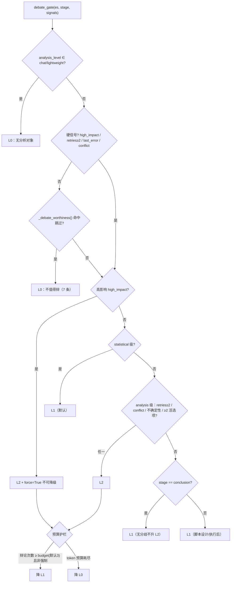
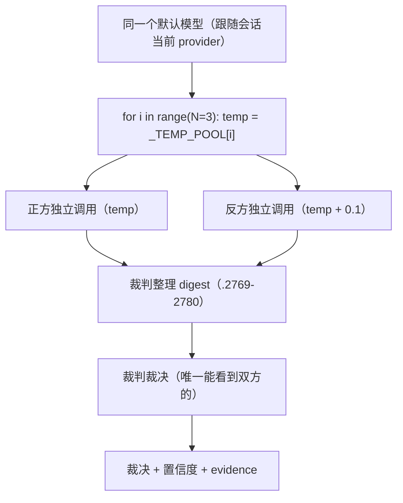

# MemOmics 辩论门控与 L1 隔离的**代码级**机制（模式 G 支撑材料）

> 场景：用户做竞品调研 / 自省审计时，会追问「辩论什么时候触发？L0/L1/L2 分别什么场景触发？
> L1 的单模型是怎么实现上下文隔离的——**代码层吗？还是提示词？**」
> 本文件是 2026-10-04 从源码实测的答案。**回答这类问题必须能给文件+行号**，
> 说"靠提示词约束模型不看别人的话"是**错的**。

⚠️ 注：`debate-core` skill 是**人工编写**（`created_by=None`，自动策展被拒），
所以这份代码级补充落在这里。**两边口径差异**：`debate-core` 写 L1 成本「≈1/4」，
**代码注释与实跑是「≈1/3」**（8 次长调用 vs 2N+1 次短调用）——以代码为准。

---

## 1. 门控在代码层：`webui/enforcement.py::debate_gate()`

签名 `debate_gate(es, stage="conclusion", signals=None) -> (level, reasons, force)`，**位于 :273-358**。
吃三样输入：`es.analysis_level`（`chat|lightweight|statistical|analysis`）、
`stage`（`before_script|after_script|conclusion`）、`signals`（各硬/软信号）。



### 1.1 L0 跳过——7 条显式规则（`_debate_worthiness()`，:240-270）

| 信号 | 跳过理由（代码原文口径） |
|---|---|
| `no_debate` | 调用方标注 no_debate |
| `n_options < 2` | 只有 ≤1 条可选路径（没有分歧，辩不出新东西） |
| `fact_lookup` | 事实查询/只读获取（有唯一正确答案） |
| `readonly` | 只读观察步骤（不产生新结论） |
| `repeat_topic` | 同一议题已辩过（去重） |
| `linear` | 线性执行/已知流程（无方案分歧） |
| `_LINEAR_CMD_RE` 命中且无 `uncertainty/conflict/failed_retries` | 线性执行命令（无方案分歧、无异常信号） |

🔴 **硬信号优先**（:306-311）：`high_impact` / `failed_retries≥2` / `last_error` / `conflict`
四条任一命中 → **整个跳过过滤让路**，直接按 L2 处理。

### 1.2 L1 触发（:319-345）

- `statistical` 级 → **默认 L1**（:320-322）
- analysis 级：脚本设计/执行后，无失败/无冲突/无分歧 → L1（:344-345）
- **结论合成但没有分歧、没有高风险 → L1**（:339-342）——注释写明「不升 L2，避免为辩论而辩论」

### 1.3 L2 触发（:313-338）

- **高影响 `force=True` 不可降级**（:313-317）：入库（`save_knowledge`）/ 报告（`generate_report`）/ 结论产物
- 失败重试 ≥ 2（:330-332）
- `rail_review(post)` 未通过 / 结果冲突（:333-335）
- 结论合成且有 **≥2 条活选项**（`fork_options` / `has_fork`）或高不确定性（:336-338）

### 1.4 两条预算护栏

- 辩论次数 ≥ `debate.budget`（默认 3）且**非强制** → L2 降 L1（:349-351）
- **token 预算耗尽 → 直接降 L0**（:353-356）

---

## 2. 上下文隔离在**代码层**：`_call_llm_sync()`

文件：`memomics/bio_tools/debate_analysis.py`（3682 行，196KB）。

```python
# :1440-1445
payload = {
    "model": model,
    "messages": [{"role": "user", "content": prompt}],   # ← 只有 1 条消息
    "max_tokens": max_tokens,
    "temperature": temperature,
}
```

**每个角色 = 一次独立 HTTP 请求**（每次 `httpx.Client` 独立创建，无共享状态）；
`messages` 数组从头到尾**只有该角色自己的 prompt**。

| 判据 | 值 |
|---|---|
| 隔离证据字段 | 返回体带 `isolation_verified: True` + `messages_count: 1`（:1457 / :1492 / :1514） |
| 提示词层 vs 代码层 | 提示词层＝同一对话里"你扮演反方"，模型**仍能看到对话历史**；代码层＝**新建空 messages**，物理上看不到 |
| 为什么必须是代码层 | 模块 docstring 明写「上下文隔离机制：每个编辑是独立的 HTTP API 调用…正方编辑不知道反方说了什么，反之亦然」（:24-29） |

⚠️ 有两个容易混淆的"隔离"，别答错：
- **会话级隔离**用 `contextvars.ContextVar`（`_sid_var` / `_results_dir_var` / `_model_cfg_var`，:59-65），
  因为 Hermes 的 `tool_executor` 把工具丢到 ThreadPoolExecutor worker 线程，`threading.local` 不跨线程传播（:51-58 注释）；
- **角色级隔离**就是上面的"一次调用一个空 messages"，与之正交。

---

## 3. L1 的实际形态：`_debate_l1_lightweight()`（:2710-2764）



- **温度梯度**制造多样性：`_TEMP_POOL[i % len]`，反方比正方 **+0.1**——同模型同温度会给出高度雷同的答案；
- 默认 `samples=3`（`cfg["l1"]["samples"]`，钳制在 1–5），每组正反各 1 次调用；
- 成本 **2N 次短调用 + 1 次裁判（+1 次裁判整理）≈ L2 的 1/3**（L2 = 8 次长调用）；
- 2026-09-18 起加"裁判整理"环节：L1 采样大量返回 **reasoning 草稿**（`pro_draft_only` / `con_draft_only` 字段，
  :2761-2762），直接喂裁判会"卷面很乱、论据挂不上锚点"；
- 每组的正反、组与组之间**全部切断上下文**；裁判是唯一聚合者。

---

## 4. 回答用户这类问题的模板（三步，别只给结论）

1. **先定性**：门控与隔离**都在代码层**，不是提示词层；
2. **给文件 + 行号**（上表），能贴出 `payload = {...messages: [1 条]...}` 那几行最好；
3. **给对照**：说明"提示词层"的做法会怎样（同一对话角色扮演 → 模型仍可见历史），
   从而让用户自己看出差别——用户要的是**机制**，不是"我们做了隔离"这句断言。

⛔ 不要答"模型被要求不要看别的角色的输出"——那是提示词层，且无法验证；
本家用的是 `messages_count: 1` 这种**可断言**的方式。