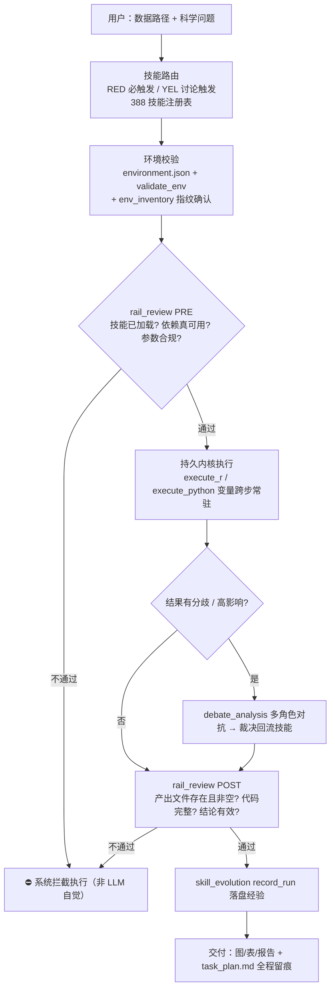

# MemOmics 自省式能力审计（模式 G 底稿）

> 场景：用户按序列读完 Biomni → Paper2Agent → BioMaster → Co-Scientist 四篇竞品后，
> 转头发问「你能不能看一下你自己 MemOmics 这个科研 agent，它能做什么？设计初衷为了解决什么问题？怎么解决的？」
> 本文件是 2026-10-04 那一轮的**实测底稿**——所有数字来自当场扫描磁盘/代码，不是 README 自述。

---

## 1. 实测规模（一条命令一批，2026-10-04 取值）

| 指标 | 取数位置 | 实测值 |
|---|---|---|
| 技能（索引登记） | `hermes_home/SKILLS_INDEX.md` / 数 `**/skill.json` | **388**（RED 67 / YEL 308 / GRN 13） |
| 技能（磁盘 SKILL.md） | `find hermes_home/skills -name SKILL.md` | **476** |
| 技能分类目录 | `ls hermes_home/skills/` | **25**（含 `statistics` / `plotting` / `comparison` / `user-scripts` 等用户脚本库） |
| 知识库条目 | `find memomics/knowledge_base -type f` | **239** |
| 知识库物种目录 | `ls memomics/knowledge_base/Homo_sapiens` | `bone_marrow, brain, general, heart, hippocampus, hippocampus_vs_caudate_nucleus, liver, skeletal_muscle` |
| 自进化运行日志 | `find results -name "run_record_*.json"` | **1000** |
| 辩论归档 | `find results -name "debate_*.json"` | **297** |
| 分析结果会话 | `ls -d results/*/` | **417** |
| 门禁实现 | `webui/enforcement.py` / `hermes-agent/toolsets.py` | `arm_intent_confirm` / `set_awaiting_form` |
| 技能注册表生成器 | `webui/skills_registry.py` | — |
| 生信工具包 | `memomics/bio_tools/` | `task_run.py` 等 |

⚠️ **口径陷阱**：476（磁盘文件）vs 388（`skill.json` + 索引登记）——**必须先声明口径再报数**。
挑大数说会被追问（用户此前的审计习惯就是把两个数字摆一起比）。

命令批次（可直接复用）：
```bash
find hermes_home/skills -name "SKILL.md" | wc -l                     # 476
python -c "import json,glob,collections;c=collections.Counter();\n
[tot+=1 for p in glob.glob('hermes_home/skills/**/skill.json',recursive=True)]"  # 388 + 级别分布
find results -name "run_record_*.json" | wc -l                       # 1000
find results -name "debate_*.json" | wc -l                           # 297
ls -d results/*/ | wc -l                                             # 417
```

---

## 2. 设计初衷 → 机制 → 磁盘证据（本模式的核心映射表）

纲领句（`README.md`）：*「接入你的 API Key，用自然语言把科学问题变成完整分析流水线——从环境校验、数据读取、
质控分析，到出版级图表与结论交付，**全程自主执行、自主审查、自我纠错**。」*

把它拆成**五个具体失败场景**，每个配真实模块（⚠️ ①–④ 属「质检支柱」，⑤ 属「知识库支柱」——**两条支柱缺一不可**，见 §2b）：

| 真实痛点 | 对应机制 | 磁盘/代码证据 |
|---|---|---|
| ① LLM 会**编结果**（说"已完成"但文件不存在） | `rail_review` pre/post，**系统硬拦**不是靠自觉 | `webui/enforcement.py` + `hermes-agent/toolsets.py` |
| ② 每次**重新发明流程**，参数无出处、不可复现 | 388 个技能成文规程（参数铁律 / 坑位 / 验证清单） | `hermes_home/SKILLS_INDEX.md`（RED 67 / YEL 308 / GRN 13） |
| ③ **看似合理实则错误**的结论溜过去 | `debate_analysis` 多角色对抗（L0–L2 分级） | 297 份 `debate_*.json`（含 `topic/level/judge_verdict/confidence/recommended_params`） |
| ④ 经验**随会话蒸发**，同样的坑反复踩 | `skill_evolution` + 磁盘锚点日志 | 1000 份 `run_record_*.json`（含 `skill/success/action/message`） |
| ⑤ **参数无出处 / 跨组织串味 / 辩论空手吵** | 证据化知识库（证据铁轨 + 五级目录 + 回写闭环 + 辩论注入） | `memomics/knowledge_base/` 239 条 + `save_knowledge` 铁轨 + `debate_analysis.auto_kb` |

`run_record` 样例：
```json
{"success": true, "action": "record_success", "skill": "scrna-qc",
 "proven_scripts_updated": false, "skill_json_updated": true,
 "message": "Success recorded: 01_qc_metrics.py, 02_qc_visualization.py for human/skeletal_muscle/aging"}
```

---

## 2b. 🔴 知识库支柱（2026-10-04 用户当场纠正后补，以后必带）

> 用户原话：「但是你没有提及 MemOmics 在知识库的搭建啊？知识库收集已验的知识，保证剩下分析可靠，
> **参数有来源**，同时辩论的时候，也有参考，很大程度上能够减少错误。」
> ⇒ 只讲 rail_review + 辩论 = **只答了半张牌**。自省交付必须给知识库**单独一节**。

**四问四答（讲清这条支柱的最小完备集，每答带出处）**：

| 问 | 答 | 出处 |
|---|---|---|
| **谁写进去** | ① 文献提炼 `kb_extract_from_paper`（生物学知识 / 生信参数 / 质控阈值三向分流）② 分析结论 `save_knowledge` ③ 用户导入 `literature_import` | 三个工具各自契约 |
| **凭什么写**（最硬的一环） | **证据铁轨强制**：`source ∈ {data_driven, domain_convention}` 时 **evidence 必填**；`verified=unverified` **直接拒收**。**不是靠 agent 自觉——写入通道本身拒绝** | `save_knowledge` 契约 + 知识库轨实现 |
| **怎么组织** | **五级目录** `<物种>/<组织>/<方向>/<类别>/<assay>/` —— **防止跨组织串味**。实测阈值确实按组织不同（肌肉 snRNA MT%<5%、单细胞放宽到 20%），骨骼肌的参数不能拿去套海马 | `memomics/knowledge_base/Homo_sapiens/{skeletal_muscle,brain,hippocampus,heart,liver,bone_marrow,…}` |
| **谁在读** | ① 分析前 `search_knowledge` / `kb_coverage` 取参数与模板；② **辩论注入专用通道**：`debate_analysis` 的 `knowledge_base_info` + `auto_kb`（默认开，按**物种+组织+方向**自动检索注入）⇒ 正反方**不是空手吵**，有该组织该方向既有证据垫底 | `debate_analysis` 的 `auto_kb` 参数 |

🔴 **闭环才是这条支柱的价值**（用户说的"减少错误"就指它）：
**分析产出 → 带证据回写 KB → 下次检索复用 → 辩论时又被引为论据**。
不是"建一个静态库让人查"，而是**滚动增强的证据总线**。

**这条恰好是本家相对四篇竞品的真差异**——四家都没有"用着用着库变厚"的机制：

| | 知识资产的形态 | 是否会随使用增厚 |
|---|---|---|
| Biomni | 314 通用资源 | ❌ 建库时由 2500 篇论文一次性挖出 |
| Paper2Agent | 每篇论文一个 MCP | ❌ 每篇一个**孤岛**，互不通信 |
| BioMaster | 无（仅 Plan/Execute 两个 RAG） | ❌ 无沉淀资产 |
| Co-Scientist | 无固定资产 | ❌ 假设用完即弃 |
| **MemOmics** | **388 技能 + 239 条 KB（五级目录）** | ✅ **带证据回写 → 复用 → 再进辩论** |

---

## 3. 执行链（交付用 mermaid 骨架）



**四个真正的设计选择**（区别于「包一层 prompt」）：
1. **技能优先而非自由发挥**——与 Biomni「不预设模板」**相反**：Biomni 换泛化，MemOmics 换可复现；
2. **审查是系统级的，不是提示词级的**——`enforcement.py` 里 `arm_intent_confirm` / `set_awaiting_form`
   让意图未确认 / rail_review 未过的执行类工具被**服务器直接拒绝，绕不过去**；**最硬的一条是不依赖 LLM 守规矩**；
3. **经验以日志累积，原脚本永不改**——`skill_evolution` 写 `results/<sid>/log/run_record_*.json`，
   辩论裁决回流 `skill.json` 的 `debate_verdicts`；自进化的物理实现是**磁盘账本，不是模型记忆**；
4. **长任务当基础设施做**——`>60min` 强制后台 + 心跳 cron + 三源交叉验证（GPU/进程/日志）+ `task_run.py` 统一包装器。

---

## 4. 🔴 诚实边界五条（固定模板，用户最认的部分；①–④ 质检侧，⑤ 知识库侧）

① **底座非自研**：建在 Hermes 之上；原创集中在 `webui/enforcement.py`、`webui/skills_registry.py`、
   `skill_evolution`、`memomics/bio_tools` 几层——原创度**低于** Biomni（自建 CodeAct + 环境）；
② **技能含金量不均**：388 条里相当部分由 `create-bio-skill` 自动生成，与 Biomni「LLM 生成 + 开源版 0 测试」
   **同类风险**；登记 388 条 ≠ 388 条经真人验证；
③ 🔴 **rail_review 查形式，不查科学**：验文件存在 / 非空 / 代码完整，**验不出统计口径选错**
   （例：把技术重复当生物学重复去算 log2FC）——**与 BioMaster 的 Check Agent 同一天花板**（工程级校验 ≠ 科学级校验）；
④ **辩论是同模型 8 席位、非异构**：能抓明显方法学错误，**抓不到同源偏差**（对比 Paper2Agent 的真独立子 agent）；
⑤ 🔴 **知识库是"文献提炼"不是"你的数据实测"**：它保证的是**参数有出处**，不等于**参数适用于你这份数据**；
   且与四篇竞品同病——**系统性地看不到阴性结果**（发表偏倚进不了 KB）。
   ⇒ 「降低错误」的作用是**把瞎猜变成有据可查**，不是**保证结论正确**。

> 收尾金句（本次原话）：**「它能保证『活干完了、文件在、没瞎编』，但保证不了『你选的方向本身是对的』——
> 后面这条，目前这四篇里也没有一篇真正解决。」**

**能力最强处与最弱处是同一枚硬币**：系统级强制审查（强）↔ 形式校验替代不了科学判断（弱）。

---

## 5. 五范式矩阵（本家定位，接模式 F5）

| | 解决的失败模式 | 沉淀单位 | 质检机制 |
|---|---|---|---|
| **Biomni** | 会不会（能力覆盖） | 314 通用资源（2500 篇论文挖） | 人工实现 + 测试用例（开源版实测 0 测试） |
| **Paper2Agent** | 准不准（忠实复现） | 每篇论文一个 MCP | 论文自己的数据回测（3% 容差 + 图感知哈希<20） |
| **BioMaster** | 跑不跑得完（长流程崩） | 无（仅 2 个 RAG） | Check Agent 逐步查产出（存在/非空/命名/格式） |
| **Co-Scientist** | 想不想得出（只读不创） | 无固定资产 | 自我对弈 + 锦标赛排名（Elo） |
| **MemOmics（本家）** | **敢不敢信**（LLM 会一本正经地编） | **388 技能（成文规程）+ 239 条 KB（五级目录，可回写增厚）** | **rail_review 硬门禁 + L0–L2 辩论门控 + 证据铁轨 + KB 注入辩论** |

一句话：**前四篇都在想办法让 Agent「做得更多」，MemOmics 的赌注是让 Agent「不能偷偷做错」**——
把质检从"模型自觉"变成"系统强制"；**再叠加一条别人都没有的**：
**知识资产会随每次分析带证据回写而增厚**（四家的资产都是建库时一次性冻结的）。

---

## 6. 可复用的下一步（收尾给用户挑）
① 逐行讲 `webui/enforcement.py` 的门禁逻辑（到底在哪些点上真能拦住）；
② 统计 388 技能里多少是 AI 自动生成、多少经真人验证（把边界 ② 坐实）；
③ 做一份「五大科研 Agent 范式对比」HTML/DOCX 报告（走模式 B4 / D4）。