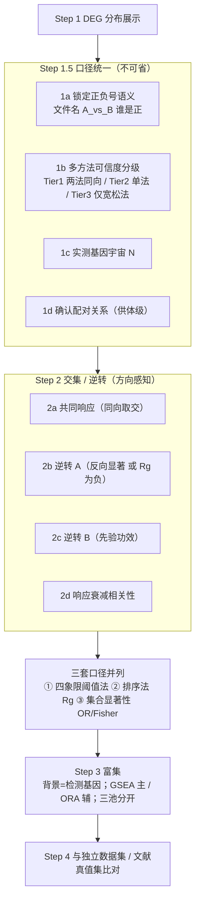

# 多对比 DEG 整合（交集 / 逆转 / 共享响应）

## 何时使用

用户**已经算好** DEG，问的是"接下来怎么研究"或直接点名要交集 —— 不是问怎么算 DEG（那走 `deg-analysis`）。

触发信号：

- 「我这么多 DEG 该怎么往下做」
- 「找重合的 DEG」「运动共同的 DEG」
- 「运动**逆转**衰老 / 逆转糖尿病的重合基因」
- 「哪些是某条件特异的」
- 要出 UpSet / Venn「重合」图

**典型设计**：多条件（Young / Old / Old+Disease）× 干预（Pre / Post）、**配对供体** ——
这类设计里"条件效应"与"干预效应"是两个可比的向量，所以能做逆转分析，也必须按下面的铁律做。

> 详细判据、实测数字、可复制脚本骨架、命中清单 → `references/multi-contrast-overlap-analysis.md`

---

## 先给路线：三步是连续的，但**中间必须插一步**

用户的直觉通常是「① 展示分布 → ② 找重合 → ③ 做富集」。顺序对，**但 ① 和 ② 之间必须插"口径统一"**，
否则 ② 的数字不可信。



> **开工第一件事**：跑 `scripts/deg_table_power_probe.py <DEG目录>`（宽表直接跑、长表加 `--split-by contrast,celltype`）
> —— 一次拿到每张表的形态、每个对比的检出功效、阈值是否在起作用、以及每对集合的
> 「真实交集 vs 随机期望 E / OR / Jaccard」四张表。**这四个数出来之后再决定做不做交集**，
> 不要先算完再回头怀疑。

**1a 是本类分析最昂贵的错误源**：`A_vs_B` 这种文件名**不告诉你正负号是谁减谁**。
方向锁定错 → 所有"逆转"结论**整体反过来**。开工第一步就是把它钉死，不要默认。

---

## 六条铁律

### 1. 交集必须方向感知 —— 基因名交集天然一半是假阳性

| 象限 | 判据 | 生物学含义 |
|---|---|---|
| 同向（concordant） | 条件↑ 且 干预↑ | 干预**加剧**了条件特征 —— **不是逆转** |
| **反向（discordant）** | 条件↑ 且 干预↓ | 干预把方向扭回来 ← **这才是逆转** |
| 同向 | 条件↓ 且 干预↓ | 同上，加重下调 |
| 反向 | 条件↓ 且 干预↑ | 逆转（下调侧） |

- 任何"重合基因"表**必须按象限分列**；把四格合并成一个数 = 结论作废
- **一边显著、另一边不显著 ≠ 阴性** —— 多半是功效不足（见铁律 3）

### 2. 原始交集数必须先减随机期望

```
E[|A ∩ B|] = |A| × |B| / N        N = 实际检测到的基因数（不是全基因组）
```

实测：某条件集 16,535 基因、N ≈ 27,015、另一个集合 231 基因 → `E ≈ 141`，**占后者 61%**。
直接数交集 = 大集合把六成基因"吸"进来，纯算术。

| 该报 | 不该只报 |
|---|---|
| Odds ratio、Fisher 精确检验（背景 = N） | 原始交集个数 |
| Jaccard index | Venn 图里的数字（无基线） |
| 交集数 **与 E 并排** | "重合 300 个基因" |

**阈值无关的替代（与阈值法并列做）**：`s = sign(coef) × (−log10 p)`（或 `coef/SE` 的 z）
→ 单基因逆转分 `Rg = s_条件 × s_干预`（负 = 反向）；全局 `cor(s_条件, s_干预)` 为负 = 整体反向。
好处：不依赖 0.2/0.25 这类人为划线，效应温和但真实的基因不会被切掉。

### 3. 交集前先出「各对比检出数」表

实测（同一批数据、老方法 pseudobulk dreamlet、`|logFC|>0.25 & FDR<0.05`）：

| 对比 | Aging | Ex_Old | Ex_Young | Ex_DM | DM |
|---|---|---|---|---|---|
| 显著行数 | **29,542** | 1,246 | **22** | **4** | **1** |

→ `DM`=1、`Ex_DM`=4：**"干预逆转该疾病"这条线在这个方法上不存在**，交集数学上必为 0。
**同一批数据里不同对比的可分析性差异极大**，不能假定"有 DEG 就能做交集"。

- 任一边 < ~50 个基因 → 该交集**先别做**，换另一套 DEG 或明确声明局限，**不要给出数字**
- 检出数差异 >10× 的组合 → 必须做铁律 2 的期望校正

### 4. 诊断「阈值到底在不起作用」

把该方法 **|effect| 的中位数** 与阈值比：

| 方法 | \|logFC\| 中位数 | 阈值 0.25 的实际效果 |
|---|---|---|
| 老方法（dreamlet pseudobulk） | **0.3475** | 29,550 → **29,542**，只砍 8 行 → **等于不设防** |
| 新方法（细胞级 glmer+RUV） | 远低于 0.25 | 0.20→0.25 砍掉 11,111 行 |

**"0.25 砍掉了多少基因"这句话不能跨方法套用** —— 阈值作用完全取决于该方法自身效应量分布。
读 `|coef|` 分位数：中位数 > 阈值 → 别拿它当"我们做了严格过滤"的证据。

### 5. 推断单位必须与设计一致

- 配对设计（同供体 Pre/Post）→ 逆转分析必须在**供体级**做
- 细胞级 p 值做**条件间**比较 = **伪重复**（pseudoreplication）
- 实测：ICC = 0.418 → 设计效应 ≈ 2984 → 有效 n = 57；精度上限由**供体数**决定，
  **加细胞数不增加信息**（细胞级假阳性率随深度 25%→93.5%，供体级稳定 3.5–9.0%）
- 汇报必须写清用的是细胞级还是供体级 p 值

### 6. 富集的三条硬约束

1. **背景 = 实际检测基因**（非全基因组）—— 否则线粒体/核糖体等超大基因家族淹没所有通路、FDR 失真
2. **小交集以 GSEA 为主、ORA 只做辅**（GSEA 只用排序、不用阈值，对"交集太小"稳得多）；ORA 要带 OR
3. **绝不在 >1 万基因的超大集上做 ORA** —— 什么通路都会"显著"，是纯噪声；超大集只适合 GSEA

**三池分开富集**：共同响应 / 逆转 A / 逆转 B —— 分栏对照才能看出通路分工。

---

## 判据表模板（直接照用）

| 用户问题 | 基因集运算 | 主判据 | 必须附带 |
|---|---|---|---|
| 干预共同响应 | `E_1 ∩ E_2 ∩ E_3`，**同向取交** | 三集合交集 + 多集合显著性 | Jaccard、每对 OR、UpSet 图 |
| 干预逆转条件 A | `A` 与 `E_A` **反向显著**；或 `Rg` 为负 | 反向基因数 **vs 期望** `\|A\|×\|E_A\|/N`；全局 `cor` 为负 | 供体级配对检验；每套 DEG 各做一遍 |
| 干预逆转条件 B | 同上换 B | 同上 | ⚠️ 先确认功效（铁律 3），无功效则不下结论 |
| （建议加做）响应是否衰减 | `cor(E_1, E_2, E_3)` 跨基因 | 高相关 = 响应保留；条件组显著低 = 衰减 | 常比"逆转"更独特（如合成代谢抵抗） |

**"响应是否衰减"这一条要主动加**：多条件 × 同干预、配对、同批次的设计能做到，
而绝大多数公开数据做不到 —— 是这类设计最不容易被别人做掉的一条线。

---

## 出图建议

| 图 | 为什么 |
|---|---|
| **2×2 象限散点**（x = 条件效应，y = 干预效应） | **一张图直接读逆转/加剧/无关**，信息量远大于交集数；标注各象限基因数 |
| **UpSet**（≥4 集合） | 远胜 Venn：支持多集合、精确交集、可排序；Venn 超 3 集合就不可读 |
| 逆转基因**供体级热图**（行 = 基因，列 = 供体 × Pre/Post） | 把"逆转"落到个体层面，审稿人最想看 |
| 三个富集池**并列条/气泡** | 共同响应 / 逆转 A / 逆转 B 分栏 |

---

## 自查清单（交结论前逐条过）

- [ ] 把同向重合当成了逆转（**最常见**）
- [ ] 报了原始交集数，没有随机期望 / OR 基线
- [ ] 在检出数是个位数的对比上做交集，然后解释"没有重叠说明无关"
- [ ] 用细胞级 p 值做条件间比较（伪重复）
- [ ] 富集背景用了全基因组而不是检测基因
- [ ] 在超大 DEG 集（>1 万）上做 ORA
- [ ] 文件名 `A_vs_B` 的正负号没锁定就直接算方向
- [ ] 引用了 `SuperExactTest` / `RobustRankAggreg` 的 PMID 却没核实原文（**检索未命中其原始方法学文献，不许凭记忆编**）

---

## 与其他 skill 的分工

| 任务 | 走哪 |
|---|---|
| 从表达矩阵**算** DEG | `deg-analysis` / `deg-mixed-design` |
| 已算好的多套 DEG **整合**（本 skill） | 本 skill |
| DEG → GO/KEGG/GSEA 结论的**定稿前验证** | `enrichment-conclusion-validation` |
| 富集本身怎么跑 | `functional-enrichment` |

> 本 skill 只管"交集/逆转/共享"这一类整合动作与其判据；不重算 DEG。

## 参考来源

- `references/multi-contrast-overlap-analysis.md` —— 完整判据、实测数字、脚本骨架、出图配方
- `references/multi-contrast-overlap-analysis.md` —— 完整判据、实测数字、脚本骨架、出图配方
- `scripts/deg_table_power_probe.py` —— **开工体检器**：读 csv/xlsx/长表，输出 POWER（各对比检出数）/
  THRESHOLD（阈值是否不设防）/ OVERLAP（obs vs E / OR / Jaccard）三张表 + VERDICT
- 文献依据（本类分析通行的"干预逆转"范式）见该 reference 的文献小节