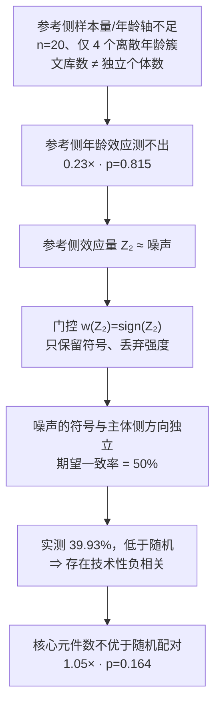

# 门控变量是否携带信息 —— 「为什么我们自己算的比不过随机」诊断

> 触发：用户问「**专利不就是个筛选方法吗？为什么我们自己算的比不过随机呢？**」
> 「这套筛选真的有效果吗」「被筛出的集合是不是不优于随机」「这个门控/评分作为独权区别特征站得住吗」
> 也用于：给一个已跑通的筛选流程做**最后一道效力体检**（决定它能不能当独权核心主张）。

⚠️ **要的是因果根因 + 能不能救的判定，不是安慰、不是重算一遍、不是换口径再试。**
用户问这个问题时，心里已经有了怀疑；回答必须落到「哪个变量没有信息 / 因此哪句话不能写」。

---

## 1. 先把「比不过随机」拆成三个可独立核验的指标

「比不过随机」是三个**不同**的命题，混着讲必然说不清。逐项报「观测 / 零假设 / 判定」三元组：

| 指标 | 问的是什么 | 零假设怎么造 | 实测标本（跨物种衰老核心元件） |
|---|---|---|---|
| **① 计数富集** | 筛出的集合**个数**比随机配对多么 | **打乱配对关系**（保持两侧效应量边缘分布，把参考侧效应量整体重排到别的元件上） | 357 vs **340.1±16.3**（1.05×，p=0.164）→ **未富集** |
| **② 门控选择性** | 门控的**触发**是否偏向同向元件 | 比较同向池 / 反向池的命中率 | 同向池 61.34% vs 反向池 64.93%（**比值 0.94**）→ **不偏向同向** |
| **③ 池内一致率** | 被选集合内部的同向率是否 > 50% | 二项检验 vs 0.5 | **39.93%** vs 50%（p=1.9×10⁻⁹）→ **显著低于随机** |

**判据**：三项里只要 ②③ 不过，就**不是「算法不够好」，是「门控变量里没有信息」**——
计数富集（①）还可能靠别的路径侥幸成立，②③ 直接打在变量的信息量上。

---

## 2. 因果链：为什么必然是这个结果

**关键逻辑**（这一步最容易讲错，务必说准）：

> **「强度测不准」不蕴含「方向可信」。**
> 强度与方向是同一枚硬币的两面 —— 一个测不出效应的变量的**符号**就是噪声的符号，
> 而噪声符号与任何东西的一致率数学期望就是 50%。

所以「参考侧强度不可信、但方向相对可信」这个设计动机是**自相矛盾**的：
它拿一个刚被自己测出是噪声的变量去当判决依据。

**低于 50% 的含义要单独说**：若 sign(Z₂) 是真噪声，实测应落在 50% 附近；
落到 39.93%（低于 50% 且 p=1.9e-9）说明 sign(Z₂) 与主体侧 Z₁ 存在**微弱负相关**，
其来源至少部分是**技术性的**（基因长度 / 可及性深度 / 可比对性），不是生物学。
判据：把疑似技术因素**完全控制掉再测水平**（分层 / 残差化），不要拆梯度。
标本：某条「门控触发对真实同源配对敏感」的 1.33× 证据，**按基因长度分层后塌成 1.04×**。

---

## 3. 循环论证检查（比三个指标更容易被漏掉）

被门控「选出来」的集合，其一致率是**定义性**的，不是发现：

- 门控定义 = 同向才给 +1 → 被选集合 100% 同向 → **「精度 100%」是重言式**
- 同理「反向混入率 0%」也是定义性结果
- 分母含「同向」条件、分子也含 → 任何「富集倍数」都可能是循环论证

⇒ **凡「精度 100% / 反向混入 0 / X×

富集」出现在报告里，先检查分母是否已含该条件。**
可保留的表述只能改成**相对基线**（如「同为零反向混入时，召回由对称法的 1.1% 提升至 25.3%」），
即**同类方法之间的相对比较**，这不是对随机的富集。

---

## 4. 塌了之后怎么定位 —— 筛选方法 → 评估/判定方法

数据不支持「我们筛出了跨物种保守核心元件」，但**支持**「我们能判定参考物种能不能当方向参考」。
这不是失败，是**claim 定位的可用落点**（⚠️ 重定位仍须用户拍板，见 `patent-analysis` 的
`claim-premise-first-verification.md`；用户点名「筛选方法」时定位即锁定，不得自行改）。

保留写法：

| 写 | 不写 |
|---|---|
| 效果 = **主体侧年龄效应可检出**（如 shuffle 24.3×，p<0.005，独立于参考侧） | ❌「被输出元件构成跨物种同向保守集合」 |
| 效果 = **对参考侧给出可判定结论**（本数据集：不宜作方向参考，依据 0.23× / 0.94 / 1.05×） | ❌「精度 100%、召回 25.3%」（循环论证 + 非随机对照） |
| **失效边界如实披露**（门控选择性、池内一致率、计数不富集） | ❌ 选择性披露：只报有利一侧 |
| 独权落点移到**技术特征**（统一同源网格 + 跨粒度逐单元归一化 `z̄=Z/√n`，见 `substitutability-score-formula-traps.md`） | ❌ 把统计口径（门控公式）当独权区别特征 |

🔑 **自查信号**：如果你正在写「效果很好」而说不出它相对**匹配零假设**的效果，停手先跑 §1 的三个指标。

---

## 5. 跨模态 RNA 验证 —— 能做哪个版本（用户问「能不能去集群看表达曲线」）

**结论：可以，方法学正当，且是塌了之后最值得做的一件事。** 但要分清两个版本证明的东西完全不同：

| 版本 | 做什么 | 能证明 | 能救跨物种结论吗 |
|---|---|---|---|
| **A · 主体侧跨模态验证** | 被筛元件的邻近基因，在**独立 RNA 数据**里是否随年龄单调变化、方向与 ATAC 的 Z₁ 符号一致 | 主体侧年龄效应的**独立模态证据**（完全不依赖参考侧） | ❌ 不能 |
| **B · 跨物种表达方向一致性** | 两侧都有年龄分辨 RNA → 直接算**表达层面**的跨物种同向率 | 参考物种到底能不能当方向参考（**真正的判决**） | ✅ 能 |

**B 的两种结果对专利都是利好**（这一点要主动讲清，否则用户以为只有坏消息）：
- RNA 层也 ≈50% → 结论**稳固**：该参考物种不是有效方向参考（价值在「**能判出来**」）
- RNA 层 >50% → 说明**模态问题**，不是方法问题 → claim 可改 RNA 或 ATAC+RNA 双模态

### 数据可得性（2026-09-13 实查，可复核）

| 资源 | 状态 |
|---|---|
| 人海马衰老 bulk RNA —— PMID **41883201**，*Aging Cell* 2026，Saenz-Antoñanzas 等《Differential Gene Expression in Human Hippocampus With Aging》 | ✅ 正中靶心 |
| 人海马 snRNA-seq 跨生命周期 —— **GSE199243**（PMID 36332572，13 样本） | ✅ 有 |
| 树鼩海马衰老 snRNA + 跨物种比较（含人/猴/鼠）—— **GSE235838**（PMID 40093585） | ✅ 可能带猴数据，需核实 |
| **猴（食蟹猴）海马衰老 RNA 公共数据** | ❌ GEO 检索 **0 条** |

⇒ **A 版数据现成，可立即做；B 版需集群自有猴 RNA 或走 GSE235838。**
先做 A（给专利补一条不依赖参考侧的效果证据线），B 视猴 RNA 可得性再定。

⚠️ 语义错配警告（同类坑已单独记录）：**拿表达类衰老基因集去验证可及性元件列表 = 语义错配**，
重叠低 ≠ 方法无效。先判错配再判成败（详见 `patent-analysis` 的 `screening-method-effect-argumentation.md` §5）。

---

## 6. 执行纪律

1. **一个探针跑完全部指标**（三个指标 + 分层对照 + 循环论证扫描），不要一项一个工具调用 → 触发循环检测。
2. **报三元组，不报绝对率**：任何「修复把 X% 拉到 Y%」必须同屏给匹配零假设与配对 z。
3. **不要用换口径去救结构性缺陷**：缺陷在数据结构时，换口径只改幅度不改结论。判据：换口径会不会改变判定方向？不会 → 立即停止口径纠结。
4. **结论先交付、辩论后补**：核实类结论不依赖辩论；裁判角色故障时如实声明「无辩论背书」，不要无限重试。
