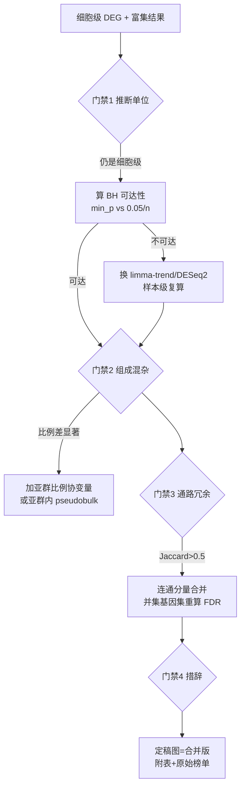

# 富集结论验证（定稿前四项门禁）

> 本 skill 是 `functional-enrichment` / `deg-analysis` 的**结论把关**层。那两个 skill 管「怎么跑富集」，
> 本 skill 管「跑出来的东西能不能写进结论、气泡图该怎么画」。
> 它们由人工维护、不允许 agent 自动改，所以历次实测教训沉淀在这里。
> 📄 完整配方 + 本例全部数字：`references/kegg-redundancy-and-sample-level-pitfalls.md`

## 何时触发（Red）

- 富集结果要**写结论 / 出定稿图 / 入知识库 / 写报告**之前（不是拿到结果就能写）
- debate 裁决 = `need_more_info` / `modify`，或反方质疑「细胞级显著样本级消失」「疾病名通路算独立吗」「组成混杂」
- 样本级与细胞级显著性不一致（一边几百个、一边 0 个）
- KEGG top 榜单里出现成串疾病名通路（Diabetic cardiomyopathy / Alzheimer / Parkinson / Huntington / Prion / ALS）
- 跨组（分组比较）富集出的通篇是线粒体 OXPHOS / 能量代谢

## 四项门禁（缺一项就不许写「确证」）



### 门禁 1｜推断单位：细胞 ≠ 样本（伪重复）
细胞级 `FindMarkers(test.use="wilcox")` 把每个细胞当独立重复 → 有效 n 从 ~8 样本膨胀到数百细胞，p 值系统性偏小。
**必做**：按样本聚合 raw counts → CPM → log2 做样本级复算。

### 门禁 2｜多重检验可达性（决定「阴性」能不能说出口）🔴
```r
min_p_wilcox <- 2 / choose(n1 + n2, n1)     # n=10 vs 7 → 1.03e-4
bh_floor     <- 0.05 / n_tested             # 23,674 基因 → 2.1e-6
```
`min_p_wilcox > bh_floor` ⇒ **任何基因在数学上都不可能达 FDR<0.05**，此时「0 个显著」是检验限制，不是「无差异」。
→ 立刻换参数模型：limma-trend 或 DESeq2 Wald（实测 limma 427 / DESeq2 383 个 FDR<0.05，方向与细胞级一致）。

### 门禁 3｜细胞类型构成混杂（跨组富集最常见的假信号源）
先查每样本各亚群比例（`prop.table(table(group, subtype), 1)` + 样本级比例 Wilcoxon）。
实测：RSS 2.00% vs 16.38%（p=0.0145）、Pure IIA 17.33% vs 4.88%（p=0.035）→ 混合 pseudobulk 方向可由构成驱动。
加比例协变量（`~ group + RSS + IIA + IIX`）后样本级显著基因 427 → 33 ⇒ 构成是主要驱动之一但**解释不完全**（别一句「全是混杂」了事）。

### 门禁 4｜通路冗余：疾病名通路 ≠ 独立生物学
KEGG 里同一批线粒体 ETC 基因被重复注释进多个疾病 map（实测两两 Jaccard 0.68–0.92：OXPHOS↔Thermogenesis 0.88、Huntington↔Parkinson 0.92）。
处置：Jaccard>0.5 连通分量合并 → 模块 FDR **用并集基因集重算**（不许取成员最小 FDR）→ 代表名用生物学名（含 OXPHOS 就叫 "OXPHOS/ETC module"），⛔ 别用疾病名，也别用基因数最大的成员（实测自动规则选中 Thermogenesis，会误导成产热通路）。

## 结论措辞模板

| 事实 | 可写 | 不可写 |
|------|------|--------|
| 细胞级几百 DEG；样本级秩检验 0 个但参数模型几百个；校组成后几十个 | 「细胞级探索性 + 样本级参数模型方向可复现（组成校正后大幅衰减），构成差异是主要驱动之一」 | 「无差异」（被检验限制推翻）、「确证差异」（混杂未排除） |
| 下调侧单条通路 FDR=0.0078、其它 FDR>0.05 | 「名义/探索级发现」 | 「显著下调通路」 |
| 疾病名通路与代谢通路高 Jaccard | 「合并为一个 OXPHOS/ETC 模块（[+n 条冗余通路]）」 | 把 11 条当 11 条独立结论 |

## 交付物清单（定稿一套）

1. **主图**：去冗余合并版气泡图（x=GeneRatio，size=Count，color=-log10(FDR)，facet 上/下调），图注写明「冗余通路按 Jaccard>0.5 合并，[+n] = 被合并的重复注释通路数」
2. **附图**：原始榜单版（未合并）+ 通路 Jaccard 矩阵
3. **表**：富集全表（含名义 p 与 FDR）、组成比例表（含样本级 p）、样本级 limma/DESeq2 表、模块重算表
4. 探索期按用户偏好**另出一版 raw p 着色**（FDR 会掩盖 p≈0.047 这类边缘显著）

## 操作坑（实测）

| 现象 | 根因 | 修复 |
|------|------|------|
| ggplot 报 `factor level [13] is duplicated` | 同一通路名在 up/down 两侧都出现（如 Cytoskeleton in muscle cells），labels 建 factor 时重名 | `lab <- make.unique(as.character(lab), sep=" [#")` 再 `factor(..., levels=rev(unique(...)))` |
| 富集表 `geneID` 想直接拿去算并集 | 需要**全路径成员**而不是命中基因 | 用 `clusterProfiler::download_KEGG("hsa")` 的 `KEGG PATHID2EXTID` 取该 hsa 号的全基因集；`Description→ID` 用富集表的 `ID` 列映射 |
| 模块 FDR 比成员最小 FDR 差好几个数量级 | 成员最小 FDR 是选择性报告 | 一律并集重算（实测 1.34e-8 → 1.13e-5） |
| 富集背景取成了过滤后的基因 | `FindMarkers(logfc.threshold>0)` 只回传通过阈值的基因 | 传 `logfc.threshold=0` 拿全检测基因当 universe（实测 8,061），显著性再另行过滤 |

## 读本 skill 后的动作

1. 跑 `references/kegg-redundancy-and-sample-level-pitfalls.md` 里的配方（四项门禁各一段代码，可直接抄）
2. 把门禁结论写进 task_plan + 会话锚点（`session_memory(kind="finding")`）
3. 结论措辞按上表；交付物按上表清单给全套，不要只给一张图