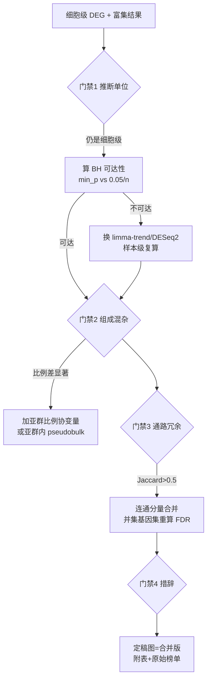
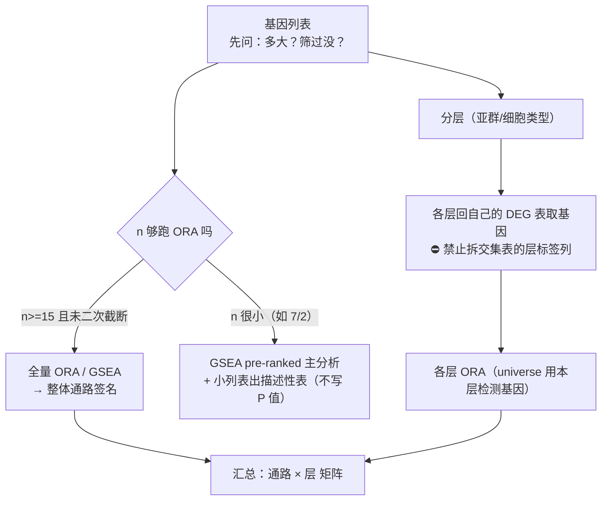

# 结论文监局（定稿前五项门禁）

> 本 skill 是 `functional-enrichment` / `deg-analysis` 的**结论把关**层。那两个 skill 管「怎么跑富集/DEG」，
> 本 skill 管「跑出来的东西能不能写进结论、阈值站不站得住、气泡图该怎么画」。
> 它们由人工维护、不允许 agent 自动改，所以历次实测教训沉淀在这里。
> 📄 完整配方 + 本例全部数字：`references/kegg-redundancy-and-sample-level-pitfalls.md`
> 📄 效应量阈值（θ=0.2/0.25）校准全流程 + 21 个正对照基因：`references/effect-size-threshold-calibration.md`
>   —— 含 §4b 文献阈值的**模态核对**（猴脑 0.25 属 ATAC 非 RNA DEG）、§4c θ 效力随表而变、
>   §4d 目的依赖的推荐、§4e 行数/去重基因双口径 + 方向指纹

## 何时触发（Red）

- 富集结果要**写结论 / 出定稿图 / 入知识库 / 写报告**之前（不是拿到结果就能写）
- debate 裁决 = `need_more_info` / `modify`，或反方质疑「细胞级显著样本级消失」「疾病名通路算独立吗」「组成混杂」
- 样本级与细胞级显著性不一致（一边几百个、一边 0 个）
- KEGG top 榜单里出现成串疾病名通路（Diabetic cardiomyopathy / Alzheimer / Parkinson / Huntington / Prion / ALS）
- 跨组（分组比较）富集出的通篇是线粒体 OXPHOS / 能量代谢

## 门禁清单（缺一项就不许写「确证」）

> 门禁 6 是**跑之前**的输入/口径门；门禁 1–5 是**结果出来后**的结论门。顺序：先 6，再 1–5。



### 门禁 1｜推断单位：细胞 ≠ 样本（伪重复）
细胞级 `FindMarkers(test.use="wilcox")` 把每个细胞当独立重复 → 有效 n 从 ~8 样本膨胀到数百细胞，p 值系统性偏小。
**必做**：按样本聚合 raw counts → CPM → log2 做样本级复算。

### 门禁 2｜多重检验可达性（决定「阴性」能不能说出口）🔴
```r
min_p_wilcox <- 2 / choose(n1 + n2, n1)     # n=10 vs 7 → 1.03e-4
bh_floor     <- 0.05 / n_tested             # 23,674 基因 → 2.1e-6
```
`min_p_wilcox > bh_floor` ⇒ **任何基因在数学上都不可能达 FDR<0.05**，此时「0 个显著」是检验限制，不是「无差异」。
→ 立刻换参数模型：limma-trend 或 DESeq2 Wald（实测 limma 427 / DESeq2 383 个 FDR<0.05，方向与细胞级一致）。

### 门禁 3｜细胞类型构成混杂（跨组富集最常见的假信号源）
先查每样本各亚群比例（`prop.table(table(group, subtype), 1)` + 样本级比例 Wilcoxon）。
实测：RSS 2.00% vs 16.38%（p=0.0145）、Pure IIA 17.33% vs 4.88%（p=0.035）→ 混合 pseudobulk 方向可由构成驱动。
加比例协变量（`~ group + RSS + IIA + IIX`）后样本级显著基因 427 → 33 ⇒ 构成是主要驱动之一但**解释不完全**（别一句「全是混杂」了事）。

#### 门禁 3 强化：组成混杂的四件套取证（2026-09-24 实测，比"加比例协变量"更硬）

单加协变量只能说"协变量进来后效应还在/不在"，**说不清下调基因到底是不是耗竭亚群的标志基因**。四件套一次跑完（都便宜）：

| # | 做法 | 判读 | 本次实测（MF_2000，Y_Post vs O_Post） |
|---|------|------|------------------------------------|
| 1 | 组成表 `table(annotation_L3, type)` + 组间占比 | 差异大 = 混杂风险高 | RSS 16.4%→2.0%、Specialized MF 12.2%→3.3%、Pure IIA 4.9%→17.3% |
| 2 | **marker Fisher 富集**：每亚群 top50 marker（`FindAllMarkers(only.pos=TRUE, min.pct=0.25, logfc.threshold=0.25)`）vs 下调基因集 | 下调基因富集在**耗竭亚群**的标志里 ⇒ 列表主体是组成变化 | RSS 21/50（13.8×，BH 1.6e-18）、Specialized MF 15/50（9.9×）、OTUD1+(I) 15/50（9.9×）；Pure 型 0 个 |
| 3 | **秩检验（不依赖 top50）**：全基因按亚群特异性排序，下调基因秩 vs 其余基因 Wilcoxon 秩和 | 只有名义显著 ⇒ 第 2 步的强富集**对阈值敏感**，措辞写成"趋势" | 仅 OTUD1+(II)（p=0.0082，BH 0.082）、RSS（p=0.0179，BH 0.090） |
| 4 | **组成协变量 + 共线性诊断**：样本组成比例 → CLR → 第一主成分 `compPC1` → `~type + compPC1`；报 Pearson/Spearman/R²/**VIF** | VIF<5 且 \|r\|<0.7 才算"可估"；且**只说明不能由组成主成分单独解释**，不等于排除混杂 | Pearson 0.40 / VIF 1.19；下调 209/209 完全保留、冲突 0 |

**within-L3 的可估判据**：每样本每亚群 **≥10 细胞 且 每组 ≥3 个可估样本**。
实测（2,132 cells / 每样本 45 cells / 10 个 L3）：**10 个 L3 全部不可估**（每样本每 L3 仅 4–5 细胞）；合并大类后仅 Mixed(396 cells) 可估（下调 83，其中 69 与全局重叠、0 冲突）。
⇒ **不可估就如实写"数据不允许更细的校正"**，别降门槛硬跑；用合并大类的重叠率作方向性佐证。

**配套稳健性（一次脚本跑完，别分轮）**：剔除小样本（实测 209→225，重叠 187/209）、leave-one-sample-out ×N（符号一致率 / 每次仍显著数 / ≥80% 仍显著数 = 209/209、93、145）、阈值扫描（`padj{0.01,0.05,0.1} × |log2FC|{0,0.25,0.5,0.75}` → 104/209/311）、Cook 距离离群（逐样本 >3×qf 计数，实测全 0）。

📄 完整配方（含全部代码骨架、三级交付表定义、措辞段、出图清单、交付自检清单）：`references/pseudobulk-deg-composition-confound.md`

### 门禁 4｜通路冗余：疾病名通路 ≠ 独立生物学
KEGG 里同一批线粒体 ETC 基因被重复注释进多个疾病 map（实测两两 Jaccard 0.68–0.92：OXPHOS↔Thermogenesis 0.88、Huntington↔Parkinson 0.92）。
处置：Jaccard>0.5 连通分量合并 → 模块 FDR **用并集基因集重算**（不许取成员最小 FDR）→ 代表名用生物学名（含 OXPHOS 就叫 "OXPHOS/ETC module"），⛔ 别用疾病名，也别用基因数最大的成员（实测自动规则选中 Thermogenesis，会误导成产热通路）。

### 门禁 5｜效应量阈值：θ 凭什么取这个数（2026-09-28 新增）

用户给的筛选式常是 `filter(fdr < 0.05 & abs(coef) > 0.25)`，再问「0.2 还是 0.25 更好 / 有文献支持吗 / 你觉得呢」。
**凭直觉或惯例回答会给出反效果建议**（本轮实测 θ=0.25 砍掉 2/3 已确证真信号）。三组证据实测后再答，
完整配方 + 21 个正对照基因表 + 本轮全部数字：`references/effect-size-threshold-calibration.md`。

| 证据 | 做法 | 判读 |
|---|---|---|
| **A 边界带** | 取 `θ_lo < \|coef\| ≤ θ_hi`（严阈值额外滤掉的那一带），比其 `fdr` / `\|z\|` 分布 vs 保留组 | 边界带 fdr 中位仍极小（实测 1e-16~1e-45）⇒ **p 值对两阈值无区分力，阈值只是任意切点** |
| **B SE 尺度** | `θ / median(se \| fdr<0.05)` = 等效多少倍 SE，对比显著集 `\|z\|` 中位 | `θ=0.25` ≡ 10–21×SE（统计门槛才 1.96×）⇒ 两把尺子在筛**不同基因**：「基因太多就调阈值」是换尺子，不是收紧 |
| **C 正对照校准（决定性）** | 领域公认差异基因（肌肉衰老/运动示例 21 个：CDKN1A/GADD45G/FBXO32/MYOG/NR4A3/PPARGC1A/ULK1…）的阈值通过率 | θ=0.25 衰老组仅保留 33.2%、运动组 0.6–4.9% ⇒ **在砍已确证的真信号** |

**答法（用户要判断，不是罗列；⚠️ 2026-09-29 修正为"目的依赖"，见下 5c）**：
① **先说这取决于目的**（保召回选 0.20 / 保精确选 0.25，见 5c）——⛔ **不要给"唯一正确 θ"**；
② 若两阈值都落在分布尾部之外（本轮 4/5 组在第 97.6–99.5 百分位、保留率 0.47–11.8%），
明说"谁更好"本身意义有限；③ **点出真问题** —— 先查该 `fdr<0.05` 集合是否失校
（本轮 SE 低估 ~26 倍、85% 基因判显著 ⇒ 调效应量阈值只是裱糊，审稿人问的是 SE 校准不是阈值），
同时给一个有利事实：`coef` 是点估计，受 SE 崩塌影响小于 p 值 ⇒ 用 `|coef|` 筛方向是对的；
④ 给替代方案（正对照校准定 θ / top-N 排名法 / 先修 SE）。

**文献口径（如实说）**：通常**数值没有文献支持** ⇒ 写「加效应量过滤这个做法有文献支持，
取 0.2 还是 0.25 没有」，给方法学基础文献（MAST PMID 26653891 / RUV PMID 25150836 /
Soneson & Robinson PMID 29481549）。上游出处要去源头仓库 grep，措辞用
「在这 N 个脚本里没找到」，⛔ 不写"官方没有该阈值"（见 `bioinformatics-fact-retrieval` §2.5）。

⇒ ⛔ **引用前必须核对模态**（本类问题最容易犯，2026-09-29 实测踩坑）：核到
「**该文献的哪个分析、哪张表**」为止，不能停在"这篇用了 0.25"。实测猴脑 Cell 2026 的
**0.25 属于 ATAC sDAREs**（`P<0.05` 且 `log2FC>0.25`），其 **RNA DEG 代码无任何效应量阈值**；
同篇 longDAREs 用 `|log2FC|>1.1`、pDAREs 用 `|R|>0.5` —— 一篇里三套阈值，模态错配即被审稿人抓。
检索顺序：**先读论文 methods 的阈值句定模态 → 再核代码确认**。
（完整证据表见 references §4b）

#### 门禁 5b｜同一个 θ 在不同表上「杀伤力」完全不同 —— 先算保留率再给建议

θ 的松紧**不是 θ 的属性，是「θ ÷ 该表效应量分布」的属性**。同一句 `fdr<0.05 & |coef|>θ`：

| 表 | θ=0.25 保留率 | 判读 |
|---|---:|---|
| pseudobulk（dreamlet）：Aging 中位 0.348 | **99.97%**（29,550→29,542）；运动四组 100% | **θ=0.25 近乎恒真、失去过滤意义** |
| 细胞级（glmer+RUV）：Aging 中位 ~0.20 | 38.8% | θ 落在分布内，真正在筛 |
| 细胞级 运动四组 中位 0.029–0.107 | **0.5–4.9%** | θ 远在分布之外，砍到只剩几十个 |

⇒ 保留率 **>95% = 阈值失效**、**<5% = 阈值过杀** ⇒ **两种情况都先怀疑表本身（引擎/SE 校准），再谈 θ**。
⇒ 两轮会话对同一问题给出相反结论，根因就是**它们作用在性质不同的两张表上**（references §4c）。

#### 门禁 5c｜θ 的推荐是「目的依赖」的，别给唯一答案

| 目的 | 该选 | 依据 |
|---|---|---|
| 不漏掉已确证真信号（保**召回**） | **0.20**（或更低） | 证据 C 正对照校准：θ=0.25 衰老组仅保 33.2%、运动组 0.6–4.9% ⇒ 在砍真信号 |
| 压制已失校的假阳性（保**精确**） | **0.25** | θ 越大挡掉越多；`fdr<0.05` 单独用不足以筛基因（边界带 fdr 仍 1e-16~1e-45） |

⇒ **答法**：先说明"取决于你的目的"→ 给上表 → 点出真问题（SE 失校，调 θ 只是裱糊）→ 给替代方案。
⛔ 不给"唯一正确 θ"；⛔ 也不因两轮结论不同而回避——**说清各自前提**才是正解。
⚠️ 报数时**行数与去重基因数两个口径都出**（同一基因在 10 个亚群被计 10 次）；
并顺手查**方向指纹**：θ=0.25 下衰老组 up/down = **48:1**（运动组 ~1:1）⇒
**极端不对称本身就是失校指纹**，先查 SE 再谈生物学（references §4e）。

### 门禁 6｜富集口径 / 输入选择（**在门禁 1–5 之前就该定**，2026-10 新增）

门禁 1–5 管的是「**结果出来后**能不能写结论」；门禁 6 管的是「**跑之前**输入怎么选」——
口径没定就开跑，后面五个门禁全都要返工。用户会明确说「**先别跑，我只是想把口径理清**」。

> **用户工作方式**：问口径时**不要开跑、不要建 task_plan、不要准备脚本**，
> 只给「口径清单表 + 一句话理由 + 还需拍板的点」，回答保持简短（原话「**不要太复杂，简单点**」）。

拿到一份基因列表，先回答这 5 个问题：

| # | 口径点 | 判定 |
|---|--------|------|
| 1 | 列表多大？ | **ORA** 需足够基因数；n<15 功效极低 → 改 **GSEA pre-ranked** |
| 2 | 列表是否已被筛过？ | 已按 FDR/coef 筛过的列表**不得再取 top-N**（二次阈值 = 选择偏倚，N 成隐藏参数）；要控长度用 GSEA（阈值无关设计） |
| 3 | 全量 vs 分层？ | **不是二选一**：全量答「整体通路签名」（headline），分层答「哪一层凭哪些通路被影响」。**两个都做** |
| 4 | 分层用什么输入？ | **各层自己的完整 DEG 列表**，⛔ 不是把交集表按层标签列拆开 |
| 5 | universe 用哪个？ | **跟层走** —— 该层实际检测到的基因，不要统一套全局 universe |



**三条硬规则（实测，可复现）**

1. **小列表不要硬跑 ORA**：7 基因列表在 universe 7,743 + ~1 万条 GO/KEGG 下，要过 BH 需 **3–6/7** 个基因同属一条通路；2 基因列表基本无解（功效上限实测）。
   → 改 GSEA pre-ranked；小列表另出**「基因→通路/复合物」描述性表，不写 P 值**。
2. **交集表按层标签列拆开 = 重复计数**：实测一个基因常同时出现在 **5–7 层**（如 AAK1 在 7 个亚群），按列拆后各层基因数之和 ≫ 交集数。
   → 要分层必须**回各层自己的 DEG 表重算**。
3. **层间结果不是独立检验**：汇总写「某通路在 **8/10 层**出现」，⛔ 不写「10 次独立验证」（层间基因高度共享）。

**为什么要分开做（口径不敏感的判据）**：实测收窄到 8 个 MF 亚群 vs 放到全部 10 个群体，三组交集结果**完全相同**（仍 7/2）⇒ 该口径不敏感、结论稳；
但「全量 vs 分层」回答的是**不同问题**，口径不敏感 ≠ 可以只做一个。

> ⚠️ 交集丰度本身已是强结果时（实测三向交集 UP fold **3674×** / DOWN **115×**，P=2e-4），
> 富集是「**加解释**」不是「**补证据**」——别在报告里让富集承担立论责任。

📄 实例、全部数字、文献依据（PMID 42018548 / 16199517 / 32026945）：`references/enrichment-scoping-decisions.md`

### 门禁 6b｜列表成分审计（富集前先看懂这份列表，2026-09-25 新增）

定口径的同时，用户会**单独**问「**表里有没有 XX 开头的基因 / 这是什么基因**」——
这不是闲聊，是富集前的**列表成分审计**。四步，缺第 3、4 步最容易翻车：

1. **家族扫描**：对结果 CSV 用 `search_files` 搜**纯大写字面前缀**（`HSP`），
   再扩检同家族别名（`HSPB|HSPE|DNAJ|CRYAB|BAG3|HSP90`）。
   ⚠️ **不要加 `(?i)` 或 `\b`** —— 包装层不传内联标志，**静默退化成 0 命中**，
   让"表里没有这个家族"变成一个**假事实**（配方：`platform-execution-pitfalls`
   → `references/search-files-regex-quirk.md`）。
   **0 命中必须配阳性对照**（先用已知必然命中的最小 pattern 在同批文件跑一次）才可下否定结论。
2. **权威功能注释**：`query_uniprot(query="<基因> human", query_type="search")` 取官方
   `protein_name` / `function` / 关键词 —— ⛔ 别凭记忆描述基因功能。
3. **方向解读**：先列**数据方向**（各条件的 effect / 显著亚群 / FDR），再讲生物学；
   两者对齐后才写结论（实例：HSPA9 与 HSPD1 均为 Aging↑→Ex↓，且运动侧只在 OTUD1+(II) 一个亚群显著）。
4. **反例必须如实列出来**：检索到方向相反的文献要**写进答复**，不能只挑顺手的引用。
   实例：本数据 HSPA9/HSPD1 为 Aging↑→Ex↓，而大鼠抗阻训练**提高**骨骼肌 HSP
   （PMID 16524679）—— 方向相反，须标注「不可想当然，以本数据为准并说明差异来源可能」。

**两条降级规则**

- **核编码线粒体基因 ≠ MT- 污染**：`HSPA9`/`HSPD1` 是**核基因组**编码的线粒体伴侣，
  **不按 MT% 剔除**；但它们贡献的 "protein folding / mitochondrial protein import"
  词条若只有 2 个基因顶着 → **降级为描述性**，⛔ 不写"显著富集"。
- **报出每条词条的支撑基因数**：`n=2` 撑起的通路必须在报告里标 n。

**逆转向表的现成结构（可直接用）**：本项目 4 张表
`task4/results/table{3a,3b,4a,4b}_reversal_*.csv`，列 =
`<条件>_effect, gene, <条件>_subclusters, <条件>_absCoef, <条件>_FDR, Ex_*…, direction_change`。
**亚群归属已内建在这一列里** ⇒ 正因为它存在，才会诱使人「按列拆成每亚群一份」——
⛔ 见本门禁规则 2，要分层必须回各亚群自己的 DEG 表重算。
行数示例：`3a` = 786 行（**785** 基因）、`3b` = 28 行（**27**）、`4a` = 14 行（13）。

**交付形态（用户偏好）**：给合作方/他人看的解释 → **中文版 + English version 两段并列、可直接转发**；
用户说「不要太复杂 / 简单点」时压到 3 点核心，砍掉推导过程与备选方案列表。

## 结论措辞模板

| 事实 | 可写 | 不可写 |
|------|------|--------|
| 细胞级几百 DEG；样本级秩检验 0 个但参数模型几百个；校组成后几十个 | 「细胞级探索性 + 样本级参数模型方向可复现（组成校正后大幅衰减），构成差异是主要驱动之一」 | 「无差异」（被检验限制推翻）、「确证差异」（混杂未排除） |
| 下调侧单条通路 FDR=0.0078、其它 FDR>0.05 | 「名义/探索级发现」 | 「显著下调通路」 |
| 疾病名通路与代谢通路高 Jaccard | 「合并为一个 OXPHOS/ETC 模块（[+n 条冗余通路]）」 | 把 11 条当 11 条独立结论 |
| 样本级下调 N 个，且下调基因**富集耗竭亚群标志**（Fisher 13.8×）、within-L3 因细胞不足不可估 | 「样本级、**组成关联**的下调候选（组成混杂未校正），方向 LOO 100% 一致」+ 三级表（保守核心 = 双方法交集 或 LOO 全显著 ／ 主候选 ／ 宽松候选，tier 定义随附 md） | 「组成变化**驱动**的下调」「亚群内下调」「细胞内在下调」「因果靶点」——**驱动/因果这类词一律不写**；也别反向埋没信号（写"全是混杂、无发现"同样错） |

## 交付物清单（定稿一套）

1. **主图**：去冗余合并版气泡图（x=GeneRatio，size=Count，color=-log10(FDR)，facet 上/下调），图注写明「冗余通路按 Jaccard>0.5 合并，[+n] = 被合并的重复注释通路数」
2. **附图**：原始榜单版（未合并）+ 通路 Jaccard 矩阵
3. **表**：富集全表（含名义 p 与 FDR）、组成比例表（含样本级 p）、样本级 limma/DESeq2 表、模块重算表
4. 探索期按用户偏好**另出一版 raw p 着色**（FDR 会掩盖 p≈0.047 这类边缘显著）

## 操作坑（实测）

| 现象 | 根因 | 修复 |
|------|------|------|
| ggplot 报 `factor level [13] is duplicated` | 同一通路名在 up/down 两侧都出现（如 Cytoskeleton in muscle cells），labels 建 factor 时重名 | `lab <- make.unique(as.character(lab), sep=" [#")` 再 `factor(..., levels=rev(unique(...)))` |
| 富集表 `geneID` 想直接拿去算并集 | 需要**全路径成员**而不是命中基因 | 用 `clusterProfiler::download_KEGG("hsa")` 的 `KEGG PATHID2EXTID` 取该 hsa 号的全基因集；`Description→ID` 用富集表的 `ID` 列映射 |
| 模块 FDR 比成员最小 FDR 差好几个数量级 | 成员最小 FDR 是选择性报告 | 一律并集重算（实测 1.34e-8 → 1.13e-5） |
| 富集背景取成了过滤后的基因 | `FindMarkers(logfc.threshold>0)` 只回传通过阈值的基因 | 传 `logfc.threshold=0` 拿全检测基因当 universe（实测 8,061），显著性再另行过滤 |
| 🔴 pseudobulk 结果里 `gene` 列是 `"4988"`/`"981"` 这类**行号**，与细胞级结果 `merge(by="gene")` 后**交集 = 0**、`table(sig)` 全 NS（脚本无任何报错）（2026-09-24 实测） | `vapply()`/`sapply()` 建 pseudobulk 矩阵时**丢弃 names**，DESeq2 拿 `1:n` 当 rownames | 建完即 `rownames(pb) <- rownames(cnt)`；merge 前加断言 `stopifnot(sum(res_pb$gene %in% mk$gene) > 0)`。**判据：两法交集为 0 先查基因名，再谈生物学** |
| `AggregateExpression(sub, layer="counts")` → `formal argument "layer" matched by multiple actual arguments`（连带 `slot="counts"` 兜底分支也静默失败，聚合矩阵返回 NULL，报错点飘到下游 `stopifnot`）（2026-09-24 实测） | 参数签名冲突 + tryCatch 兜底把错误吞掉 | **别用 `AggregateExpression` 做 pseudobulk**，手写稀疏求和：`cnt <- GetAssayData(sub, assay="RNA", layer="counts")` → `pb <- vapply(unique(grp), function(s) as.numeric(Matrix::rowSums(cnt[, grp==s, drop=FALSE])), numeric(nrow(cnt)))`（老版 Seurat 用 `slot=`） |
| DESeq2 报 `variables in design formula cannot contain NA: type` | `sub$type[match(colnames(pb), sub$samplename)]` 在聚合带出空样本列时 `match` 返回 NA | 用 `unique()` 建的 **样本名→组别映射表**对齐，再 `stopifnot(!any(is.na(col_tab$type)), ncol(pb) >= 4)`；多余的列先 `pb[, ok]` 剔除 |
| `assays(dds)[["cooks"]]` 报 `could not find function "assays"` | 精简 R 会话没 attach SummarizedExperiment | 写全名 `SummarizedExperiment::assays(dds)[["cooks"]]` |

## 读本 skill 后的动作

1. 跑 `references/kegg-redundancy-and-sample-level-pitfalls.md` 里的配方（四项门禁各一段代码，可直接抄）
2. 把门禁结论写进 task_plan + 会话锚点（`session_memory(kind="finding")`）
3. 结论措辞按上表；交付物按上表清单给全套，不要只给一张图