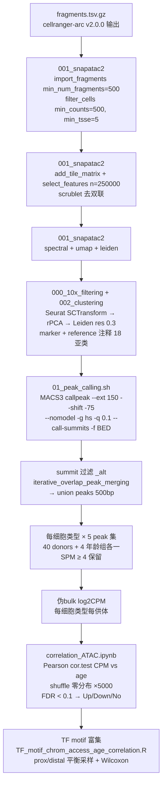

# GSE278576 人海马衰老 ATAC 对比流程（官方复现）

## 官方来源（2026-08-04 核实）

| 来源 | 路径 |
|------|------|
| **官方代码仓库** | `github.com/nrzemke/aging_human_hippocampus`（Zenodo DOI 10.5281/zenodo.19391232） |
| 本地克隆 | `E:\专利\Human_Hippocampus_ATAC\official_scripts\aging_human_hippocampus-main\` |
| 论文 | Science 2026-07-23, PMID 42490474, DOI 10.1126/science.adt8307 |
| 预印本 | bioRxiv 2024-10-17, PMID 39463924, DOI 10.1101/2024.10.14.618338 |
| GEO | GSE278576（80 samples = 40 donors × 10x Multiome + snm3C-seq） |
| 补充材料 | 本地 `papers\suppl_media1.pdf`（M&M 全文）+ `suppl_media2\`（Tables S1-S24） |
| 可视化 | https://epigenome.wustl.edu/seahorse/ |

**关键概念：该文不是 Young vs Old 分组比较，而是「连续年龄 Pearson 相关」——pseudobulk CPM 与供体年龄的相关性，FDR<0.1 判显著。** 与专利 S320/S330 设计一致，但它只做单物种（人）。

## 官方完整流程（脚本路径对应）



## 官方参数表（必须严格使用）

### 1. 数据导入 & QC（官方 `001_snapatac2_sample processing.py`）
```python
adata = snap.pp.import_fragments(
    [frag_paths], file=[name + '.h5ad'],
    chrom_sizes=snap.genome.hg38,
    min_num_fragments=500)
snap.pp.filter_cells(adata, min_counts=500, min_tsse=5, max_counts=1000000)
snap.pp.add_tile_matrix(adata)
snap.pp.select_features(adata, n_features=250000)
snap.pp.scrublet(adata); snap.pp.filter_doublets(adata)
snap.tl.spectral(adata); snap.tl.umap(adata)
sc.pp.neighbors(adata, use_rep="X_spectral"); sc.tl.leiden(adata)
```

### 2. Peak calling（官方 `02_feature_calling/01_peak_calling.sh`）
```bash
macs3 callpeak --treatment <celltype>.bed --ext 150 --shift -75 --nomodel \
  -g hs --name <celltype> -q 0.1 --call-summits -f BED
# summit 过滤: grep 'chr' | grep -v '_alt'
# 合并: iterative_overlap_peak_merging_1.R（snATACutils）→ union peaks
# 统一 500bp: summit ±250bp
```
> ⚠️ **官方代码用 MACS3 而非论文写的 MACS2**。参数核心一致（--shift -75 --ext 150 -q 0.1 --call-summits）。论文版还带 `--bdg -B -SPMR -f BAMPE`（BAM 输入），官方脚本用 BED 输入 `-f BED`。

### 3. 年龄相关分析（官方 `03_age_correlation/correlation_ATAC.ipynb`）
```r
# 输入: 每细胞类型 pseudobulk log2CPM 矩阵（行=peak, 列=donor）
age <- read.table('age.tsv')  # V1=donor, V2=age
# 供体过滤: cCRE 需供体平均 ≥1 count/cCRE
# 特征过滤: 总 counts ≥ 2 × 剩余供体数
pcc = foreach(i=1:nrow(cpm)) %dopar% {
  cor.test(as.numeric(cpm[i,]), as.numeric(age_mat[i,]), method="pearson")$estimate }
# shuffle 零分布: randomizeMatrix(cpm, null.model="richness", iterations=5000)
# 同法算 pcc_shuf → 密度图对比
pval = foreach(i=1:nrow(cpm)) %dopar% {
  cor.test(as.numeric(cpm[i,]), as.numeric(age_mat[i,]), method="pearson")$p.value }
pval$fdr <- p.adjust(pval$pval, "fdr")
comb$Age_Correlated[comb$fdr < 0.1 & comb$cor > 0] <- "Up"
comb$Age_Correlated[comb$fdr < 0.1 & comb$cor < 0] <- "Down"
# 输出: <celltype>_ATAC_pcc_donor_counts_filt_donors.tsv
#       <celltype>_pcc_fdr_0.1.tsv
```

### 4. TF motif 年龄相关（官方 `TF_motif_chrom_access_age_correlation.R`）
- 背景: 该细胞类型可及 peaks，proximal(≤1kb TSS) 和 distal 按比例平衡采样
- 统计: 每个 motif 的 scaled PCC vs 背景 Wilcoxon 检验 → FDR
- 火山图: x=scaled pcc, y=-log10(FDR)，正=#FC8961 负=#7F2582

## 运行步骤（本机 9 样本）

### Phase 0: 数据核对
- 9 样本 fragments（`E:\专利\Human_Hippocampus_ATAC\fragments\`）：hc77/hc78/hc5579/hc76/hc29/hc6052/hc5614/hc13344/hc935
- ⚠️ **9 个样本全部在 20-40 岁组**（Table_S1：20/20/25/26/28/28/31/33/38）→ 年龄跨度窄，Pearson 统计力有限；跑通流程为主，结论标注"仅 Young 组 pilot"
- 供体年龄映射：`Table_S1.tsv`（Donor ID → Age）
- fragments 头部注释确认 cellranger-arc-2.0.0

### Phase 1: fragments → h5ad（SnapATAC2）
- 输出: `results/.../snapatac2/{sample}.h5ad`
- 9 样本逐个 import（每个 1-3GB 压缩，单样本 <15min）

### Phase 2: 合并 + QC + 聚类
- merge → filter_cells → tile matrix → select_features → scrublet → spectral → leiden

### Phase 3: 细胞类型注释（ATAC-only 替代方案）
- 官方注释用 RNA（Multiome），本机只有 ATAC fragments → 用 marker 基因 TSS 附近可及性粗注释
- 海马 marker: SLC17A7(Ex), GAD1/2(Inh), GFAP/AQP4(Astro), AIF1/C1QB(Micro), MOG/MBP(Oligo), PDGFRA(OPC), CLDN5(Endo), VWF(Endo)

### Phase 4: Peak calling（MACS3）
- 每细胞类型 1 个 BED（或先用全细胞 call）→ MACS3 → summit 过滤 → union → 500bp
- ⚠️ MACS3 需安装（conda 或 pip）。Windows 上 MACS2 已知装不上（Cython 3+），MACS3 需测试。

### Phase 5: pseudobulk log2CPM + 年龄相关
- 每细胞类型 × 每供体：fragments 落在 union peaks 的计数 → log2CPM
- 官方 correlation 逻辑（Pearson + shuffle + FDR<0.1）→ Up/Down cCRE 列表

### Phase 6: 出图
- PCC 密度图（真实 vs shuffled）
- FDR<0.1 火山图（cor vs -log10FDR）
- 年龄相关 cCRE 热图（donor 列 × cCRE 行）

## 已知陷阱

0. **🔴 官方 cCRE 可复用（2026-08-04 验证）——本机首选路径**
   - 官方补充表 `Table_S7.tsv`（20.8MB）就是 **472,859 个官方 cCRE 全集**（坐标 chr-start-end + 18 亚类归属）！
   - **不需要自己 call peaks**（跳过 MACS3）+ **不需要 snapatac2**（Windows 无 wheel 装不上，2.10.0 需源码编译无 MSVC 必失败；2.9.0 也只有 macOS/Linux wheel）
   - 流程：官方 cCRE 坐标 → 自己 fragments 计数 → pseudobulk log2CPM → Pearson vs age（官方逻辑不变）
   - fragments 格式：`chr start end barcode count` 5 列，数据从第 51 行开始（前 51 行是 cellranger-arc 注释头）
   - 官方 Table_S1.tsv 提供 donor→age 映射（9 样本全 20-40 岁组）
1. **官方代码 MACS3 vs 论文 MACS2** — 以官方代码为准（-f BED 输入）；本机如走 cCRE 复用路径则不需要 MACS3
2. **细胞注释是 RNA-based** — 只有 ATAC 时用 marker TSS 可及性近似，注释质量低于原文
3. **9 样本全 Young** — 结论只能是"流程验证 + Young 组内趋势"，不能外推衰老结论；等 40 样本下齐再跑完整版
4. **snapatac2 装好后 torch 依赖** — 若报 CUDA 错误，确认 TMPDIR 在 E 盘（C 盘空间不足）
5. **R 4.5.3 环境** — 用 `C:/Program Files/R/R-4.5.3/bin/Rscript.exe` + `.libPaths(c("USER_R_LIBS/R-4.5.3", .libPaths()))`
6. **fragments 无细胞注释** — 无法直接对齐原文 18 亚类；聚类数/注释需按数据实际调整
7. **Windows bash 跑 R 可能 segfault** — 用 cmd.exe /c 包装或直接 execute_r

## 验收标准

- [ ] 9 个 h5ad 生成（SnapATAC2 import 成功）
- [ ] 合并后 QC 指标表（nFrags/TSSE 分布）
- [ ] UMAP + Leiden 聚类图
- [ ] 细胞类型注释图（marker TSS 可及性）
- [ ] MACS3 peaks（每细胞类型 × 数量统计）
- [ ] pseudobulk log2CPM 矩阵
- [ ] Pearson + FDR 结果表（Up/Down cCRE）
- [ ] 3 张核心图（密度/火山/热图）

## Common Issues / Pitfalls

### ⛔ ArchR Windows 多实例 tmp 目录竞争（2026-08-07 实测，40 样本批量）
- **症状**: 并发 3 跑 createArrowFiles → 5/7 样本在 `.filterCellsFromArrow` 阶段失败，错误 `Cannot open file 'E:\...\tmp\tmp-<hash>.arrow' does not exist`
- **根因**: ArchR 1.0.3 所有实例共享同一 `outputDirectory/tmp/`，多进程竞争清理临时 Arrow 文件
- **修复**: **必须串行跑**（并发 1）。`batch/run_serial.sh` 逐个样本跑，完成检查 `ArchR_Arrow_QC_Filtered/{s}/{s}_filtered_cells.csv`
- **验证**: hc77 单例成功（3841 cells QC → 3546 after doublet），hc78 并发失败后串行重跑成功
- **教训**: 60GB RAM 能撑并发 ≠ ArchR 能并发。ArchR 1.0.3 Windows 版单实例串行是唯一稳定模式

### ⛔ filterDoublets 后 DoubletFilter 列消失（统计 bug）
- **症状**: `sum(proj$DoubletFilter == "Doublet")` 恒返回 0，doublet_rate 显示 0%（实际过滤了 295 cells）
- **根因**: `filterDoublets()` 返回的 proj 只含 Keep 细胞，DoubletFilter 列已被移除，select 该列返回 NULL
- **修复**: 用过滤前后细胞数差计算 `n_doublet = n_before_doublet - n_cells_after`
- **注意**: filtered_cells.csv 中手动补 `DoubletFilter="Keep"` 列供 P4 使用，但该列不在 ArchR 元数据中

## Proven Scripts

> Auto-generated from actual analysis runs. Each row records a successful execution.

| 物种 | 组织 | 方向 | 日期 | 脚本 | auto | user | ✔ |
|------|------|------|------|------|------|------|----|
| human | hippocampus | aging | 2026-08-04 | - | - | - |  |
| macaca | hippocampus | aging | 2026-08-09 | l1_phylop_fill_v3.py | - | - |  |
| human | hippocampus | aging | 2026-08-09 |  l3_motif_compare.R | - | - |  |
| human | hippocampus | aging | 2026-08-11 | - | - | - |  |
