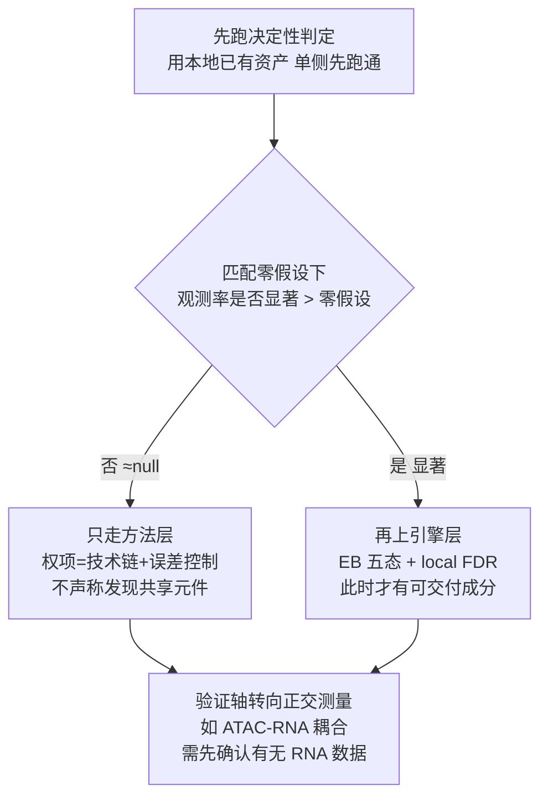

# 外部方法升级方案评估（用户贴另一 AI / 审稿人的「完整思路」时读）

## 何时用

用户把**另一个 AI 或审稿人**写的方法学改造方案整段贴进来，常见开场：

- 「我建议的完整思路 + 第一层…第二层…第三层…第四层…」
- 「这是另一个 AI 的思路和评价」
- 「你觉得这套思路怎么样 / 能救回来吗 / 要不要按它重做」

⚠️ 交付物是**逐层判定 + 可行性核对 + 顺序裁决**。不是附和、不是复述它的结论、不是替它找补。
用户要的是「这份方案哪里对、哪里是硬伤、我该先干什么」。

---

## 核心原则一：换更好的估计器 ≠ 造出信号

方案通常会写成一条递进链。先把它切成四层再判：

| 层 | 常见内容 | 能救什么 |
|---|---|---|
| 效应量估计层 | 弃 per-tile Pearson+Stouffer → pseudobulk 负二项/泊松 GLM；相对寿命年龄对齐；小组对比替代线性斜率；统一网格 + mappability/GC/深度分层 + matched base_rate 零假设 | 只能**消除技术假象**（有效自由度膨胀、全局漂移、网格错配）。不产生新信号 |
| 判定引擎层 | 弃硬阈值 `\|Z\|≥τ & p<α & 同向` → 二维经验贝叶斯五态混合 + local FDR | 只能**挽救方法学主张**（消掉 τ 的自由度、零分布自估、误差可控输出可进权项） |
| 验证轴层 | 脑区 / 细胞类型 / 模态（ATAC–RNA 耦合）/ 物种 四轴正交验证 | 唯一可能给出**正向发现**的层——因为它是**正交测量**，不是同一测量的重复 |
| 专利落点层 | 权项从「统计规则」搬到「具体技术链 + 可测量下游效果」+ 三基线横评 | 唯一能救一个**前提已塌的 claim** 的层 |

**判据**：先问「数据里到底有没有信号？」。若匹配零假设下观测率已落在 null，则引擎层的产出上限就是 0——
五态 EB 的「共享成分」后验质量必然 ≈0，这不是引擎不好，是地基决定了上层结论。
所以评估报告必须显式写出：**引擎层升级救的是方法学主张，不是生物学主张。**

反面句式（禁止沿用方案的口吻）：
- ❌「不需要辩护 12.3× 富集了，直接给误差可控的后验概率」——技术上对，但漏了「可能没有可给的东西」
- ✅「EB 会把『共享成分≈0』如实报出来；那是诚实答案，也是本方案的上限」

---

## 核心原则二：率类指标必须报三元组

**任何率类指标的修复前后对照，必须同屏给出 (观测率, 匹配零假设 base_rate, 配对 z)。**
只报绝对率变化 = 把零假设同步移动误读成信号增强。这是本项目实测踩过的坑（自我纠正）。

标本（2026-09-12，跨物种衰老可替代性专利，`M2/FIX_v10/04_combined/screening_success_rate.csv`）：

| 条件 | 观测率 | 匹配零假设 | 配对 z | 判定 |
|---|---|---|---|---|
| 基线 v9 (topK890) | 0.401 | 0.510 | **−6.67** | 显著**低于**随机 |
| 修复① 统一网格 (topK890) | 0.530 | 0.509 | **+1.30** | 与随机不可区分 |
| 修复② 深度校正 (topK890) | 0.526 | 0.504 | +1.34 | 与随机不可区分 |
| 修复① τ_A 门控 (n=82) | 0.634 | 0.556 | +1.67 | 与随机不可区分 |
| 修复② τ_A 门控 (n=55) | 0.582 | 0.463 | +1.89 | 与随机不可区分 |
| 修复③ 漂移消除 (topK890) | 0.392 | 0.502 | −6.50 | 无效 |

**读法**：修复①② 把「显著低于随机」纠正成「与随机无法区分」，**一步也没跨过随机**。
曾经的汇报「修复①把 40.1% 拉到 63.4%」是**误导性对比**——零假设也从 50.7% 升到 55.6%。
⇒ 汇报纪律：凡「某修复把 X% 拉到 Y%」，必须同屏给零假设 + z，并明说这是**纠正假象**而非获得信号。

---

## 核心原则三：z 对 K 的剖面是零成本真伪判据

- **真信号**：z 随取样量 K 增大而增强（检验力上升）
- **噪声**：z 呈「平台后衰减」

标本：统一网格后 z 在 topK 100 / 500 / 890 恒为 +1.24 / +1.27 / +1.30，到 2000 掉 +0.18、5000 变 −1.14 = 平台型 = 噪声。
看到平台型剖面即判无信号，**不要再往上加引擎**。

---

## 核心原则四：方案依赖的资产先盘真实库存

方案常照**论文资源描述**写依赖项，不等于是本地工作数据。回盘六项（全部用工具实查，不许照抄方案）：

1. 个体数与样本数
2. **脑区覆盖面**（样本名里的区域字段有多少种）
3. **模态**（有无 RNA / 表达矩阵文件——这决定 ATAC–RNA 耦合轴能不能立）
4. **元数据列**（有无 Sex / 批次等协变量——决定 GLM 的 covariates 能不能加）
5. **计数矩阵 / Arrow 是否本地**（决定「几小时能跑完」是否成立）
6. 分组大小（每组个体数，不是细胞数）

标本（本项目实测，与方案描述严重不符）：

| 项 | 方案/论文描述 | 本地实测 |
|---|---|---|
| 猴 | 23 只 × 8 脑区 × 双模态 | **21 只 / 63 样本 / 全部 `Hip`（仅 1 个脑区）** |
| 猴 RNA | 有 scRNA | **零 RNA/表达矩阵文件** |
| 猴协变量 | GLM 含「性别」 | **猴元数据无 Sex 列** |
| 猴计数 | — | 本地 Arrow 仅 **3/63** → 计数层重算须回集群 |
| 人 | — | 40 只 / 40 样本 / 20–89 岁 / 每组 10 只 / 20F:20M / **Arrow 40/40 齐全** |
| 猴年龄组 | 4 个「丛簇」 | 实为 4 个**年龄组**；Young **仅 4 只且全为 5 岁**；young vs old 实际 n=9 vs n=12 |

⇒ 依赖缺失资产的层，先标「**待确认**」，不要先承诺工期。

---

## 核心原则五：前提已塌时 claim 的两层重定位（方案这一层通常是对的）

方案的专利侧结论若与我们此前的两层判定一致，**要明确肯定它**：

- **方法层 ✅ 成立**：逐元件判定方向一致性可实施、可复现、双实现互证
- **结论层 ❌ 不成立**：判为一致 ≠ 保守集（保守集本该过半，实测 <50%）
- 落点只能是**方法**：权项从「统计规则」搬到「具体技术链 + 可测量下游效果」
- 对照实验三基线（①两队列各自筛选取交集 ②合并 Z 做 meta ③单物种筛选）× 三类指标（FDR / 跨脑区复制率 / 下游功能验证命中率）= 把技术效果从「我们发现了一个结论」改写成「筛选性能提升」
- 权项布局：方法 + 装置/存储介质 + 计算机程序产品
- ⚠️ **宽限期提醒**（法条层，务必主动说）：中国专利法第 24 条的宽限期**不含期刊发表**；自己发表的论文在本国法下就是自己的现有技术 → 申请要尽快，且权项必须落在论文未披露的技术特征上

---

## 核心原则六：顺序裁决——先做便宜的决定性检验

**禁止按方案全套重写后再等结果**（= 把返工风险放到最后）。正确顺序：

理由同 `references/claim-premise-first-verification.md` 的顺序铁律：**成本极低、且能杀死 claim 的检验默认 🔴 阻断级，排在数字优化之前。**

---

## 输出骨架（评估这类方案时直接用）

1. **一句话总评**：方向对不对 + 硬伤在哪（通常是「把换估计器当成救活信号」）
2. **逐层判定表**：层 / 它的主张 / 我的判定（✅ / ❌ / 🟡）/ 依据（本轮实查数字）
3. **必须纠正的事实清单**：含**纠正自己上一轮**的误导性数字（诚实优先）
4. **结论 + 建议顺序**：先做哪个便宜检验，再决定要不要上引擎
5. **待用户确认的资产缺口**：把「方案假设有、本地实测没有」的东西摆出来，让用户去核集群

⚠️ 第 3 条最重要：本类场景里「我上一轮报的数字」很可能也需要纠正（如把绝对率变化当改善）。
主动纠正自己的旧结论，比补充新分析更能建立可信度——用户会因为这一条而相信你的其他判定。

---

## 核心原则七：形态二 —— 「观测单位重构型」方案（比换估计器更低一层）

方案不一定停在「换统计量」。更高水平的方案会**下沉一层，攻击观测单位本身**，典型两个论点：

1. **组成混杂**：组织级 pseudobulk 的「衰老效应」混了两件事 —— ① 细胞类型比例随年龄变化 ② 细胞内在调控变化。前者高度依赖取材/注释/QC，后者才跨物种保守。
2. **年龄轴自由度**：参考物种可能只有 3–4 个年龄组，per-元件年龄斜率的分辨率被钉死，长尾噪声主导。

**这两个论点通常是对的**，而且实测往往比方案说得更严重。但判定时必须补三步，方案自己不做：

### ① 组成混杂：从「偏移存在」升级到「两侧构成不匹配」（🔴 决定性）

方案通常只举证「某细胞类型 Young vs Old 差得很大」。**这只是必要条件。真正的杀手是两数据集的细胞类型构成根本不同** —— 那时组织级 pseudobulk 在 A 侧测的和 B 侧测的**不是同一种细胞**，跨物种一致性被结构性压低。

实测标本（人 vs 食蟹猴海马 scATAC，2026-09-13）：

| | 人侧占比 | 猴侧占比 |
|---|---|---|
| ODC | **73.7%**（Young 56.11% → Old 73.69%，**+17.58 pp**） | 23.6%（24.32% → 23.56%，−0.76） |
| ExN | 5.4% | **46.3%**（43.62% → 46.32%） |
| Astro | 16.59% → 7.13%（−9.46 pp） | 15.16% → 14.94%（−0.22） |
| OPC | 5.67% → 3.10%（−2.57 pp） | 6.24% → 3.64%（**−2.60**，两侧幅度几乎相同） |

⇒ 汇报口径：「不是混了组成变化，是**两侧混的组成根本是两种细胞**」。这比方案原文强得多，也是 46% 低同向率的候选主因（机制坐实，量化待做）。

⚠️ 组成层报数规则：**必须报全年龄趋势，不能只比 Young vs Old 两端**。标本：猴 Astro 两端 −0.22 pp 看似不动，但 Middle 18.47% → ExcOld 9.68%，全年龄秩相关才看得出下降。

### ② 年龄轴：把「自由度」说准确（否则被审查员抓）

| 说法 | 判定 |
|---|---|
| 「只有 4 个独立年龄点」 | ⚠️ 不精确。精确说法 = **N 个年龄组**（数据集 `Age_group` 自己的分组）+ **M 个整数年龄** |
| 「只有约 4 个自由度」 | ⚠️ 形式残差自由度是 n−2；**有效年龄分辨率 ≈ 年龄组数**。写「有效分辨率 ≈4 级」，别写「df=4」 |
| 参考侧某组组内零方差 | ✅ 必查。标本：猴 Young 组 4 只**全为 5 岁** → 年龄轴最低端退化 |
| 个体数两处对齐 | ✅ 年龄表 vs 细胞元数据。标本：年龄表 20 个体、`monkey_meta` 21 个体/63 样本 → 有样本无年龄信息，须回问用户 |

### ③ 方案提议的「新判据」要同时查方向、价值、层次可行性（见原则八）

---

## 核心原则八：方案提议新判据 / 新发现层次时的三条判定

### 判据方向：用信号强的一侧训练、弱的一侧检验

方案常把「跨物种预测/迁移」写成 `参考物种训练 → 主体物种预测`。**先查两侧的年龄轴分辨率与样本量，方向很可能是反的。**

标本：方案写「猴训练 → 人预测年龄」，但猴只有 4 个年龄组、n=20 且最低端退化；人 27 个整数年龄、连续 20–89、n=40。**在粗的那一侧训练，MAE 被训练目标的颗粒度直接封顶。** 正确方向 = 人训练 → 猴检验（或人侧建衰老评分，再看它与猴年龄的 Spearman）。

### 判据价值：迁移/预测误差法**确实能修一个老硬伤**（要主动肯定）

「同向率」算的是 **concordance（一致性）**；「预测误差 / MAE」算的是 **substitutability（可替代性）**。claim 写「可替代性评估」而独权只算同向一致 = A22.2/A26.4 的「claim A 算的是 B」（见 SKILL.md 授权铁律表）。⇒ 迁移评分**把 claim 与计算对齐了**，这是真实加分，评估时必须点名，不要只挑毛病。

⚠️ 但别把「单一数字」讲成「没有脆弱性」：它换掉的是口径敏感性，换来的是**估计噪声**（n=20/40 个体做预测模型偏薄）。

### 发现层次上移：逐层核可行性，别照方案原文写

| 层 | 常见声称 | 必查 |
|---|---|---|
| 组成层（细胞类型比例曲线） | 功效极高（用全部细胞） | ✅ 通常成立；要求报全年龄趋势（见原则七①） |
| 程序层（TF motif） | 高 | chromVAR 类 motif 偏差 **可从 ATAC 做** |
| 程序层（**regulon**） | 高 | 🔴 **SCENIC 类需要 RNA —— 先查本地有无表达矩阵**。标本：本地零 RNA 文件 → 该半层直接砍掉 |
| 元件层 | 低 → 输出 | ✅ 同意；「在已验证语境里排序」与「筛选方法」定位一致 |

### 专利侧要分开评（别把三个法条混成一句话）

| 改动 | A25 客体 | A22.3 创造性 | A26.4 支持 |
|---|---|---|---|
| 细胞类型分层 pseudobulk | ✅ 加分（面向测序数据的具体处理步骤） | ⚠️ **不加分** —— 领域标准做法，本身无创造性 | ✅ |
| 统一同源元件网格 + 长度中性化门控 | ✅ | ✅ **真正的创造性来源** | ✅ |
| 迁移评分 | 🟡 | ✅ 加分（可量化技术效果） | ✅ |
| 组成层做发现 | 🔴 减分 | 🔴 减分（细胞比例随年龄变化是常识） | 🟡 |

🔴 **常见错报**：方案说「细胞类型分层顶 25.1(2) 比阈值强一个量级」→ 正确回应是「分层帮的是客体+支持，**不帮创造性**；创造性只能来自组合」。不要照抄方案的乐观句。

⚠️ 「细胞数」的归属必须核实：方案引用的 `69,047` 实为**猴侧** ExN 数（`monkey_meta` 计得 69,047），**人侧 ExN 只有 13,150**。分层后两侧每组细胞数差一个量级，会在跨物种比较里再制造一次混杂。

---

## 核心原则九：方案没附脚本时，照它的处方自己实现一遍

| 形态 | 识别信号 | 动作 |
|---|---|---|
| 形态一：自带脚本 | 附脚本清单 + 第一人称实跑叙述 | 一次调用跑完它全部脚本，逐位对账（见 `audit-report-verification.md` §3.5） |
| **形态二：只有散文 + 它自己的数字** | 无脚本，只有论点与数字 | 🔴 **照它写的处方自己实现一遍**，用它给的处方检验它自己的结论 |

形态二标本（2026-09-13）：方案主张「按 (n_h × n_m) 联合分层做匹配零假设」，我照此实现 → 分层零期望 0.5042±0.0038 与它给的数字逐位吻合，**但结论相反**（它说分层后反向消失，实测反向仍在 z=−10.83）。⇒ **复现它的数字 ≠ 复现它的结论**；两个都要报，且必须显式区分。

### 一次性探针

`scripts/observation_unit_audit.py` —— 一条命令跑完五段（细胞类型归属 / 组成偏移 / 两物种构成对比 / 资产可行性 / 年龄轴分辨率），并可出「组成偏移 + 年龄轴分辨率」三面板图。用法见脚本头 docstring。
