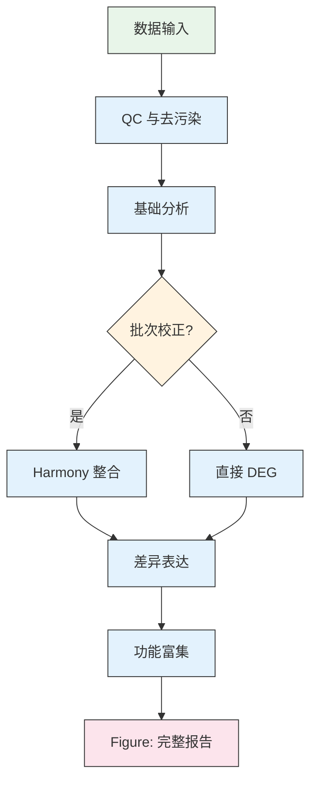

## 🧩 Skill — research-plan

### 📝 简介
根据用户的研究问题、数据类型和样本信息，自动确定适用的分析模块，输出 **Mermaid 树状技术路线图** + **每步目的·工具·预期产出对照表**。不限于 scRNA-seq — 空间转录组、ATAC-seq、bulk RNA-seq、多组学、跨物种比较、甚至纯思路问题，都能用同一格式给出方案。

---

### ⚙️ 功能详情

#### 1. 输入
| 字段 | 必需 | 说明 |
|------|------|------|
| 研究问题 | ✅ | 具体的研究问题或思路方向；若用户只描述思路未给数据，仍可设计"推荐分析路线" |
| 数据类型 | 可选 | scRNA-seq / scATAC-seq / 空间转录组 / bulk RNA-seq / CUT&Tag / 多组学 / 跨物种比较 / 无数据（思路咨询） |
| 物种 | 可选 | 人/小鼠/大鼠/斑马鱼/拟南芥/猴/跨物种比较 |
| 样本信息 | 可选 | 分组/批次/时间点/处理条件 |
| 比较方案 | 可选 | 如 "Treated vs Control"、"Old vs Young"、"猴 vs 人" |
| 个性化需求 | 可选 | 如 "要做免疫浸润分析"、"需要专利切入点"、"专硕应用类" |

#### 2. 步骤 1 — 数据类型判定 → 模块映射表

**首先**确认数据类型。若用户未给数据 → 按"思路咨询"模式给出推荐路线 + 数据产生建议。若给了数据类型 → 从下表选取：

##### 📦 scRNA-seq 模块
| 模块 | 触发条件 | 关键工具 |
|------|----------|----------|
| QC 与去污染 | 始终 | CellBender, DropletUtils, scDblFinder |
| 基础分析（聚类+注释） | 始终 | Seurat/Scanpy (SCT, PCA, UMAP, Leiden) |
| 批次整合 | >=2 批次 | Harmony/scVI/Scanorama + LISI/ASW/kBET |
| 差异表达 | 有比较方案 | presto, MAST, Wilcoxon, DESeq2 |
| 功能富集 | 有 DEG 结果 | clusterProfiler (GO/KEGG), GSEA |
| 轨迹推断 | 有时间序列/发育 | Monocle3, Slingshot, scVelo |
| 细胞通讯 | 多细胞类型 | CellChat, NicheNet |
| 调控网络 | 需要转录因子分析 | pySCENIC, GRNBoost2 |

##### 📦 scATAC-seq 模块
| 模块 | 触发条件 | 关键工具 |
|------|----------|----------|
| QC + 片段分布 | 始终 | Signac, ATACseqQC |
| Peak calling + 注释 | 始终 | MACS2, HOMER, ChIPseeker |
| 降维+聚类 | 始终 | Signac (LSI, UMAP) |
| TF motif 富集 | 始终 | chromVAR, JASPAR |
| 差异可及性 | 有比较方案 | Signac, edgeR |
| 足迹分析 | 需 TF 结合证据 | HINT-ATAC, TOBIAS |
| RNA+ATAC 联合 | 有配对 scRNA | Signac (gene activity), ArchR |

##### 📦 空间转录组模块
| 模块 | 触发条件 | 关键工具 |
|------|----------|----------|
| 空间 QC + 预处理 | 始终 | Seurat/Squidpy/Giotto |
| 空间特征可视化 | 始终 | SpatialFeaturePlot, spatialDE |
| 空间域/区域识别 | 始终 | BayesSpace, SpaGCN, StLearn |
| 空间可变基因 | 始终 | SPARK-X, spatialDE, trendsceek |
| 细胞类型反卷积 | 有 scRNA 参考 | RCTD, SPOTlight, cell2location |
| 空间通讯 | 有配体-受体 | COMMOT, SpatialDM |

##### 📦 bulk RNA-seq 模块
| 模块 | 触发条件 | 关键工具 |
|------|----------|----------|
| 质控 + 比对 | 始终 | FastQC, STAR, Salmon |
| 差异表达 | 有比较方案 | DESeq2, edgeR, limma |
| 功能富集 | 有 DEG 结果 | clusterProfiler, GSEA |
| 免疫浸润 | 需要微环境分析 | CIBERSORTx, TIMER, MCP-counter |
| WGCNA | 有性状数据 | WGCNA (共表达模块) |
| 药物靶点预测 | 有疾病组 | DrugBank, Connectivity Map |

##### 📦 多组学整合模块
| 组学组合 | 整合策略 | 关键工具 |
|----------|----------|----------|
| RNA + ATAC | gene activity bridge | Signac, ArchR |
| RNA + 蛋白(CITE-seq) | WNN | Seurat v5 WNN |
| RNA + 空间 | 反卷积 + 映射 | RCTD, cell2location |
| RNA + 甲基化 | 基因座关联 | MOFA, mixOmics |
| 跨物种比较 | 同源基因映射 + Domain Adaptation | Seurat CCA/Harmony, biomartr, OrthoFinder, XGBoost + SHAP |

##### 📦 跨物种比较专项模块（专硕应用类/专利导向）
| 模块 | 触发条件 | 关键工具 | 专利方向 |
|------|----------|----------|----------|
| 跨物种细胞类型对齐验证 | 两种物种的snRNA/scRNA数据 | Seurat FindTransferAnchors, SingleR | — |
| 细胞组成保守性分析 | 两物种均有young/old分组 | MiloR + Pearson相关性 | 细胞类型替代性指数(CTRI) |
| 跨物种DEG保守性 | 鉴定了各物种的衰老DEG | DESeq2 pseudobulk, Venn分析 | 保守性衰老基因面板 |
| 跨物种通讯比较 | 有细胞类型注释 | CellChat v2.1 compareInteractions | 信号通路替代性评分 |
| 跨物种衰老预测模型 | 物种A数据 → 预测物种B | XGBoost + Harmony Domain Adaptation + SHAP | 跨物种衰老预测模型专利 |

### 🧪 专利查新 — 方案含方法学创新点时必须执行

当方案涉及**方法学创新点**（评分系统、预测模型、基因集组合物等），先做5轮专利查新再推进分析：

**查新5轮覆盖**: (1) PubMed/Europe PMC (2) Semantic Scholar (3) Google Scholar中英文双通道 (4) 中国专利数据库关键词组合 (5) 全球专利数据库（Lens.org/Espacenet）

**查新后判断逻辑**:
| 查出什么 | 含义 | 行动 |
|---------|------|------|
| 相同技术方案已被授权 | ❌ 不可申请 | 报告用户换方向 |
| 有论文但无专利，概念部分重叠 | ⚠️ 需差异化 | 制作对比表突出差异 |
| 纯科学发现未包装为方法 | ❌ 不可直接专利 | 包装为方法/系统/模型 |
| 无任何命中 | ✅ 可申请 | 推进分析 |

**差异化对比表模板**（当存在最接近论文时，按以下格式制作）:
| 维度 | 现有文献（示例: He 2024 PLoS One） | 本方案 |
|------|-----------------------------------|--------|
| 物种对 | 鼠→人 | 猴→人（灵长类更接近） |
| 细胞类型 | 仅小胶质细胞 | 全海马细胞类型 |
| 方法深度 | 简单DEG比对 | 多维度加权评分系统S₁-S₅ |
| 量化输出 | 定性描述 | 量化评分+等级判定A/B/C/D |
| 预测模块 | 无 | 跨物种衰老预测模型 |

### 🧪 无实验样本的计算验证策略

当用户问"没有人脑实验样本怎么验证？"时启用。三层纯计算验证体系：

**层1: 内部交叉验证** — 物种A split young/old, CV测稳定性；物种A训练基因集→物种B验证

**层2: 外部独立验证（GEO公开数据）**
- 搜索GEO: `query = "{tissue} {species} aging single nucleus"`
- 常用人海马衰老数据集: GSE278576（40供体全寿命周期snRNA-seq+snATAC-seq）, GSE199243（13供体寿命周期胶质图谱）, GSE268609（78样本神经发生）, GSE185553（5供体寿命图谱）
- 评分系统在独立数据重新计算验证可重复性

**层3: 跨物种预测验证（核心）**
- 物种A训练XGBoost → 预测物种B数据 → 区分young/old
- 评估: AUC ≥ 同物种AUC×0.8 → 可替代
- 反向验证+SHAP解释一致性检验

**通过标准**: 层1 CV准确率>0.75 | 层2 评分S≥0.6 | 层3 AUC>0.75, SHAP一致性>0.6

### 🧪 多维可替代性评分系统 S₁-S₅ 公式

```markdown
S_total = w₁·S₁ + w₂·S₂ + w₃·S₃ + w₄·S₄ + w₅·S₅

S₁ = 细胞比例变化一致性 = Pearson r(Δprop_monkey, Δprop_human)   [w₁=0.15]
S₂ = 共享DEG比例 = |共享∩同向| / |共享∪特有|                      [w₂=0.25]
S₃ = 通路Jaccard = |pathway_monkey ∩ pathway_human| / |∪|         [w₃=0.20]
S₄ = 通讯保守性 = 共享显著通路 / 总显著通路数                       [w₄=0.15]
S₅ = 跨物种预测AUC = AUC(monkey_model → human_data)              [w₅=0.25]

等级: A (≥0.75) / B (0.50-0.75) / C (0.25-0.50) / D (<0.25)
```
权重可在Phase完成后由 debate_analysis 讨论调整。

**专硕应用类研究设计要点**:
- 研究方案必须以应用价值为导向：猴能否替代人做实验
- 必须有专利切入点：每个 Phase 至少对应一个可专利的技术方案
- 假说要回答实际问题，而非纯机制探索："能不能替代"比"机制是什么"更适合专硕
- Figure 策略必须包含"三一结构"：内容描述 + 具体数值预期 + 备选解读
- 每个创新点必须有技术方案细节（计算方法/公式/权利要求示例）

##### 📦 纯思路咨询（无数据）
| 场景 | 输出 |
|------|------|
| "我想研究X通路在Y疾病中的作用" | 推荐实验设计 + 可选组学技术 + 分析路线 + 预期发现 |
| "X 基因已知功能是什么，怎么研究它" | 文献已知功能总结 + 推荐下一步实验/分析 |
| "有什么生信方法可以解决X问题" | 方法综述 + 工具对比表 + 推荐路线 |
| "专硕要写专利，需要应用类动物研究方案" | 5-Phase方案 + 可专利点分析 + 应用价值突出 |

#### 3. 步骤 2 — 生成 Mermaid 技术路线图

**三种模式：**

| 模式 | 触发条件 | 输出 |
|------|---------|------|
| **双图模式（默认）** | 所有路线图咨询（RNA/ATAC/空间/Bulk/蛋白/多组学） | 主图 Flowchart TD + 辅图 Mindmap 思维导图 |
| **标准模式** | 用户明确说"只要流程图" | 单张 flowchart TD 树状图 |
| **CNS 级模式** | 用户说"CNS"/"深度"/"分阶段"/"太泛了" | 4 组件：总览漏斗 + 决策树 + 数据流 + 方法版本表 |

**双图模式规则（默认，适用于所有组学路线图）：**
> ✅ 主图用 **Flowchart TD** — 分支清晰、参数内嵌、色彩分区（classDef 6-8 色）、每节点含工具名和参数阈值
> ✅ 辅图用 **Mindmap** — 全景俯瞰、层级分明、无参数细节、用图标 emoji 前缀区分模块类型
> ✅ 两图必须同时输出，Flowchart TD 在前、Mindmap 在后
> ✅ Mindmap 的层级结构与 Flowchart 的 Phase 保持一致

**标准模式规则：**
> ⛔ 每节点 ≤15 中文字符 — 只写模块名
> ⛔ 最多 3 层 — 一级(阶段)、二级(关键步骤)、三级(产出)
> ⛔ 仅当用户明确要求"只要流程图"或"不用思维导图"时才降级到标准模式

**CNS 级模式规则（覆盖标准模式的限制）：**
> ✅ 节点可包含方法名和版本号（如 `"QC: nFeature 200-6000, MT<5%\nSeurat v5 + CellBender"`）
> ✅ 支持 5 层深度（数据输入→阶段→步骤→方法→Figure输出）
> ✅ 使用 `@{ shape: cyl, label: "..." }` 圆柱节点表示数据输入
> ✅ 使用 `{"决策问题"}` 菱形节点表示关键决策点
> ✅ 使用虚线箭头 `-.->` 表示条件分支（如"低质量→重新QC"）
> ✅ 每个 Phase 的最后一个节点指向对应 Figure 输出

**通用规则（两种模式都适用）：**
> ✅ 使用 `flowchart TD/LR` 格式（禁止 `graph TD`，Mermaid 11.x 已弃用）
> ✅ 不同模块用不同颜色区分（`classDef` + `class` 语法）
> ✅ 所有节点文本用双引号包裹

**⛔ **⏩ Mermaid 11.x 严格语法规则（违反即报错，已验证）:**
1. **🔴 致命: 括号 () 在未引号标签中 → 解析失败** — 必须用 `["QC (CellBinder)"]` 而非 `[QC (CellBinder)]`
2. **所有节点文本必须用双引号包裹**：`A["QC与过滤"]` 而非 `A[QC与过滤]`
3. **禁用字符**：`&` `<` `>` `{` `}` 放在节点文本中会报错
4. **节点 ID 只用字母+数字，不以下划线开头**：`N1` `N2` 而非 `_start`
5. **classDef 放在所有节点定义之后、class 引用之前**

**以下是经过 Mermaid 11.16.0 实际验证的模板——直接复制修改，不要自己编:**



**CNS 级 4 组件 Mermaid 说明：**

```markdown
### 3.1 总览：5 阶段漏斗递进
flowchart TD — 含数据输入圆柱节点、QC决策菱形、每阶段步骤→Figure输出

### 3.2 关键决策树：三条故事线的选择
flowchart TD — 菱形分叉，基于P2/P3/P5结果自动导向故事A/B/C

### 3.3 多组学数据流：跨Phase的数据传递
flowchart LR — snRNA/snATAC各自链路 + 跨组学虚线桥接 + 整合节点

### 3.4 方法与工具版本速查
表格 — Phase × 核心方法 × 包/版本 × 输入 × 输出 × 对应Figure
```

#### 4. 步骤 3 — 生成对照表

每个模块必须说明：
| 模块 | 目的（一句话） | 工具 | 预期产出 |

#### 5. 使用说明
- **触发条件**：用户询问"怎么分析"、"用什么方法"、"实验方案"、"技术路线"、"研究思路"时自动触发
- **调用方式**：`skill_view("research-plan")` 先加载本 skill，再生成方案
- **⚠️ 必须先读上下文**：生成方案前从历史消息提取研究问题、数据类型、物种、样本信息
- **⚠️ 不要给通用模板**：方案必须基于用户实际数据，没有数据就做思路咨询
- **🔴 致命规则 — 技术路线图必须出现在聊天回复中**：
  1. **方案写入 .md 文件后，必须把 Mermaid 代码块原样贴回聊天回复**
  2. 聊天回复格式：先用 1-2 句话概括方案，然后直接贴 ` ```mermaid ` 代码块
  3. **严禁**只写"方案已保存到 E:\..."不贴图表 — 用户看不到文件内容
  4. **严禁**用文字表格替代 Mermaid 图（如"3.1 总览 | 5阶段漏斗递进"）
  5. CNS 级模式至少贴 3.1 总览图，标准模式贴完整的 Part A 图

---

### 🔧 方案模板

**标准模式**（普通方案咨询，2 部分）：
每个方案必须包含 **两个互补部分**：

#### Part A: Mermaid 树状图
- 节点简洁（模块名 ± 产出名），≤15 字
- 层数 ≤3
- 用 `classDef` 区分模块颜色

#### Part B: 对照表
- 每个模块一行
- 4 列：模块 / 目的 / 工具 / 预期产出
- 目的用一句话说明"为什么做这一步"
- 预期产出具体到文件名级别

**CNS 级模式**（用户说"CNS"/"深度"/"分阶段" → 详见 `references/cns-level-plan-template.md`）：

必须包含 **15 个段落**：
1. 文献依据表（7-8篇 [KB]/[PMID] 标注）
2. 核心假说 H₀/H₁ + 4 条预测链
3. Gap 分析表（3 篇对比文献）
4. 创新性声明
5. 分析方法与论证（每步骤含理由）
6. **技术路线图 4 组件 Mermaid**（3.1 总览漏斗 + 3.2 决策树 + 3.3 数据流 + 3.4 版本速查表）
7. Phased 分析（每 Phase：生物学问题 + 方法表 + Figure 三一结构）
8. Figure 策略（含具体数值预期 + 备选解读）
9. 统计方案（功效 + 效应量 + 阴阳对照）
10. 实验验证路径
11. 备选方案与风险
12. 专利分析
13. 可执行待办
14. 可复现性声明
15. 质量检查（Loop Gate 10 项）

**Figure 三一结构**（CNS 级每张 Figure 必须）：
| 三一结构 | 内容 |
|---------|------|
| **内容** | (a)(b)(c)(d) 子图具体描述 |
| **预期** | 具体数值预测（如"Type II Young 49%→Old 29%→T2D 22%"） |
| **备选** | 如预期不符合的替代解读和后续分析调整 |

---

### 🔗 与其他 Skill 的协作

- **research-plan → task_plan.md**：方案生成后直接写入 `results/{session_dir}/task_plan.md`，作为分析蓝图。每个模块对应一个 Phase。
- **research-plan → 分析 skill**：根据选定的模块自动触发对应的分析 skill（如 `scrna-clustering`、`deg-analysis`、`cellchat-v2`）
- **与 SOUL.md 铁律联动**：`rail_review(pre)` 检查实际执行是否符合方案，偏差 >1 步 → 警告

### 🔄 Mermaid 失败兜底：HTML 技术路线图

**触发条件：** Mermaid 图渲染失败 ≥2 次（Syntax error / 空白 / 用户说"图没出来"/"重新生成"≥3 次）

**立即执行的兜底动作：**
1. **停止尝试修复 Mermaid** — 即使语法完全正确，Mermaid 11.x 在某些环境下也不稳定
2. **改用 HTML 文件交付技术路线图** — 使用 `templates/tech-roadmap-html.html` 模板
3. **HTML 优势**：自包含、无渲染依赖、支持复杂表格+流程图+Panel 布局+颜色编码
4. **写文件后提示用户直接打开**：浏览器打开 `file:///MEMOMICS_HOME/results/...html`

> ⛔ **不要在第 3 次失败后继续尝试 Mermaid。直接切 HTML。** 用户要的是可见的路线图，不是 Mermaid 语法正确性。

### 📁 参考文件

- **`templates/tech-roadmap-html.html`** — Mermaid 失败时的 HTML 技术路线图模板。
- **`references/mermaid-style-showcase.md`** — 同一流程六种 Mermaid 样式展示（Flowchart TD/LR、Mindmap、Gantt、Timeline、Sankey、State）。当用户要求"换一种展示方式"时加载。含 5 阶段卡片流 + Panel 布局网格 + 数据流表 + 故事线。颜色编码：🔴核心/🟡增强/🟢输出。
- **`references/cns-level-plan-template.md`** — CNS 级完整 15 段方案模板。当用户说"太泛了"/"不够深"/"分阶段"/"CNS级别"时加载。包含：文献依据表、H₀/H₁假说、Gap分析、Figure三一结构、专利分析、Loop Gate等所有必需段落。
- **`references/cross-species-hippocampus-aging-analysis.md`** — 跨物种海马衰老分析案例参考。
- **`references/cross-species-replaceability-framework.md`** — 🔑 五层递进可代替性评估框架（Level 1-5: IRS+SDI+cos(θ)+Mixed Model+ABCD基因分类）。专利级跨物种方法论，比 S₁-S₅ 更严谨。
- **`references/multi-group-subtype-deep-analysis.md`** — 复杂多组×亚型分析 Playbook。≥4 组 + 亚型分解的场景：伪bulk DEG/基因集评分/应答指数/多条件 DotPlot/轨迹推断。
