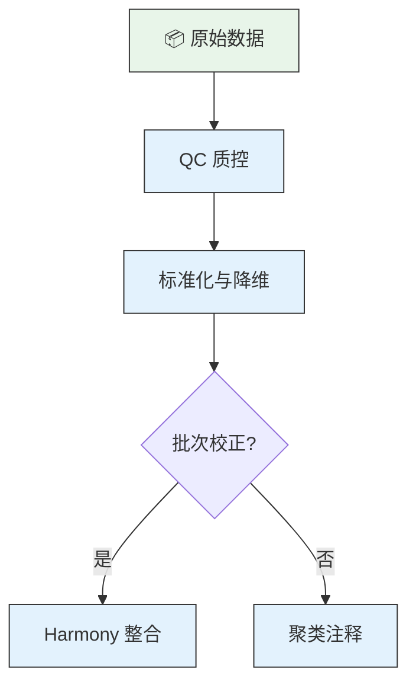
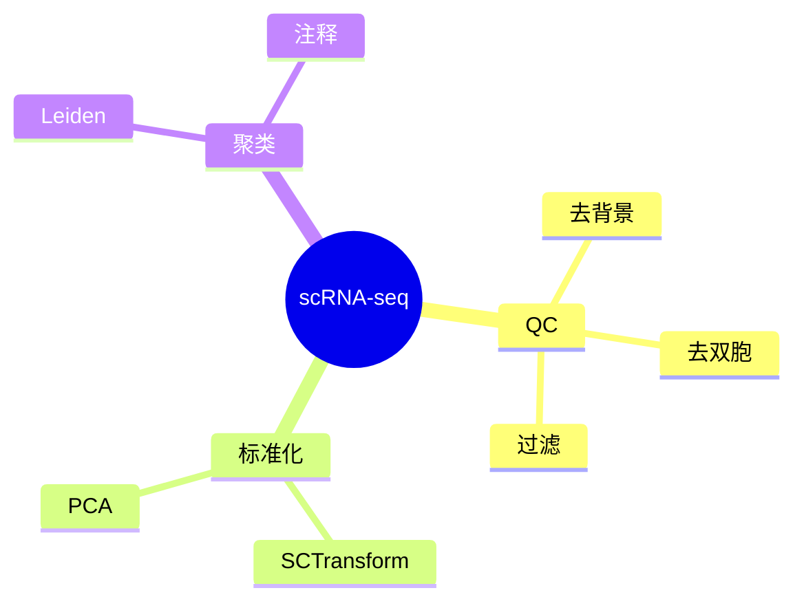

# Mermaid 图表样式展示 —— 同一流程六种表达

> 当用户要求"换一种展示方式"或"测试不同样式"时，用此参考文件。

## 六种样式及适用场景

| # | 样式 | Mermaid 类型 | 适用场景 | 一句话优势 |
|---|------|-------------|---------|-----------|
| 1 | Flowchart TD | `flowchart TD` | 详读、技术文档、参数内嵌 | 分支清晰、色彩分区 |
| 2 | Flowchart LR | `flowchart LR` | PPT、宽屏展示 | 从左到右符合阅读习惯 |
| 3 | Mindmap | `mindmap` | 全景概览、头脑风暴、汇报 | 层级清晰，一图看全 |
| 4 | Gantt | `gantt` | 项目排期、时间估算 | 时间+依赖关系一目了然 |
| 5 | Timeline | `timeline` | 阶段性里程碑汇报 | 简洁大气，适合复盘 |
| 6 | Sankey | `sankey-beta` | 数据量流动、漏斗分析 | 直观显示过滤/损失 |
| 7 | State Diagram | `stateDiagram-v2` | 技术文档、自动化流程 | 条件分支 + 子状态嵌套 |

## 用户偏好（已验证）

**默认组合：Flowchart TD（主图）+ Mindmap（辅图）**

- 主图：详细参数、色彩分区、classDef 6-8色
- 辅图：全景俯瞰、emoji图标前缀、层级与主图Phase一致
- 不主动提供其他样式，除非用户说"换一种展示方式"

## 典型用法示例

### Flowchart TD（主图）

### Mindmap（辅图）

## 已验证可用的 Mermaid 11.x 语法要点
- `flowchart TD` 不要用 `graph TD`
- 节点文本必须双引号包裹：`["文本"]`
- 禁用字符：`&` `<` `>` `{` `}`
- classDef 放所有节点定义之后
- Mindmap 不需要 classDef
