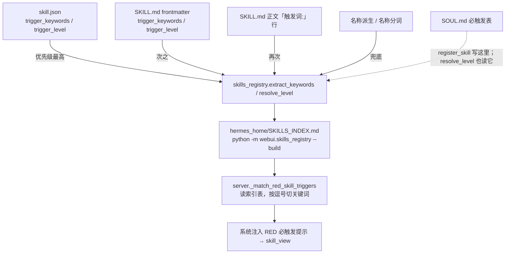

## ⛔ MemOmics 强制规则

1. 写代码前 `search_knowledge` + `skill_view`；2. 8 步循环；3. 写一步跑一步；
4. 关键参数多值 + `debate_analysis`；5. 执行后 `rail_review(post)`；
6. 结果落 `results/<sid>/`；7. 出错/成功走 `skill_evolution(record_error/record_run)`。

---

# 技能注册与触发路由（新建/改触发词后的必做管道）

> ⚠️ **每次新建技能的必做收工步**：`skill_manage(action="create")` **不会**自动生成 `skill.json`，
> 而 `scan_skills()` 的源码是 `if "skill.json" not in files: continue` ——
> **顶层没有 skill.json 的技能 = 不进索引 = 永不触发**。
> 2026-10-04 本 skill 自己就栽在这：只在 `templates/` 里放了 skill.json，顶层漏写 →
> 一次漏文件换来**三连锁门禁转红**（picker/索引漂移 + `templates` 幽灵技能 + 未入 git），
> 完整证据链见 `references/new-skill-json-missing-cascade.md`。
> 收工三步：
> 1. 复制 `templates/skill.json.template` → 本目录 `skill.json`（填 name / trigger_keywords / trigger_level）
> 2. `python -m webui.skills_registry --build` → `python scripts/check_skills_gate.py` → 通过后 `git add` 整目录
> 3. 复核：`python scripts/verify_skill_registration.py <skill-name>`
>
> **一句话铁律：`register_skill` 返回 success ≠ 技能能被触发。**
> 2026-10-04 实测：`register_skill` 成功、SOUL.md 已写入，但真实 matcher 命中为 `[]`——
> 技能等于没接上。根因是触发链路有 4 个数据源、有优先级、还有回填覆盖。

## When to Use

### ✅ 该用
- 新建了 skill（或改了触发词）→ **收工前必须过本 skill 的 7 步管道**
- 出现任一失败签名：真实 matcher 返回 `[]` / 索引行关键词看着像名称分词 /
  `test_webui_picker_and_prompt_index_agree` 红（`WebUI 有索引里没有的技能` / `索引缺少技能: <支撑目录名>`）/
  `test_every_red_skill_is_covered` 红 / `test_index_is_reproducible_from_committed_metadata` 红 /
  新建技能后**首次提交**就报 `这些技能的 skill.json 还没入 git` / `git commit` 被 `[skills-gate]` 拦下
- 用户说「技能没被触发」「建完技能怎么验证」「注册了但命不中」

### ⛔ 不该用
- **建一个新技能本身**（内容/文档/脚本）→ 走 `create-bio-skill`；本 skill 只负责**注册与触发落地**
- 改技能的分析内容、参数、脚本 → 与该技能自身相关，与本管道无关
- 只是查询技能列表 / 看某个技能能不能加载 → `skill_view` / `skills_list` 就够

## 触发链路全景（4 个数据源 + 优先级）



**四条源码级事实（决定了所有坑）**

1. `server._match_red_skill_triggers()` **读的是 `SKILLS_INDEX.md`**（解析表格行、`kw_cell.split(",")`），
   **不是**直接读 SOUL.md。SOUL.md 写对了但索引没重建 → 依然命不中。
2. `extract_keywords` 顺序 = `json → md.trigger_keywords → md.trigger.when → 正文触发词行 → 名称派生 → 名称分词`。
   **json 在最前**，所以 frontmatter 里写 `trigger_keywords` 会被 skill.json 盖过。
3. 采用门槛 `if len(kws) >= 2`。**只写 1 条 → 直接跌落到名称派生**。
4. `--build` 的回填会把**名称派生值写进 skill.json**，手写词被静默清掉。

名称派生的失败签名（一眼可辨认）：`figure layout geometry, layout, geometry` /
`cli anything, cli, anything` ← 出现这种「技能名 + 空格分词 + 单词」就是它。

## Pipeline：7 步（逐条可复现）

```bash
# 1) 目录必须落在被扫描的根：skills/ 或 hermes_home/skills/{bioinformatics,plotting}
#    （server.list_skills() 只扫这三个；放别的目录 → 索引有、WebUI 没有 → 测试红）

# 2) 触发词写进 skill.json（不是只写 frontmatter）；10-17 条，含包名/中文/英文/同义词/口语
#    "trigger_level": "RED",
#    "trigger_keywords": ["包名", "中文功能", "英文功能", "用户口语", ...]

# 3) 重建索引 + 复核索引行（必须看到自己的关键词 + "RED 必触发"）
python -m webui.skills_registry --build
grep '| <skill> |' hermes_home/SKILLS_INDEX.md

# 4) 真实 matcher 验收（唯一可信标准；不是看 SOUL.md）
python -c "import sys;sys.path.insert(0,'webui');import server;print(server._match_red_skill_triggers('一句真实用户口语'))"
#    期望 ['<skill>']；得到 [] → 回第 2 步

# 5) RED 技能补一条路由用例（真实口语，不要写技能名）
#    webui/tests/fixtures/skill_routing_matrix.json → cases: {id,intent,text,must_hit,max_hits}

# 6) skill.json 必须入 git（只 add SKILL.md 不够）
git add hermes_home/skills/<...>/<skill> webui/tests/fixtures/skill_routing_matrix.json hermes_home/SKILLS_INDEX.md

# 7) 提交前跑门禁（它会硬拦 commit）
python scripts/check_skills_gate.py     # 期望 [skills-gate] PASS
```

> 🔧 **一键体检（8 项）**：`python scripts/verify_skill_registration.py <skill-name>`
> 📋 **完整机制 / 失败签名 / 排查命令**：`references/skill-registration-pipeline.md`
> 📄 **skill.json 起手模板**：`templates/skill.json.template`（**必须带 `.template` 后缀**，理由见下方支撑目录铁律）
>
> 🚫 **支撑目录命名铁律**：`templates/` `references/` `scripts/` 里**绝不能出现字面名为 `skill.json` 的文件**。
> 扫描器是 `os.walk` 全树遍历 + `if "skill.json" not in files: continue` —— 任何含 skill.json 的目录都会
> 变成一个技能（**目录名即技能名**），于是 `templates/skill.json` 会在索引里生出名叫 `templates` 的幽灵技能，
> 门禁报 `索引缺少技能: templates`。模板一律加 `.template` 后缀（`skill.json.template`）。
>
> 🚫 **RED 用例必须字面含关键词**：matcher 是**子串匹配**（`kw in text`），新用例的文案里必须真的出现
> `trigger_keywords` 里某一条的**原样字串**——写「帮我用 ExtendScript 批量改 Illustrator 里的文字」，
> 而不是同义改写「用脚本批处理 AI 文件」；否则**用例自己先红**，看着像技能没注册成功。

## Parameters

| 项 | 值 / 说明 |
|----|----------|
| 被扫描的技能根 | 项目根 `skills/`；`hermes_home/skills/bioinformatics/`；`hermes_home/skills/plotting/` |
| 触发词条数 | ≥2 才被采用；**建议 10–17 条** |
| 关键词列分隔符 | 索引里按**逗号**切 → 关键词内**不能含逗号** |
| 索引构建 | `python -m webui.skills_registry --build` |
| 提交门禁 | `python scripts/check_skills_gate.py`（`SKILLS_GATE=0` 是官方逃生阀，非必要不用） |
| 触发校验脚本 | `hermes_home/skills/bioinformatics/create-bio-skill/scripts/verify_skill_trigger.py`，可传 `SKILLS_BASE` 覆盖分类目录 |

## Common Issues

| 现象 | 根因 | 修法 |
|------|------|------|
| `_match_red_skill_triggers("自然语言")` → `[]` | 索引该行关键词是名称派生 | 真关键词写进 **skill.json** → `--build` → grep 索引行复核 |
| 索引行关键词 = 技能名 + 空格分词 + 单词 | 原本只有 1 条关键词（`len>=2` 不成立）→ 跌落名称派生 | 补到 ≥10 条，重建 |
| 手写关键词「自己消失了」 | `--build` 回填用名称派生值覆盖 | 写完 skill.json 后**必须 grep 复核**；被清了就重写 |
| `索引有 WebUI 看不到的技能: ['X']` | 技能目录不在 `list_skills()` 扫描根 | 迁到 `hermes_home/skills/bioinformatics/` |
| `有 N 个 RED 技能没有任何路由用例` | RED 技能未进 `cases` | 补用例（先确认能命中），或写 `coverage_exempt` + 理由 |
| `这些技能的 skill.json 还没入 git` | skill.json 未跟踪 | `git add <技能目录>`（整目录） |
| `[skills-gate] 提交已被拦下：技能门禁未通过` | 门禁 exit=1 | 修到 PASS 再提交 |
| `register_skill` 返回 `already_registered` 且关键词没更新 | 该 action 对已注册技能**不更新关键词** | 手改 `SOUL.md` 注册行，或改 `skill.json` 后重建索引 |
| 两次 `--build` 后索引字节数不同 | 非确定性回填在写文件 | 复核 skill.json 是否被改写；索引应可复现 |
| frontmatter 写了 `trigger_keywords` 仍不生效 | skill.json 优先级更高 | 挪到 skill.json |
| `索引缺少技能: templates`（幽灵技能叫支撑目录名） | 支撑目录里放了**字面名为 `skill.json`** 的文件；`os.walk` 全树遍历，任何含 skill.json 的目录都被当成技能 | 模板改名 `skill.json.template` → 重建索引 → 门禁（`references/new-skill-json-missing-cascade.md`） |
| `WebUI 有索引里没有的技能: ['<新技能>']` | 新建技能**顶层漏写 skill.json** → `list_skills()` 列出它、`scan_skills()` 跳过它 | 补顶层 skill.json（≥2 条关键词，建议 10–17 条）后重建 |
| `这些技能的 skill.json 还没入 git`（新建技能时必现） | 刚创建的 skill.json 未跟踪；索引可复现性测试读的是**暂存区** | `git add <技能目录>` **整目录**（连带 templates/ references/ scripts/） |
| 某 skill.json 的 diff **只有换行符**（`--numstat` 显示 N/N 对称、`git diff` 全是 `+...\r`） | 写它的代码缺 `newline="\n"`（`webui/server.py` 的技能写接口），Windows 下 `\n` 被翻成 `\r\n`；**内容逐字节相同** | 无内容损失 → `git checkout -- <file>` 还原；**别把它当真改动提交** |
| 提交前发现几百个 skill.json 变脏，怀疑是自己弄的 | 结论要靠 mtime，不靠感觉 | 按 mtime 分桶统计（`os.path.getmtime` 按日期计数），再与**会话起始快照的 git 计数**对齐——本轮 416 M 全程未变，299 个是 09-23 遗留积压，与我无关 |
| 连续多轮重跑门禁被系统判「循环失控」 | 为换解释器/换 grep 反复跑同一个 ~95 s 的门禁 | **一次跑完取汇总**：`.venv/Scripts/python.exe -m pytest ... -q \| tail`（pytest 一律走项目 venv），PASS 就停手；只有出现 `failed` 汇总行才带着报错原文重跑一次 |

## Proven Scripts

> 经实际运行验证成功的脚本记录。`skill_evolution(action="record_run")` 自动追加至此表。

| 物种 | 组织 | 方向 | 日期 | 脚本 | auto | user | ✔ |
|:----|:----|:----|:----:|:-----|:----:|:----:|:-:|
| - | - | 技能注册 | 2026-10-04 | verify_skill_registration.py | 8 | - |  |

## References

- 本项目源码（权威口径，改动以此为准）：`webui/skills_registry.py`（`extract_keywords` / `resolve_level` /
  `scan_skills` / `_read_soul_red`）、`webui/server.py`（`list_skills` / `_match_red_skill_triggers`）、
  `scripts/check_skills_gate.py`、`webui/tests/test_skill_routing_matrix.py`、`webui/tests/test_skills_registry.py`
- 建技能的内容规范：`skill_view("create-bio-skill")`（该 skill 的注册章节与实际机制有历史偏差，见
  `references/skill-registration-pipeline.md` §6）
- 本 skill 的详细机制笔记：`references/skill-registration-pipeline.md`
- 缺顶层 skill.json 的**三连锁失败链**（逐条报错原文 + 根因 + 修法 + 复核证据）：
  `references/new-skill-json-missing-cascade.md`

---

## ⛔ Terminal 完成后强制协议（铁律 26）

```
1. rail_review(phase='post')
2. debate_analysis(topic="{注册/触发改动}", context="改动+索引行+matcher 返回+门禁结果")
3. skill_evolution(action="record_run")
4. 更新 task_plan.md
```