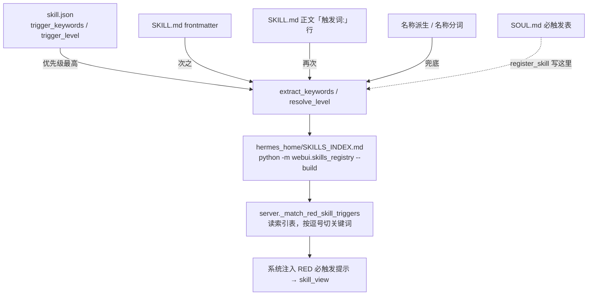

# MemOmics 技能注册与触发管道（机制 · 失败签名 · 排查命令）

> 2026-10-04 实测整理。**每次新建 skill 或改触发词后都要读这一份。**
> 核心结论：`register_skill` 成功 ≠ 触发生效。触发链路有 4 个数据源，
> 它们的优先级和回填行为决定了「你以为注册了、其实命不中」。

## 1. 触发链路全景



## 2. 源码级事实（改动以此为准）

| 事实 | 位置 | 后果 |
|------|------|------|
| matcher 读 **SKILLS_INDEX.md**，不读 SOUL.md | `webui/server.py::_match_red_skill_hits` | SOUL.md 写对但索引没重建 → 命不中 |
| 索引行关键词按 **逗号** 切 | 同上 | 关键词内不能含逗号 |
| json 优先级 **高于** frontmatter | `webui/skills_registry.py::extract_keywords` | frontmatter 写 `trigger_keywords` 会被盖过 |
| 采用门槛 `len(kws) >= 2` | 同上 | 只写 1 条 → 直接跌落名称派生 |
| RED 判定 SOUL.md 优先，其次 json/md `trigger_level` | `resolve_level` | `trigger_level: "RED"`（大写 RED/YEL/GRN/WHT） |
| `--build` 会把名称派生值写进 skill.json | 回填路径 | 手写词被静默清掉，必须 grep 复核 |
| `list_skills()` 只扫三个根 | `webui/server.py::list_skills` | 放别的目录 → 索引有、WebUI 没有 |

**索引行的列位置**（脚本解析用）：`| N | name | desc | keywords | level |` →
`line.split("|")` 后 `[-3]` = 关键词列，`[-2]` = 触发级别列。

## 3. 失败签名 → 定位 → 修法

| 现象 | 根因 | 修法 |
|------|------|------|
| `_match_red_skill_triggers("自然语言")` → `[]` | 索引该行关键词是名称派生 | 真关键词写进 **skill.json** → `--build` → grep 复核 |
| 关键词列 = `技能名, 技能 名 空格分词, 单词` | 原只有 1 条关键词，`len>=2` 不成立 | 补到 10–17 条，重建 |
| 手写关键词「自己消失」 | `--build` 回填覆盖 | 写完立即 grep 复核，被清了重写 |
| `test_webui_picker_and_prompt_index_agree`：`索引有 WebUI 看不到的技能: ['X']` | 目录不在扫描根 | 迁到 `hermes_home/skills/bioinformatics/`（或 `plotting/`） |
| `test_every_red_skill_is_covered`：`有 N 个 RED 技能没有任何路由用例` | RED 技能未进 `cases` | 补用例（先确认能命中），或写 `coverage_exempt` + 理由 |
| `test_index_is_reproducible_from_committed_metadata`：`这些技能的 skill.json 还没入 git` | skill.json 未跟踪 | `git add <技能目录>`（整目录，不是只 add SKILL.md） |
| `[skills-gate] 提交已被拦下：技能门禁未通过` | `scripts/check_skills_gate.py` exit=1 | 修到 `[skills-gate] PASS` 再提交；**别急着 `SKILLS_GATE=0` 绕过** |
| 两次 `--build` 后索引字节数不同 | 非确定性回填在写文件 | 复核 skill.json 是否被改写；索引应可复现 |
| `register_skill` 返回 `already_registered`，关键词没更新 | 该 action 对已注册技能不更新关键词 | 手改 `SOUL.md` 注册行，或改 skill.json 后重建 |

## 4. 权威命令序列

```bash
# A. 目录：hermes_home/skills/bioinformatics/<skill>/   ← 必须在扫描根下

# B. skill.json（真关键词 ≥10 条；从 templates/skill.json 复制改）
#    "trigger_level": "RED",
#    "trigger_keywords": ["包名", "中文功能", "英文功能", "用户口语", ...]

# C. 重建索引
python -m webui.skills_registry --build
#    末行形如：已写入 .../SKILLS_INDEX.md (N 行 / M 字符)

# D. 复核索引行（必须看到自己的关键词 + RED 必触发）
grep '| <skill> |' hermes_home/SKILLS_INDEX.md

# E. 真实 matcher（唯一可信验收）
python -c "import sys;sys.path.insert(0,'webui');import server;print(server._match_red_skill_triggers('一句真实用户口语'))"

# F. 路由矩阵用例 → G. git add → H. 门禁
python scripts/check_skills_gate.py     # 期望 [skills-gate] PASS
git add hermes_home/skills/<...>/<skill> webui/tests/fixtures/skill_routing_matrix.json hermes_home/SKILLS_INDEX.md
```

## 5. 路由用例（fixtures）格式

```json
{ "id": "<skill>-01", "intent": "口语",
  "text": "用户真会说的一句话（不要写技能名）",
  "must_hit": ["<skill>"], "max_hits": 3 }
```

- `must_hit` 中的技能**必须被命中**；`max_hits` 是命中上限（防泛滥）。
- `distractors` 是「必须零命中」的闲聊句。
- **写用例前先用 matcher（E 步）确认标的句真能命中**，否则用例本身就是错的。
- `intent` 是口径标签（「直白」「口语」），不是技能名。

## 6. `create-bio-skill` 文档与实际机制的历史偏差

`create-bio-skill` 是**人工撰写**的 skill，本章节仅供对照，**不要直接改它**：

- 它 Step 9 只说 `skill_evolution(action="verify_delivery_gate")`；本仓库实际的提交门禁是
  **`scripts/check_skills_gate.py`**（索引一致性 + 全量测试），**以脚本为准**，两者都要过。
- 它 Step 8 认为「`register_skill` 写进 SOUL.md 即可触发」——**不成立**，索引不重建就命不中（§1）。
- 它的 Step 4 要求写 skill.json，但没写「`trigger_keywords` 必须进 json、必须 ≥2 条、必须 grep 复核」。
- `verify_skill_trigger.py` 支持 `SKILLS_BASE` 环境变量覆盖分类目录（默认只找 `bioinformatics/`），
  别因为默认路径找不到就误判成技能写错。

### 6.1 两条更靠前的落地事实（2026-10-04 实测）

- **`scan_skills()` 会跳过没有 `skill.json` 的技能**（源码 `if "skill.json" not in files: continue`）；
  而 `skill_manage(action="create")` **不会**自动生成 skill.json。
  → 建完技能当时**根本不进索引、不会触发**。这比「关键词写错」更靠前，
  是「新建技能后像没触发」的第一大原因。必须自己写 skill.json 再 `--build`。
- **策展（curator）只改「agent-created」技能**：若技能的记录是 `created_by=None`
  （人工撰写，或早期创建未记录），后台策展会**拒绝**修改它，返回
  `Manually authored skills are off-limits to autonomous curation`，补丁与写文件都被挡。
  此时只能在**主会话**里改，或另建一个厂级 umbrella 承载这部分知识——
  本 skill 正是这样产生的（`create-bio-skill` 与 `cli-anything` 都是 `created_by=None`）。
- **给已存在的文件打补丁前，必须与 `skill_view` 同一条消息里发出**：
  后台策展的 read-before-write 守卫按「本轮是否读过该文件」判定，
  跨消息先读后写会被拒（`_read_before_write_required`）。新建文件不受此限。

## 7. 本机实例（可用于对照的已验证样本）

- `cli-anything`（2026-10-04 建）：全部 7 步走通，索引行关键词 16 条 + `RED 必触发`，
  matcher 对「CLI-Anything 是干什么的？帮我装一下 cli-hub」命中 `['cli-anything']`。
- `figure-layout-geometry`（既有缺陷实例）：skill.json 的 `trigger_keywords` **只有 1 条**
  （`["某张程序化画的图"]`）→ 跌落到名称派生 → 索引里只剩 `figure layout geometry, layout, geometry`
  → **一个 RED 技能自然语言永远命不中**，也就成了门禁里「无路由用例」的那一个。
  按其 SKILL.md 第 7–9 行的权威触发词回填 16 条后恢复正常。
  → **教训：`trigger_keywords` 只有 1 条 = 等于没写。**