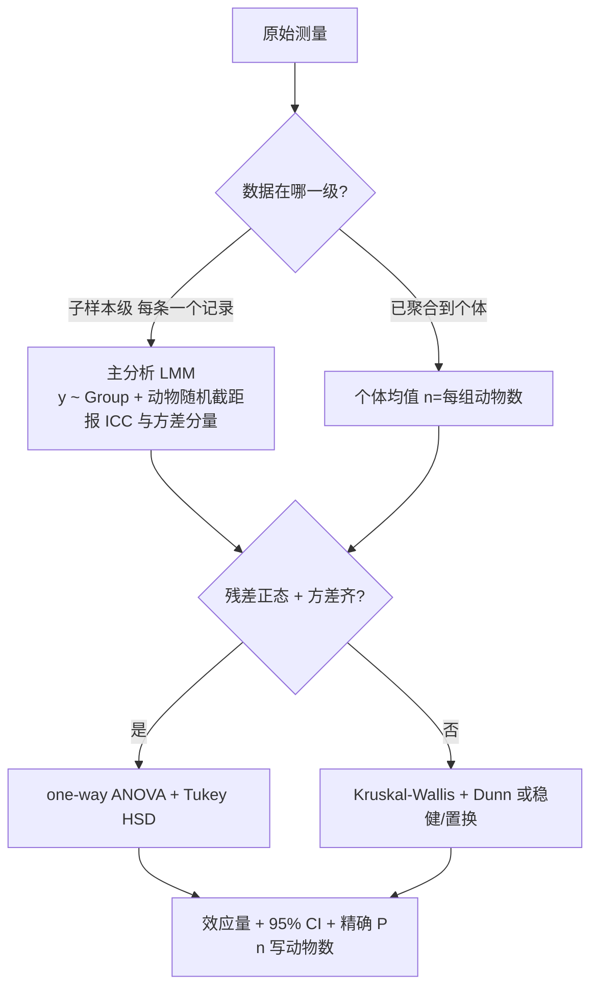

# 统计方案审查（Statistical Design Review）

审查**已提出**的统计方案（不是帮用户设计新实验），产出 = 严重度分级的问题清单 + 可落地的正确做法 + 复核证据。
上游设计与功效规划见 `experimental-design-statistics`；统计报告口径与失败模式分类见 `nature-statistics`
（本 skill 与它们互补：它们讲"怎么设计 / 怎么写方法学"，本 skill 讲"**怎么审一份已成型的方案并给出修正**"）。

## 何时用 / 何时不用

- ✅ 用户话里同时有**设计**（组数、每组 n、测量层级）+ **统计方法**（t 检验/Pearson/ANOVA…），并要求审/挑错/给正确做法。
- ✅ 只给了方法没给数据 → **照样能审**（本 skill 用模拟数据演示偏差，不依赖用户数据）。
- ❌ 只是问某个检验的定义（走 knowledge 查询）。
- ❌ 用户给了数据要"帮我跑分析"（走对应分析 skill，不适用本流程）。

## 🔴 核心手法：用模拟数据把偏差跑出来（本 skill 的命门）

**不要只断言"这样会有伪重复、p 值会虚小"**——按用户的设计造一份模拟数据，把**错误口径与正确口径的 p 值并排**给出来。
这一步把"我认为"变成"跑出来就是这样"，是这类审查唯一有说服力的证据；也是后续 rail_review(post) 的图来源。

一个脚本做完（避免多轮往返）：按真实设计造数（组数 × 每组动物数 × 每只子样本数，组间效应取小/中 `d≈0.5`）→
① 错误口径（子样本当 n，未校正两两 t）② 个体均值 + ANOVA + Tukey ③ LMM + ICC ④ 功效表 → 打印对照表。

**可直接引用的实测数字（2026-09-25，小鼠 3 组×6 只×16 根纤维/只，真实效应 d=0.5）**：

| 口径 | A-C / B-C 的 P | 判定 |
|---|---|---|
| 纤维当 n=288，两两 t 检验 | 3.7e-05 / 1.6e-03 | ✗ 虚假显著 |
| 每只小鼠均值（n=6/组）+ ANOVA + Tukey | 0.174 / 0.457（p adj）| ✓ |
| LMM `y ~ Group + (1\|Mouse)` | 0.091（C vs A），**ICC=0.313** | ✓ 推荐 |

话术：**"同一批数据，原方案报出 P<0.001，正确做法是阴性"**；ICC≈0.31 = 个体间方差占 1/3 ⇒ 子样本不独立的量化证据。
功效（n=6/组，α=0.05）：d=0.5 → **0.12**；0.8 → 0.24；1.2 → 0.47；1.5 → 0.65；3 组 ANOVA → **0.27**。

现成探针：`scripts/stats_plan_audit_demo.R`（改开头参数即可套用到任何"多层测量 + 多组比较"设计）。

## 输出骨架（照此组织，别写成散文）

1. **一句话结论 + 严重度标签**（"方向对，但有两处 P0 会被审稿人打回"）。
2. **逐条问题表**：`级别 | 问题 | 为什么错 | 后果`。
3. **实测证据**（上节的对照表 —— 数字优先）。
4. **正确做法**：比较类 / 相关类 / 样本量与可复现分块给，配检验选择流程。
5. **可复用代码**：能直接粘的 R 片段；缺包给安装命令但**不擅自安装**（铁律 29）。
6. **待补信息 AUTHOR_INPUT_NEEDED**：只列**会改变下一步动作**的问题（测量层级、是否配对、协变量、细胞数）。
7. **参考来源**：KB/技能 + ≥2 篇带 PMID/DOI 的文献 + 本次模拟复现的脚本/图路径。

## 五大红旗（P0/P1 速查，带判据）

| 级别 | 红旗 | 判据 / 要说清什么 |
|---|---|---|
| **P0** | **分析单位错位（伪重复）**：纤维/细胞/视野/孔/读数都不是独立实验单位 | 动物/供体才是 n；报 **ICC 或方差分量**作证据 |
| **P0** | **多组两两 t 检验未校正** | k 次比较 FWER = `1-(1-α)^k`；3 次 = **14.3%** → ANOVA + Tukey/Dunnett 或明确预指定比较族 |
| **P1** | **比例/组成数据直接 Pearson** | 受限 [0,1] + 和恒为 1 + 二项抽样误差 + 常非正态 → logit/CLR/ILR 变换或 beta 回归 |
| **P1** | **相关分析忽略分组** | 多组合并画一条线 = 组间均值差被读成"相关"（Simpson 悖论）→ 偏相关 / 分组散点 / Group 入模 |
| **P1** | **小样本无功效说明** | 给 MDE（最小可检测效应）；`n=6/组` 只能检出大效应 |
| **P2** | 只报 P 无效应量/CI；比较族未定义；配对/区组不明；技术重复当独立点；体重等协变量未纳入 | 报告 = 效应量 + 95% CI + 精确 P + **n 的定义（一律写动物数）** |

配套：**相关 ≠ 因果**（措辞限"关联"）；**技术重复先平均**；**有序因素（剂量/年龄梯度）用趋势检验**（线性趋势 / Jonckheere-Terpstra）而非两两比较。

## 正确做法

### 比较类（多层测量的多组比较）


> mermaid 节点文字里**不要写竖线**（会破坏解析）——随机截距写"动物随机截距"而不是 `(1|Animal)`。

- 主分析 LMM，**同时给一个不依赖 LMM 的敏感性分析**（个体均值 + ANOVA + Tukey 或 Kruskal-Wallis + Dunn）；两法一致才下结论。
- 子样本按类型分层（如纤维类型 I/IIa/IIx）→ 类型进固定效应：`y ~ Group*FiberType + (1|Animal)`。

### 相关类（有界变量 vs 连续表型）

1. **单位对齐**：每个个体一个配对点；表型重复测量先取均值；**细胞数决定比例精度，不能当 n**。
2. **变换**：logit / CLR / ILR；出现 0/1 → 零替换（如 +0.5）或 beta 回归。
3. **主分析**：Spearman（对单调非线性/离群稳健）+ Pearson 作敏感性；比例在 (0,1) 且要建模方差 → beta 回归。
4. **控制分组**：偏相关（残差法即可，零依赖）或 Group 入模；各组截距不同时优先"分组散点 + 组内/偏相关"，**不要合并成一条总体相关线**。
5. **多重比较**：多个细胞类型 → BH-FDR。
6. **报告**：r 或 ρ + 95% CI + n + 精确 P + 分层散点图。

### 样本量与可复现
n 太小且无法加动物 → 方法里写功效/MDE，结论降级为探索性；**投稿前冻结统计分析计划（SAP）**（主模型/校正/变换/离群规则事先写死，防事后试到显著）。

## 可复用 R 代码（2026-09-25 实测跑通）

```r
library(lme4); library(lmerTest)                        # 主分析
m <- lmer(CSA ~ Group + (1 | Mouse), data = fiber)
car::Anova(m); VarCorr(m)                               # 组间主效应 + 方差分量/ICC
emmeans::emmeans(m, pairwise ~ Group, adjust = "tukey") # 未装 → 先问用户再装

# 敏感性分析：不依赖 LMM。⚠️ 按分组聚合用 tapply，不要 aggregate（字符型分组列报 non-numeric-alike）
mu  <- tapply(fiber$CSA, fiber$Mouse, mean)
grp <- tapply(as.character(fiber$Group), fiber$Mouse, function(x) x[1])
agg <- data.frame(Mouse = names(mu), Group = factor(grp), CSA = as.numeric(mu))
TukeyHSD(aov(CSA ~ Group, data = agg))
rstatix::kruskal_test(CSA ~ Group, data = agg)          # 非正态备选

# 比例 - 表型（每个体一个点）
d$lg <- qlogis(pmin(pmax(d$prop, 1e-3), 1 - 1e-3))      # logit 变换
cor.test(d$lg, d$grip, method = "spearman")             # 稳健主分析
rx <- resid(lm(prop ~ Group, d)); ry <- resid(lm(grip ~ Group, d))
cor.test(rx, ry)                                        # 偏相关（残差法，替代 ppcor，零依赖）

power.t.test(n = 6, delta = 0.5, sd = 1)$power          # 0.12
```

依赖现状（本机实测）：`lme4 / lmerTest / rstatix / car` 已装；`emmeans / betareg / ppcor` **未装** →
偏相关用残差法替代 ppcor；emmeans/betareg 给安装命令但先征得用户同意。
执行：脚本落盘后 `source('<abs path>', encoding='utf-8')`（`exec(open(...).read())` 是 Python 配方，R 没有 exec）。

## 诊断图（统计审查也该出图，且这是过 rail_review(post) 的正解）

rail_review(post) 对无图脚本硬判 failed（`未生成任何图片`）。**正解不是凑占位图，而是出一张真实诊断面板**（本身就是交付内容）：
四联图（`par(mfrow=c(2,2))`，base graphics，零依赖）= A 伪重复代价（`-log10(P)` 双色柱 + 0.05 阈值线）/ B 嵌套结构（逐动物箱线 + 动物均值点）/
C 功效缺口（power vs n 三条线 + n=6 标注）/ D 比例-表型散点（按组着色 + 三口径相关值）。

🔴 **中文标签在 R 里能出**：`png(f, width=2600, height=2100, res=200, type="cairo")` + `par(family="Microsoft YaHei")`
（实测：中文正常、无 `mbcsToSbcs` 警告、文件正常落盘）。**先试这一行，别默认切 Python。**

## 平台集成（实测口径）

- **辩论场景 = `stats_design`**：topic/context 写清"统计设计审查 + 单位/多重比较/比例方法/功效/预注册"，裁判即用
  「实验单位判定 / 伪重复控制 / 多重比较校正 / 效应量与区间 / 相关有效性 / 功效论证 / 预注册」rubric；传 `statistics_kb` 注入更有效。
- ⚠️ **L1 辩论角色可能只回 reasoning 草稿**（`pro_draft_only/con_draft_only: true`）⇒ 引用裁决时**如实说明"正反方未按契约输出，
  裁判依据上下文数据与规则裁决"**并按中等置信处理；不要包装成满血 L2，也不要编造辩论轮次。
- 裁决的 `missing` = 交付里要写的"待补证据"清单。
- 纯审查回合不建 task_plan、不跑分析管线；但**模拟演示脚本与诊断图要落盘**并给出绝对路径。

## Pitfalls

- ⛔ **别把审查扩成"顺手帮你重跑全套分析"**——用户没给数据时，模拟数据只用于**演示偏差**，报告里明说"数据为模拟、仅验证统计流程"。
- ⛔ **别替用户假定设计细节**（每只几条腿/是否左右配对/有无协变量/细胞总数）→ 全部进 `AUTHOR_INPUT_NEEDED`。
- ⛔ 别把"不显著"写成"无差异"、把关联写成因果、把效应量大写成"显著"。
- ⛔ `aggregate()` 遇字符型分组列报 `non-numeric-alike`（stdout 全丢）→ 按分组聚合一律 `tapply`。
- ⚠️ 缺包（emmeans/betareg/ppcor）先查用户环境、问过再装，装到项目内库（铁律 29）。

## 配套文件

- `references/mouse-fiber-csa-review-2026-09.md` — 小鼠肌纤维 CSA 方案审查完整案例：实测数字、脚本清单、四联图配方、文献锚点（Aarts 2014 / McKinnon Reish 2024 / Zhang 2024）、辩论裁决与 missing 落地。
- `scripts/stats_plan_audit_demo.R` — 可直接复跑的审查探针：模拟多层设计 → 三口径 p 值对照 + ICC + 功效表 + 四联诊断图（改开头参数即可套用其它设计）。
- 相关 skill：`experimental-design-statistics`（设计/功效规划）、`nature-statistics`（统计报告与失败模式分类）、`platform-execution-pitfalls`（执行层坑）。

## 参考来源

- Aarts et al. 2014, *Nat Neurosci*, DOI 10.1038/nn.3648（PMID 24671065）— 嵌套数据应做多水平分析。
- McKinnon Reish et al. 2024, *Appl Environ Microbiol*, DOI 10.1128/aem.01033-24（PMID 39082810）— 伪重复的常见形态。
- Zhang et al. 2024, *Comput Struct Biotechnol J*, DOI 10.1016/j.csbj.2024.11.003（PMID 39624165）— 比例/组成数据变换。
- skill `nature-statistics` → `references/common-failure-modes.md`（P0 伪重复 / 未校正多重比较 / 分析单位不匹配）。