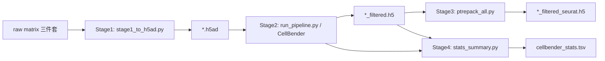

# CellBender 26 样本批量运行处方（2026-07-24, updated 2026-07-26）

## 背景

- **物种**: Homo sapiens (human)
- **组织**: skeletal muscle (骨骼肌)
- **方向**: aging (年轻 vs 老年)
- **平台**: DNB (BGI/MGI)
- **样本**: 26 个, 每样本 ~2M droplets
- **GPU**: NVIDIA RTX 5070 Ti (16GB VRAM)
- **Python**: 3.12.10, PyTorch 2.11.0+cu128

## 完整 4 阶段流水线



## 最新目录结构（v3.0）

```text
PROJECT_DATA_DIR/
├── h5ad/                          # Stage 1: 转换后的 h5ad (int32)
│   ├── 4CL_SD_D4_1_scRNA.h5ad
│   ├── e4CL_D2_1_scRNA.h5ad
│   └── ...
├── cellbender_output/             # Stage 2: CellBender 产出
│   └── 4CL_SD_D4_1_scRNA/
│       ├── cellbender_output.h5
│       ├── cellbender_output_filtered.h5
│       └── cellbender_output.pdf
├── seurat_h5/                     # Stage 3: ptrepack 压缩后
│   └── 4CL_SD_D4_1_scRNA_filtered_seurat.h5
├── summary/                       # Stage 4: 统计表
│   └── cellbender_stats.tsv
├── logs/
│   └── pipeline.log               # 总日志（LLM 每 5 分钟读一次）
├── scripts/                       # 从 skill 复制到此目录
│   ├── run_pipeline.py            # Watchdog 流水线
│   ├── stage1_to_h5ad.py          # raw → h5ad
│   ├── ptrepack_all.py            # 批量压缩
│   └── stats_summary.py           # 统计表
└── launcher.bat                   # 脱离式启动
```

## 参数（全部官方默认 + expected-cells=5000）

| 参数 | 值 | 官方默认 | 来源 |
|------|-----|---------|------|
| `--fpr` | `0.01` | `[0.01]` | `argparser.py` default |
| `--epochs` | `150` | `150` | `argparser.py` default |
| `--learning-rate` | `1e-4` | `1e-4` | `argparser.py` default |
| `--expected-cells` | `5000` | `None`(auto) | **用户指定** |
| `--total-droplets-included` | `25000` | `25000` | `argparser.py` default |
| `--low-count-threshold` | `5` | `5` | `argparser.py` default |
| `--cuda` | ✅ | — | GPU |

> ⚠️ **v1.0 历史错误**: 之前把 `learning-rate` 设成了 `0.001`（官方是 `1e-4`）。OneCycle 调度会把这 10 倍成 `0.01` 峰值学习率，超出官方注释 "**probably do not exceed 1e-3**" 10 倍。v3.0 已修正。

## 执行顺序

### 启动前 — 铁规 0 检查（先调查再回答）

```bash
# 查进程
tasklist /FI "IMAGENAME eq python.exe" /FO CSV
# 查 GPU
nvidia-smi --query-gpu=name,memory.used,utilization.gpu --format=csv,noheader
# 查目录
dir PROJECT_DATA_DIR/ /B /S | findstr /I "filtered"
```

### 启动

```bash
# 方案 A: 完整流水线（从 raw matrix 开始）
cd /d PROJECT_DATA_DIR
python scripts/stage1_to_h5ad.py --base_dir F:/00.RawData --out_dir PROJECT_DATA_DIR/h5ad
# 确认 h5ad 生成后：
start /B python scripts\run_pipeline.py --work_dir PROJECT_DATA_DIR --skip_stage1

# 方案 B: 分阶段（推荐首次调试用）
# Stage 2: 仅跑 CellBender
start /B python scripts\run_pipeline.py --work_dir PROJECT_DATA_DIR --skip_stage1 --only_stage 2
# Stage 3: 压缩
python scripts\ptrepack_all.py --cb_dir PROJECT_DATA_DIR/cellbender_output --out_dir PROJECT_DATA_DIR/seurat_h5
# Stage 4: 统计
python scripts\stats_summary.py --h5ad_dir PROJECT_DATA_DIR/h5ad --cb_dir PROJECT_DATA_DIR/cellbender_output --out_dir PROJECT_DATA_DIR/summary
```

### 运行中 — LLM 巡检

每 5 分钟（每轮对话）读 `logs/pipeline.log` 最后 20 行，格式：
```
[2026-07-26 11:05] [Stage2] [4CL_SD_D4_1_scRNA] [5/26] OK — 12.3 min
```

### 完成验证

```markdown
### 验证清单
| 检查项 | 方法 | 基准 |
|--------|------|------|
| 产出文件数 | `dir cellbender_output/*/*filtered.h5` | = 样本数 |
| 每个 > 100KB | `for %f in (...filtered.h5) do echo %f %~zf` | ALL > 100KB |
| 统计表 | `type summary/cellbender_stats.tsv` | 每样本一行 |
| ptrepack | `dir seurat_h5/*.h5` | = 成功样本数 |
| 移除比例 | stats.tsv cell_change_pct 列 | 5-30% 为正常区间 |
| 若 >50% | 调低 fpr（当前 0.01→0.005）或重跑 | 可能 overkill |
```

## 已知陷阱（10 条，覆盖历史全部失败模式）

| # | 陷阱 | 症状 | 修复 | 严重程度 |
|---|------|------|------|---------|
| 1 | **terminal(background) 死亡** | 进程静默消失 | 改用 `subprocess.Popen(creationflags=CREATE_NO_WINDOW)` 或 `start /B` | 🔴 致命 |
| 2 | **sitecustomize v3 不够** | 训练跑完但 `torch.save` 炸 → 无产出 | 升级到 v4（TypeError + AttributeError 双抓 + dill fallback） | 🔴 致命 |
| 3 | **DNB features 只有 1 列** | CellBender 加载时报 IndexError | 用 `stage1_to_h5ad.py` 的 `parse_features()` 自动识别 1/2/3 列 | 🟡 中等 |
| 4 | **PYTHONPATH 污染** | epoch 1 卡死 | 每次 subprocess 前 `env.pop("PYTHONPATH", None)` | 🔴 致命 |
| 5 | **并行跑** | RAM 爆 + ckpt 损坏 + 无产出 | 严格串行，for 循环不并行 | 🔴 致命 |
| 6 | **exit code 0 无产出** | 误以为成功 | 验证 `os.path.exists(file) and os.path.getsize(file) > 100_000` | 🔴 致命 |
| 7 | **`learning_rate=0.001`** | 峰值 LR 达 `0.01`，超出官方 "do not exceed 1e-3" | 修正为 `1e-4`（官方默认） | 🟡 中等 |
| 8 | **不查就说** | 用户问"还在跑吗？"凭空答"没有在跑" | 三连击（tasklist + nvidia-smi + dir）后再回答 | 🔴 致命 |
| 9 | **残留进程撞车** | 两个 CellBender 各占 7.2GB RAM+VRAM | 启动前 `taskkill /F /IM cellbender*` | 🔴 致命 |
| 10 | **gzzkq8fy 目录名** | 随机 session ID，无法追踪 | `--work_dir` 用语义名如 `PROJECT_DATA_DIR/` | 🟡 中等 |

## LLM 巡检模板

```markdown
### 📊 进度报告

当前样本: {i}/{n}
GPU 占用: {util}%
VRAM: {used}/{total} GB
日志最新行: {last_log_line}
已产出 filtered.h5: {output_count}/{total}
预估剩余: {est}
```

> 巡检频率严格每轮对话一次。不得跳过。不得坐等 notify_on_complete。
> 发现 FAIL → 立即诊断：读样本的 cellbender_run.log 最后 30 行。
