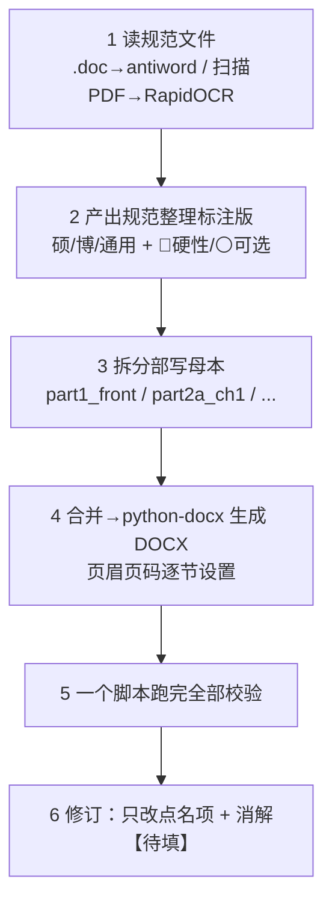

# 学位论文撰写（规范合规 + DOCX 出稿）

中文学位论文有**强制**格式规范，与普通报告、期刊论文完全不同。
本 skill 覆盖「从拿到学校规范文件 → 到交出可编辑 DOCX 定稿」的完整闭环。

> 📚 详细格式硬指标表、python-docx 实现要点、出稿校验脚本、参考文献实际版本取证
> → **references/degree-thesis-cn-spec.md**

---

## 一、四条不许违反的铁律

1. **一切以学校规范文件为准**。禁止套用任何"好看"的主题色/字体方案
   （Phylo 金色主题、Nature 风格等一律不用）。规范没说的才轮到审美。
2. **先读规范再动笔**。规范通常**不止一份**——《撰写及装帧规范》是主文件，
   还有封面扉页格式、两个声明、参考文献国标（常为扫描版 PDF）、专业学位名称表。
   **一次读全**再开始写，漏读一份就要返工。
3. **【待填】项一律留空标注，绝不代填或臆造**：学号、导师、专业名称、答辩日期、
   申请人信息、作者简介。只能给「填写要求 / 来源提示」，让用户自己填。
4. **只改用户点名的清单项**。修订阶段零润色、零重构；顺手发现的其它缺陷
   **单列出来问**，不擅自改。用户明确说过"已经没问题的就不要动了"。

---

## 二、工作流（六步，勿跳步）



**第 2 步不要只复述规范**，要加工成可执行清单：每条标 **硕/博/通用** +
**🔴硬性/⚪可选**，并单列「写作前自查清单」「章节骨架」「GB/T 7714 常用著录条目」。
硕士与博士在**前置部分项数**（硕士 7 项，无评阅意见/答辩决议书）和**印刷方式**
（硕士单双面均可、博士必须双面）上不同——照抄错版是最常见的返工来源。

**第 3 步拆分写作**防多版本产物并存，母本用 Markdown：
```
part1_front.md          封面要素/两声明/中英摘要/目录/插图附表清单/缩略词表
part2a_ch1.md           绪论
part2b_ch2.md           材料与方法
part3_ch3_ch4_ch5.md    结果 / 讨论 / 结论
part4_refs_appendix.md  参考文献 / 附录 / 作者简介 / 致谢
```
扩写某章后，**目录页码整体顺延**，并同步「插图附表清单」。

**第 4 步页眉与页码必须逐节设置**（每章一节），这是最高频的真缺陷——
实测第一版 DOCX 页眉全空，靠校验才发现。页码分节：前置罗马数字 /
主体阿拉伯数字且第1章**重新起算** / 封底无页码。

---

## 三、出稿校验（写进一个脚本，一次跑完）

**⚠️ 必须一次脚本跑完全部检查。** 连续多次 grep/read 逐项查会触发平台循环检测被强制打断。

一个 `verify_thesis.py` 里同时检查：页眉逐节（断言 == 该章「第N章 标题」，
不能只看"有没有页眉"）→ 字体字号 → 图表题注位置 → 页码分节 → 引文-文献表对应性
→ 产物计数（大小/段落/表格/节数）。

### 三个真实假阴性/假阳性坑
- **DOCX 文本里没有 Markdown 标记**：`**粗体**` 的 `**` 被剥离。拿
  `"T2T-MFA8，V1.1**[46]"` 去 `in dtxt` 会返回 **False**。→ 校验一律用**纯文本子串**。
- **表格内容不在 `doc.paragraphs` 里**：要额外遍历 `doc.tables` → `cell.text` 拼接。
- **区间引用会让"孤立文献"检查假阳性**：`[28-31]`、`[1-34]` 不被
  `\[(\d{1,2})\]` 匹配 → 已引用的条目被误报。先展开区间或双向核对**再**下结论。

---

## 四、定稿前自审：必须动手重算，不能只读文字

论文成稿后自审（或用户要"拷问/挑毛病"）时，最大风险是**只做文风点评**。
这类产物的致命伤几乎全在**数字与对应关系**上，必须独立复算，不许凭阅读印象下结论。

| 项 | 怎么做 | 真实击破例 |
|---|---|---|
| **① 期望值/独立性复算** | 凡出现「显著高于/低于独立期望」，用文中自己给的通过率重算 | 「150 显著高于独立期望」→ 实算 16029×19.8%×64.9%×8.79% = **181**，实测 150 **反而更低**；且 L1∧L2 实测 1604 < 独立期望 2063 → 两层实为**负相关**，论文自证数据推翻自己的解释 |
| **② 计数一致性** | 全部计数/差值/占比交叉验算（总数−子集＝余数？"大多数"成立吗？） | 正文「区间**外** 18 组」vs 表「区间**内** 19 组」；175−19=**156**，18 既算不出也不是"大多数" |
| **③ 引文-论断对应性** | 逐条把引用编号对回文献，查同一文献是否被用于多个互不相干的论断 | [9]（猴脑图谱）被同时用于「人脑取样受限」「liftOver 坐标迁移」「猴脑图谱」三处 → 另两处**张冠李戴** |
| **④ 孤立/漏引条目** | 文献表 ⊆ 正文引用？正文引用 ⊆ 文献表？ | [46] 只在文献表、正文从未引用 = 孤立文献，需同步补引 |

**报告口径**：
- **已核验通过的部分要明确列出并注明"不要动"**，避免修订时误伤
- 每条弱点必须附**自己实算出的证据**，不给"感觉不严谨""建议润色"这类无证据评价
- 弱点按 🔴/🟠/🟡 分级，每条给「零成本改写 / 需补算」两类选项让用户选，不替用户拍板

---

## 五、参考文献：把占位式条目换成实际版本

占位式写法（`Genome Reference Consortium / CNGB. …(2025, V1.1)[DB/OL].`）要换成实际版本时，
**三步取证，不许臆造**：

1. **回溯原始来源逐字取** —— 用户提供的一手材料（原论文参考文献表）就是最可靠出处
2. **Crossref API 核验** —— `curl "https://api.crossref.org/works/<DOI>"`，
   核对 volume / issue / page / published-print / title / author，逐项命中才落笔
3. **同步补正文引用** —— 替换文献表条目后把该编号写进正文对应位置，否则留下孤立文献；
   再 `save_reference(action="add")` 收录进引用库

顺手发现**其它**条目该换而未在点名清单内 → 只报告，不擅自改。

---

## 六、修订阶段的连带更新

删改计数必须**连带更新所有相关处**，否则前后矛盾：
- 删掉「三条待补充事项」中的一条 → 正文「三条」改「两条」，附录里对应说明条目一并删/改
- 论文自标的「数据待补」项，一旦用户补齐来源，要**从正文和附录说明两处同时清除**
- 新增/删除文献条目 → 重跑引文-文献表双向核对

---

## 七、常见坑速查

| 坑 | 表现 | 对策 |
|---|---|---|
| 套用错版规范 | 硕士论文出现评阅意见书章节 | 逐条标 硕/博/通用 |
| 页眉为空 | 生成成功但页眉没字 | 逐节设置 + 校验断言页眉文本 |
| 页码不重新起算 | 正文从第1章继续前置页码 | 分节 + restart numbering |
| 图题表题位置颠倒 | 图题在图上方 | 图题在**下**、表题在**上** |
| 多版本产物并存 | 同时有 v1/v2 合并稿与 DOCX | 母本分部 + 单一生成脚本 |
| 代填【待填】 | 编造了导师/学号 | 一律留空 + 给填写要求 |
| 顺手改了点名外的内容 | 用户："已经没问题的就不要动了" | 只改点名项，其余列出来问 |

---

## 八、相关 skill 分工

| skill | 分工 |
|---|---|
| **degree-thesis-writing**（本技能） | 学位论文的规范合规撰写与 DOCX 出稿 |
| `docx-generation` | 通用 Word/docx 生成与读取（Phylo 主题、报告类）；本技能产出 DOCX 时复用其 python-docx 手法 |
| `grill-me` | 方案/文本的连环拷问；本技能第四节是其针对**手稿数字**的强化版 |
| `literature-review` / `deep-research` | 文献检索与综述（本技能只负责把结果落进论文） |
