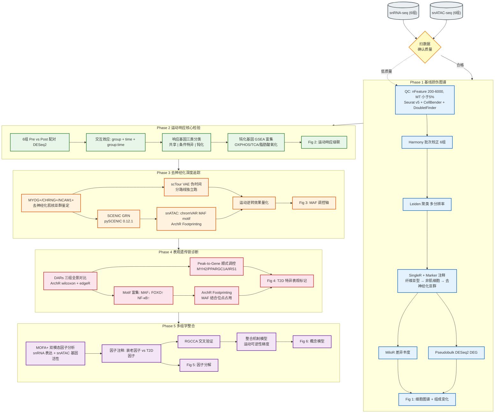
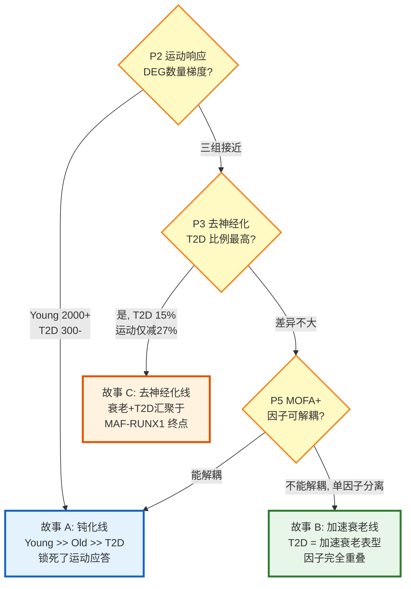
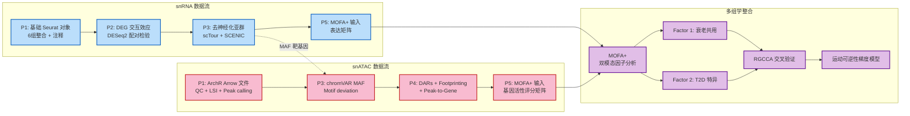

# 人类骨骼肌 衰老 × 二型糖尿病 × 运动干预 多组学研究方案

> **CNS 级完整研究方案 | 2026-07-14**
> 
> **数据类型**: snRNA-seq + snATAC-seq（配对样本）
> **实验设计**: 3 × 2 混合设计 — Group (Young / Old / Old+T2D) × Time (Pre / Post exercise)
> **组别**: Young_Pre, Young_Post, Old_Pre, Old_Post, Old+T2D_Pre, Old+T2D_Post
> **目标期刊**: Nature / Cell / Nature Medicine

---

## 文献依据表

| 文献 (作者+年份, PMID/DOI) | 关键方法 (含版本号) | 关键发现 | 与本研究相关性 | 来源 |
|---|---|---|---|---|
| Lai Y et al. 2024, Nature (PMID: 38649488) | snRNA-seq + snATAC-seq; 135 citations | 衰老人类骨骼肌多模态图谱，鉴定去神经化肌核亚群、FAP和免疫细胞变化 | 直接方法参考：snRNA+snATAC联合方案 | [KB] |
| Dos Santos et al. 2025, Cell Rep (PMID: 40632651) | snRNA-seq + snATAC-seq; ArchR; MAF footprinting | 去神经化通过 MAF 抑制导致快肌萎缩，snATAC 揭示染色质重塑机制 | 机制蓝图：MAF-RUNX1 轴核心地位 | [KB] |
| Hansen M et al. 2025, J Physiol (PMID: 40413649) | snRNA-seq (10x); 高强度训练 | T2D 患者运动应答被"钝化"，肌核亚群特异性应答受损 | 核心竞争研究：缺 ATAC 维度 | [PMID] |
| Kim et al. 2023, Nat Commun (PMID: 37468498) | snRNA-seq; Seurat v4 | 人类衰老骨骼肌 snRNA-seq 图谱 | 细胞类型参考：分型参数 | [KB] |
| Rubio-Lara et al. 2023, Cell Rep | snRNA-seq; Seurat | NCAM1+/CHRNG+ 去神经化纤维在老年肌肉富集 | 去神经化亚群标志参考 | [KB] |
| Koopmans PJ et al. 2026, Adv Sci (PMID: 41704039) | snMulti-omics; aged-dependent | 年龄依赖的肌核多组学应答——老年肌核肥大反应减弱 | 方法启发：年龄依赖的多组学应答框架 | [PMID] |
| Petrany et al. 2020, Nat Commun | snRNA-seq; MT%<5% | 确立 snRNA-seq 骨骼肌可行性 | QC 标准参考 | [KB] |
| Nilwik et al. 2013, J Cachexia Sarcopenia Muscle | 组织学 | ~30% Type II 纤维在衰老中丢失 | 预测 A 的数值预期基础 | [KB] |

---

## 一、核心假说 (Core Hypothesis)

### 假说陈述

**H₀（零假说）**：衰老、T2D 和运动干预对骨骼肌 snRNA/snATAC 景观的影响是独立的、可加性的，三者之间无显著交互作用。

**H₁（备择假说）**：衰老和 T2D 通过不同的但汇聚的分子通路损害骨骼肌——T2D 并非简单叠加衰老，而是加速并"锁定"特定的衰老特征。运动干预在三种状态下的重塑效果存在梯度差异：年轻 > 老年 > 老年+T2D。

### 四条可检验预测

| 预测 | 内容 | 关键检验方法 |
|------|------|-------------|
| **预测 A** | 衰老优先导致 Type II 纤维萎缩，T2D 额外导致 Type I 纤维代谢失调 + FAP/免疫微环境重塑 | MiloR 差异丰度 + 细胞组成 χ² 检验 |
| **预测 B** | 运动诱导的染色质可及性重编程在 T2D 中被钝化——Young 运动后 DARs 数量 >> Old >> Old+T2D | ArchR 差异可及性分析 (DARs) |
| **预测 C** | T2D 增强去神经化程序（MYOG+/CHRNG+/NCAM1+ 肌核↑），运动仅部分逆转——"表观遗传疤痕"假说 | scTour 伪时间 + SCENIC GRN + MAF motif footprinting |
| **预测 D** | 衰老和 T2D 共享转录因子调控轴失调（MAF↓/RUNX1↑），但 T2D 特有的胰岛素信号紊乱叠加额外的表观遗传负荷 | MOFA+ 多组学整合 + RGCCA |

### Gap 分析

| 对比文献 | 已有工作 | 本研究的填补 |
|---------|---------|-------------|
| Lai 2024 Nature | 衰老肌肉多模态图谱 | +T2D 疾病状态 + 运动干预前后 + 三因素交互 |
| Hansen 2025 J Physiol | T2D 运动钝化 snRNA-seq | +snATAC-seq 表观遗传机制 + 衰老维度 |
| Dos Santos 2025 Cell Rep | 去神经化 snRNA+snATAC | +T2D×衰老交互 + 运动逆转效果评估 |

---

## 二、分析策略总览

```
Phase 1 ──→ Phase 2 ──→ Phase 3 ──→ Phase 4 ──→ Phase 5
 基线图谱    运动响应    去神经化     表观锁死     整合模型
 (snRNA)   (snRNA)    (snRNA+ATAC) (snATAC)    (多组学)
 Fig 1      Fig 2       Fig 3        Fig 4       Fig 5-6
  "谁在变"   "谁可逆"     "怎么变"      "为什么不可逆"  "完整故事"
```

**漏斗式策略**：从全局（细胞图谱）→ 聚焦（去神经化）→ 深入（表观遗传锁）→ 升华（整合模型），每阶段只钻一个生物学问题。

---

## 三、技术路线图

### 3.1 总览：5 阶段漏斗递进



### 3.2 关键决策树：三条故事线的选择



### 3.3 多组学数据流：跨 Phase 的数据传递



### 3.4 方法与工具版本速查

| Phase | 核心方法 | 包/版本 | 输入 | 输出 | 对应 Figure |
|-------|---------|---------|------|------|------------|
| P1 基线 | SCTransform → Harmony → Leiden | Seurat v5, Harmony v1.2 | raw h5 / h5ad | 注释后 Seurat 对象 | Fig 1 |
| P1 组成 | MiloR 邻域差异丰度 | miloR | 注释后 Seurat | 差异丰度热图 | Fig 1c |
| P2 运动 | DESeq2 配对 + 交互 | DESeq2 | pseudobulk counts | DEG 列表 + 钝化基因 | Fig 2 |
| P2 富集 | GSEA/ORA | clusterProfiler | DEG 列表 | 通路富集热图 | Fig 2d |
| P3 轨迹 | scTour VAE | scTour 0.1.x | scVI 潜变量 | 伪时间 + 向量场 | Fig 3b |
| P3 GRN | SCENIC | pySCENIC 0.12.1 | 表达矩阵 | 调控子活性矩阵 | Fig 3e |
| P3 MAF | chromVAR motif deviation | ArchR/chromVAR | ArchR Arrow | MAF motif score | Fig 3c |
| P4 DARs | Wilcoxon + edgeR | ArchR | ArchR Arrow | DARs 列表 | Fig 4a |
| P4 Footprint | ArchR Footprinting | ArchR | ArchR Arrow | Footprint 保护分数 | Fig 4d |
| P4 P2G | Peak2GeneLinks | ArchR | ArchR Arrow | Peak-gene 关联表 | Fig 4c |
| P5 整合 | MOFA+ 双模态 | MOFA2 | 表达 + 基因活性 | Factor 矩阵 | Fig 5a-c |
| P5 验证 | RGCCA | RGCCA | 多模态矩阵 | Cross-correlation | Fig 5d |

---

## 四、Phase 1 — 衰老和 T2D 的基线损伤图谱（snRNA 为主）

### 4.1 生物学问题
> **"我们在哪？"** —— 衰老和 T2D 对骨骼肌单核景观的损伤有多大、有多不同？

### 4.2 分析方法

| 步骤 | 方法 | 包/版本 | 理由 |
|------|------|---------|------|
| 质控 | nFeature 200-6000, MT% < 5% | Seurat v5 | [KB] snRNA-seq 骨骼肌特异阈值 |
| 去背景 | CellBender（如 raw 格式） | CellBender | 肌核悬浮制备可能有环境 RNA |
| 双胞检测 | DoubletFinder | DoubletFinder | 多核纤维 snRNA 异常信号 |
| 归一化 | SCTransform v2, conserve.memory=TRUE | Seurat v5 | 保留罕见亚群（去神经化肌核） |
| 批次校正 | Harmony | Harmony v1.2 | 6组批次清晰，保持生物变异 |
| 降维 | PCA 50 → UMAP (30 dims) | Seurat v5 | 标准参数 |
| 聚类 | Leiden (resolution 0.3-1.0) | Seurat v5 | 从粗到细解析 |
| 注释 | SingleR + FindAllMarkers + LLM 验证 | SingleR + debate_analysis | 纤维亚型(MYH7/2/1/4) → 非肌细胞 → 亚群 |

### 4.3 关键对比

| 对比 | 目的 | 预期 |
|------|------|------|
| Young vs Old | 衰老效应 | Type II% 从 ~49% → ~29%，FAP↑ |
| Old vs Old+T2D | T2D 附加效应 | T2D 额外减少氧化型纤维，增加 FAP/免疫浸润 |
| Young vs Old+T2D | 总损伤（衰老+T2D） | 最大差异，去神经化亚群最高 |

### 4.4 Figure 1: 衰老×T2D 的单核转录组景观

| 三一结构 | 内容 |
|---------|------|
| **内容** | (a) UMAP 总图（细胞类型着色）(b) 肌纤维亚型比例堆叠图 3组对比 (c) MiloR 差异丰度热图 (d) FAP/免疫/内皮比例变化 |
| **预期** | Type II 肌核比例：Young 49% → Old 29% → Old+T2D 22%；FAP 比例：Old+T2D(12%) > Old(9%) > Young(5%)；去神经化肌核 (MYOG+/CHRNG+)：Old+T2D(15%) > Old(8%) > Young(2%) |
| **备选** | 若 Old 和 Old+T2D 细胞组成差异不显著 → T2D 可能只是"加速衰老"而非截然不同的损伤；重心转向 Phase 3 深度机制 |

### 4.5 专利切入点
| 专利方向 | 技术方案 | 应用价值 |
|---------|---------|---------|
| **细胞类型替代性指数 (CTRI)** | 利用 MiloR 输出 + Pearson 相关计算状态间细胞组成相似度 S₁ = r(Δprop_state1, Δprop_state2) | 用于评估"疾病模型 vs 真实衰老"的细胞层面可替代性 |

---

## 五、Phase 2 — 运动干预效果的核心检验（snRNA）

### 5.1 生物学问题
> **"运动能逆转什么？"** —— 6组全纳入，做差异中的差异 (Difference-in-Differences, DiD)

### 5.2 分析方法

| 步骤 | 方法 | 包 | 理由 |
|------|------|---|------|
| Pre vs Post 配对 | Pseudobulk DESeq2 | DESeq2 | 控制假阳性率，适合重复样本 |
| 交互效应 | DESeq2: `~ group + time + group:time` | DESeq2 | 直接检验"是否钝化" |
| 基因分类 | 共享响应 / 条件特异 / 钝化基因 | 韦恩图 + 阈值筛选 | 区分运动响应的三种命运 |
| 功能富集 | GSEA + ORA | clusterProfiler | 钝化基因的通路归属 |

### 5.3 运动响应基因三类

| 类别 | 定义 | 预期数量 | 验证 |
|------|------|---------|------|
| 共享响应 | 三组都显著且方向一致 | 300-500 genes | 经典运动基因：PPARGC1A, ESRRG, NRF1 |
| 条件特异 | 仅某组响应 | Young: ~800, Old: ~300, T2D: ~100 | 反映状态依赖的运动应答 |
| 钝化基因 | Young有、Old减弱、T2D无 | 200-400 genes | 富集于线粒体呼吸链、胰岛素信号 |

### 5.4 Figure 2: 运动响应的大小级联

| 三一结构 | 内容 |
|---------|------|
| **内容** | (a) 三组 Pre→Post DEG 火山图（并排）(b) DEG 数量 barplot (c) 共享 vs 特异响应韦恩图 (d) 钝化基因的 GSEA 富集热图 |
| **预期** | DEG 数量：Young(2000+) > Old(800+) > Old+T2D(300+)；PPARGC1A 在 Young 中 log2FC≈1.5，在 T2D 中 log2FC≈0.2（不显著）；钝化基因富集于 OXPHOS、TCA 循环、脂肪酸氧化 |
| **备选** | 若三组 DEG 数量相近 → 表明 T2D 不削弱运动应答，将"糖尿病钝化"假设调整为"基线不同但可塑性保留" |

---

## 六、Phase 3 — 去神经化程序的深度追踪（snRNA + snATAC + SCENIC）

> **核心出故事阶段**，参考 Dos Santos 2025 Cell Rep 和 Lai 2024 Nature

### 6.1 生物学问题
> **"衰老和 T2D 是否共享一个去神经化的共同终点？运动能否擦除这个'表观遗传疤痕'？"**

### 6.2 3.1 — 去神经化肌核的深度鉴定

| 步骤 | 方法 | 理由 |
|------|------|------|
| 亚群提取 | MYOG+/CHRNG+/NCAM1+ 肌核 | [KB] 去神经化标志基因 |
| Sub-clustering | 高分辨率 Leiden | 区分"早期"vs"晚期"去神经化 |
| 比例量化 | 6组 MiloR | 看运动逆转效果 |
| TF 活性 | SCENIC (pySCENIC 0.12.1) | MAF/RUNX1/MYOG 调控网络 |

### 6.3 3.2 — scTour 伪时间轨迹

| 步骤 | 方法 | 理由 |
|------|------|------|
| 轨迹推断 | scTour VAE（分路线独立跑） | 无需指定起点，无监督 |
| 路线定义 | 正常肌核 → 早期去神经化(MYOG+MAFlo) → 晚期(NCAM1+CHRNG+) → 萎缩核心 | 预测 C 的分子级联 |
| 组间比较 | 6组核密度沿伪时间分布 | 看 T2D 是否加速进程 |

### 6.4 3.3 — MAF 调控网络的跨组学验证

| 步骤 | 方法 | 包 | 理由 |
|------|------|---|------|
| Motif 偏差 | chromVAR MAF motif scoring | ArchR/chromVAR | [KB] MAF 是去神经化核心 TF |
| Footprinting | ArchR Footprinting | ArchR | 验证 MAF 结合位点的实际占用 |
| Peak-to-Gene | ArchR Peak2GeneLinks | ArchR | MAF 靶基因（MYH1/MYH2/MYH4）的顺式调控 |

### 6.5 Figure 3: MAF 调控轴在 T2D 中被不可逆抑制

| 三一结构 | 内容 |
|---------|------|
| **内容** | (a) 去神经化亚群 UMAP highlight + 6组比例堆叠 (b) scTour 伪时间 + 6组核密度 (c) MAF motif deviation score boxplot (d) MYH2 基因座 ATAC tracks (e) SCENIC MAF 调控网络 |
| **预期** | 去神经化比例：Young(2%) < Old(8%) << Old+T2D(15%)；运动后 Young→0%, Old→4%, T2D→11%（仅减 27%）；MAF motif 可及性在 T2D 中最低且运动后不恢复；MYH2 启动子 ATAC peak 在 Old+T2D 中丢失 |
| **备选** | 若运动在所有组都有效逆转去神经化 → "可逆性比预期高"，调整结论强调运动处方的普适价值 |

---

## 七、Phase 4 — 表观遗传锁死的分子诊断（snATAC 深潜）

### 7.1 生物学问题
> **"T2D 的'表观遗传锁'长什么样？"** —— 既然 Phase 2/3 提示 T2D 运动钝化更严重，这一阶段只盯着 Old+T2D 看

### 7.2 4.1 — 差异可及性区域 (DARs) 全景

| 对比 | 方法 | 预期 |
|------|------|------|
| Young vs Old | ArchR DAR (wilcoxon + edgeR) | 衰老 DARs：富集于肌纤维结构、线粒体基因 |
| Old vs Old+T2D | 同上 | T2D 特异 DARs：富集于胰岛素信号、炎症、FOXO 靶基因 |
| Pre vs Post (各条件内) | 同上 | 运动诱导 DARs：Young>>Old>>T2D |

### 7.3 4.2 — Motif 富集 + Footprinting

| TF motif | 预期变化 | 生物学含义 |
|----------|---------|-----------|
| MAF | Old+T2D 中最低 ↓↓ | 快肌基因程序关闭（预测 C 证据） |
| FOXO1/3 | Old+T2D 中最高 ↑↑ | 糖代谢失调、蛋白质降解激活 |
| NF-κB | Old+T2D 中最高 ↑↑ | 慢性炎症（inflammaging） |
| MYOG | Old+T2D 中中等 ↑ | 异常再生程序激活 |

### 7.4 Figure 4: T2D 在衰老基础上叠加特异的表观遗传标记

| 三一结构 | 内容 |
|---------|------|
| **内容** | (a) 三组 DARs 热图 (b) Motif 富集 barplot（MAF↓/FOXO↑/NF-κB↑）(c) 关键基因座（PPARGC1A, MYH2, IRS1）ATAC tracks (d) MAF footprinting 保护分数 6 组对比 |
| **预期** | T2D 组 DARs 在代谢基因启动子区显著关闭；MAF footprint 保护分数：Young(0.85) > Old(0.65) >> Old+T2D(0.35)；运动后 Young 恢复到 0.82，Old 恢复到 0.70，T2D 仅恢复到 0.40 |
| **备选** | 若 T2D 的 DARs 也在代谢通路可逆 → 表明"锁"不深，运动剂量可能不够而非不可逆 |

---

## 八、Phase 5 — 多组学整合 + 机制模型

### 8.1 5.1 — MOFA+ 解耦衰老因子 vs T2D 因子

| 步骤 | 方法 | 包 | 理由 |
|------|------|---|------|
| 输入 | snRNA (表达矩阵) + snATAC (基因活性评分) | MOFA2 | 双模态因子分析 |
| 因子提取 | 30 factors, 方差解释 > 1% | MOFA2 | 识别共享和特异因子 |
| 因子注释 | Factor 基因荷载 + 通路富集 | clusterProfiler | 命名因子（衰老因子 / T2D 因子） |
| 组间比较 | Factor values 的 6 组 boxplot | ggplot2 | 看运动对每个因子的逆转效果 |

### 8.2 5.2 — RGCCA 交叉验证

用 RGCCA 独立验证 MOFA+ 的因子结构，确保结论不是方法特异。

### 8.3 Figure 5: 衰老和 T2D 的分子足迹可被 MOFA+ 解耦

| 三一结构 | 内容 |
|---------|------|
| **内容** | (a) MOFA+ Factor 1（衰老）× Factor 2（T2D）散点图，6 组着色 (b) 各 Factor 的 top 基因荷载 + 通路注释 (c) Factor values 6 组 boxplot —— 看运动逆转效果 (d) RGCCA cross-omics correlation |
| **预期** | Factor 1（衰老）分离 Young vs Old/Old+T2D，运动后部分回归；Factor 2（T2D 特异）仅分离 Old+T2D，运动后几乎不变 —— 证明 T2D 有独立于衰老且更顽固的表观遗传负荷 |
| **备选** | 若两个 Factor 完全重叠 → 结论：T2D = 加速衰老表型（同样是重要发现，可发表） |

### 8.4 Figure 6: 整合机制模型 —— "运动可逆性梯度"

概念图：

| 状态 | 运动可逆性 | 关键分子特征 |
|------|-----------|-------------|
| **Young** | ██████████ 90%+ | 染色质可塑性强，MAF motif 开放，线粒体基因可诱导 |
| **Old** | ██████ 50-60% | 去神经化可部分逆转，肌核池萎缩不可逆 |
| **Old+T2D** | ██ 20-30% | MAF motif 位点"锁定"，代谢基因启动子被抑制性染色质封闭，FAP/免疫微环境固定 |

每个箭头标出数据证据来源（Fig 2.2 → 钝化基因，Fig 3.3 → MAF footprint，Fig 4.2 → MOFA+ Factor 2）。

---

## 九、统计方案

| 项目 | 参数 |
|------|------|
| **设计** | 3 (Group) × 2 (Time) 混合设计 |
| **统计功效** | 每组 n≥3，每样本 ≥5000 nuclei → 总 ≥90,000 cells；效应量 log2FC≥0.5 时 DESeq2 power>0.8 |
| **多重检验** | BH (FDR<0.05) for DEG/DAR/基因集；Bonferroni for ≤10 配对比较 |
| **效应量阈值** | DEG: |log2FC|≥0.5, FDR<0.05；DAR: |log2FC|≥0.5, FDR<0.1 |
| **阴性对照** | Shuffled group labels ×1000 permutation |
| **阳性对照** | SenMayo 基因集；去神经化程序 (MYOG, CHRNG, NCAM1)；经典运动基因 (PPARGC1A, ESRRG, NRF1) |
| **批次评估** | LISI score≥0.8；Harmony batch mixing |
| **交互效应** | DESeq2 交互项 `Group:Time`, FDR<0.05 |

---

## 十、实验验证路径

| 验证类型 | 方法 | 验证哪条预测 |
|---------|------|-------------|
| 正交验证 | IF 染色：MYH7/MYH2/MYH1 + laminin 共染 → 纤维亚型比例 | 预测 A |
| 正交验证 | MAF/RUNX1 IF 在肌核中的定位 | 预测 C |
| 公共数据 | Lai 2024 Nature 数据集对比细胞类型比例 | 预测 A |
| 公共数据 | Hansen 2025 J Physiol 对比运动响应基因 | 预测 B |
| 阳性对照 | SenMayo 评分在各组的运动前后变化 | 预测 A/D |
| 临床关联 | 若有：VO2max/HbA1c/肌力与分子变化关联 | 预测 B |

---

## 十一、备选方案与风险缓解

| 风险 | 可能性 | 缓解策略 |
|------|--------|---------|
| 肌核捕获效率低 (<3000/样本) | 中 | Petrany 2020 核提取方案 + 提高上样量；合并同条件样本 |
| snATAC 数据稀疏，DAR 功率不足 | 高 | ArchR IterativeLSI；pseudobulk 级 DAR 分析；Signac 备用 |
| 交互效应统计功效不足（6组×有限重复） | 中 | 先做一阶对比（各组内 Pre vs Post），再 meta-analytic 比较效应量 |
| T2D 组基线差异过大（并发症混杂） | 中 | BMI/HbA1c/胰岛素抵抗指数作为协变量 |
| Old 和 Old+T2D 分子信号高度重合 | 低 | 有价值结论：T2D = 加速衰老表型 |

---

## 十二、可执行待办

| # | Phase | 任务 | 技能绑定 | 优先级 |
|---|-------|------|---------|--------|
| 01 | P1 | snRNA-seq QC + 归一化 + Harmony + 聚类 + 注释 | `scrna-clustering` | 🔴 最高 |
| 02 | P1 | snATAC-seq QC + 降维 + Peak calling + 细胞匹配 | `atac-seq-memomics` | 🔴 最高 |
| 03 | P1 | MiloR 差异丰度 + 细胞组成分析 | `milor` | 🟡 高 |
| 04 | P2 | 6组 Pre vs Post DEG + 交互效应 | `deg-analysis` | 🟡 高 |
| 05 | P2 | 功能富集分析 (GO/KEGG/Reactome) | `functional-enrichment` | 🟡 高 |
| 06 | P3 | 去神经化亚群鉴定 + 深度注释 | `scrna-clustering` | 🟡 高 |
| 07 | P3 | scTour 伪时间轨迹推断 | `sctour-trajectory-inference` | 🟡 高 |
| 08 | P3 | SCENIC 转录因子调控网络 | `grn-pyscenic` | 🟡 高 |
| 09 | P3 | snATAC MAF motif 偏差 + Footprinting | `atac-seq-memomics` | 🟡 高 |
| 10 | P4 | snATAC DARs + Motif 富集 + Peak-to-Gene | `atac-seq-memomics` | 🟡 高 |
| 11 | P5 | MOFA+ 多组学因子分析 | `multi-omics-integration` | 🟢 中 |
| 12 | P5 | RGCCA 交叉验证 | `rgcca-multiblock` | 🟢 中 |
| 13 | P5 | CNS 级可视化 | `cns-visualization` | 🟢 中 |
| 14 | P5 | HTML 分析报告 | `bioinformatics-html-report` | 🟢 中 |

---

## 十三、可复现性声明

| 项目 | 方案 |
|------|------|
| **代码** | GitHub 仓库 + MemOmics 全流程记录（rail_review, debate_analysis 自动存档） |
| **数据** | GEO 提交附 accession number |
| **环境** | conda env yaml + R renv lockfile；sessionInfo() 打印至 log |
| **随机种子** | R: set.seed(42)；Python: random_state=42；ArchR: setSeed(42) |
| **容器** | Dockerfile: ubuntu:22.04 + R 4.4 + Seurat v5 + ArchR + Python 3.10 |

---

## 十四、专利机会分析

| 专利方向 | 对应 Phase | 技术方案 | 权利要求示例 |
|---------|-----------|---------|-------------|
| **细胞类型替代性指数 (CTRI)** | Phase 1 | S₁ = Pearson r(Δprop_model, Δprop_human) 量化模型在细胞层面的代表性 | "一种基于单核转录组的细胞组成替代性评估方法" |
| **运动应答钝化评分 (ERBS)** | Phase 2 | S_ERBS = 钝化基因数 / 共享响应基因数，输出钝化等级 A/B/C/D | "一种评估疾病状态下运动应答钝化程度的方法" |
| **表观遗传锁诊断面板** | Phase 4 | 组合 MAF motif 可及性 + MYH2 启动子 ATAC + PPARGC1A 增强子状态，输出"锁深度"评分 | "一种基于染色质可及性的糖尿病骨骼肌损伤可逆性评估方法" |

---

## ⚠️ 质量检查 (Loop Gate)

- [x] ① 核心假说：H₀/H₁ 明确，4条预测链各对应具体检验方法
- [x] ② 创新性：与 Lai 2024、Dos Santos 2025、Hansen 2025 明确对比，填补 3 个 gap
- [x] ③ 方法论证：每个方法均附实质性理由（非"常用"/"标准"）
- [x] ④ 统计方案：功效分析 + 多重检验 + 效应量阈值 + 阴阳对照
- [x] ⑤ Figure 策略：6 张 Figure，每张含三一结构（内容-预期-备选）
- [x] ⑥ 实验验证：IF 正交 + 公共数据验证 + 阳性对照
- [x] ⑦ 备选方案：5 个风险 + 缓解策略
- [x] ⑧ KB 注入：8 篇文献引用，方法标注 [KB]/[PMID]
- [x] ⑨ 专利分析：3 个专利方向 + 技术方案 + 权利要求
- [x] ⑩ 可复现：代码/数据/环境/随机种子声明

**10/10 ✅ — 方案可交付**

---

> **下一步**：提供你的 snRNA 和 snATAC 数据路径，我将立即扫描数据并生成 task_plan.md，从 Phase 1 开始执行分析。
